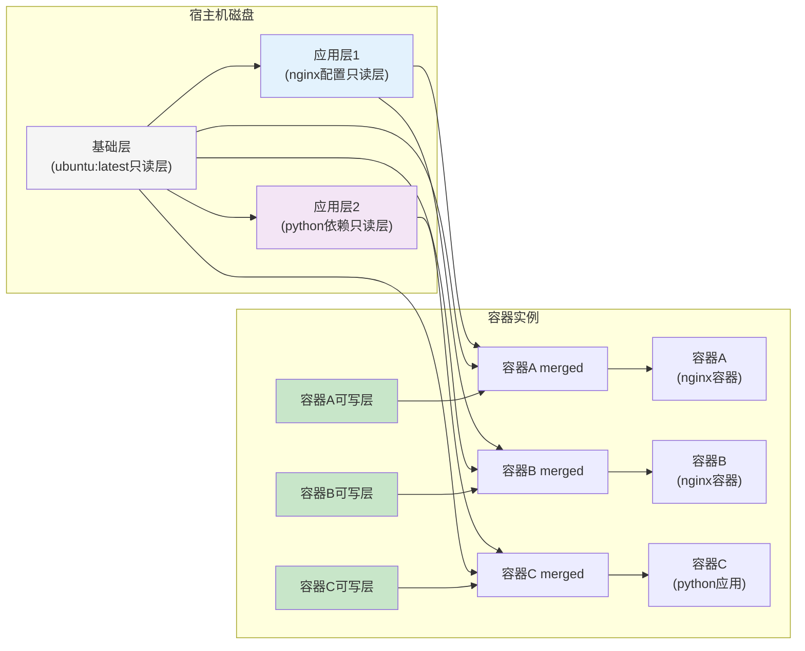
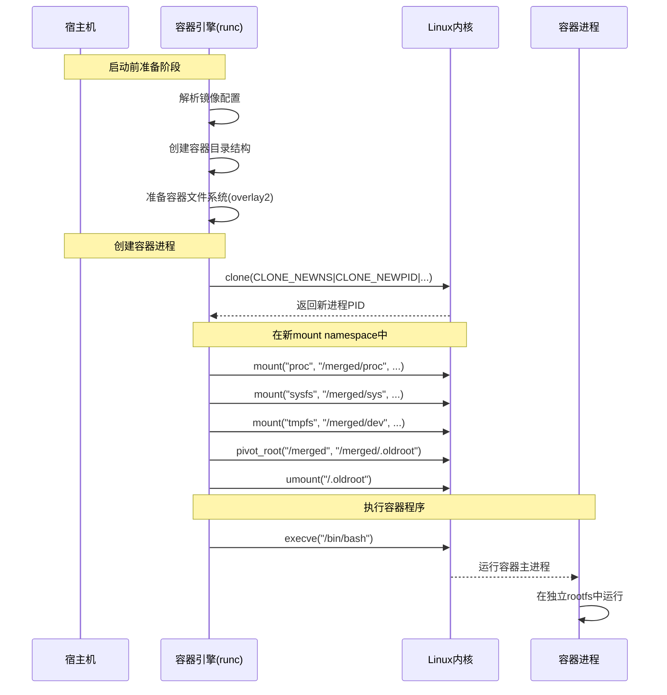
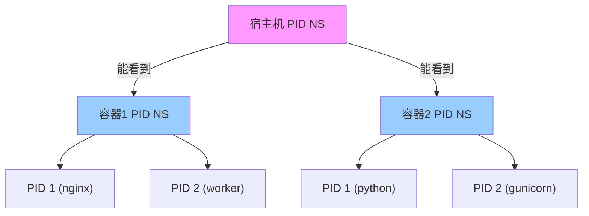
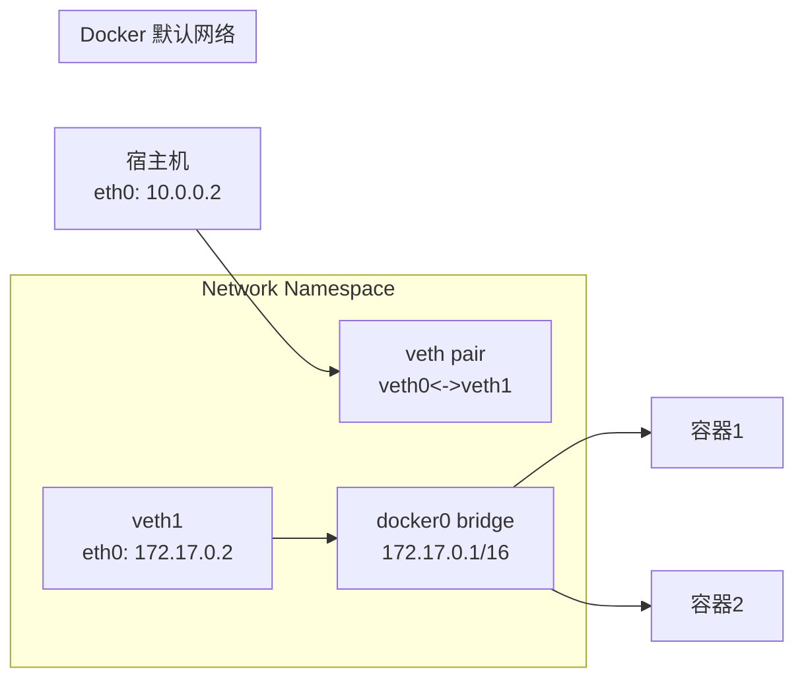
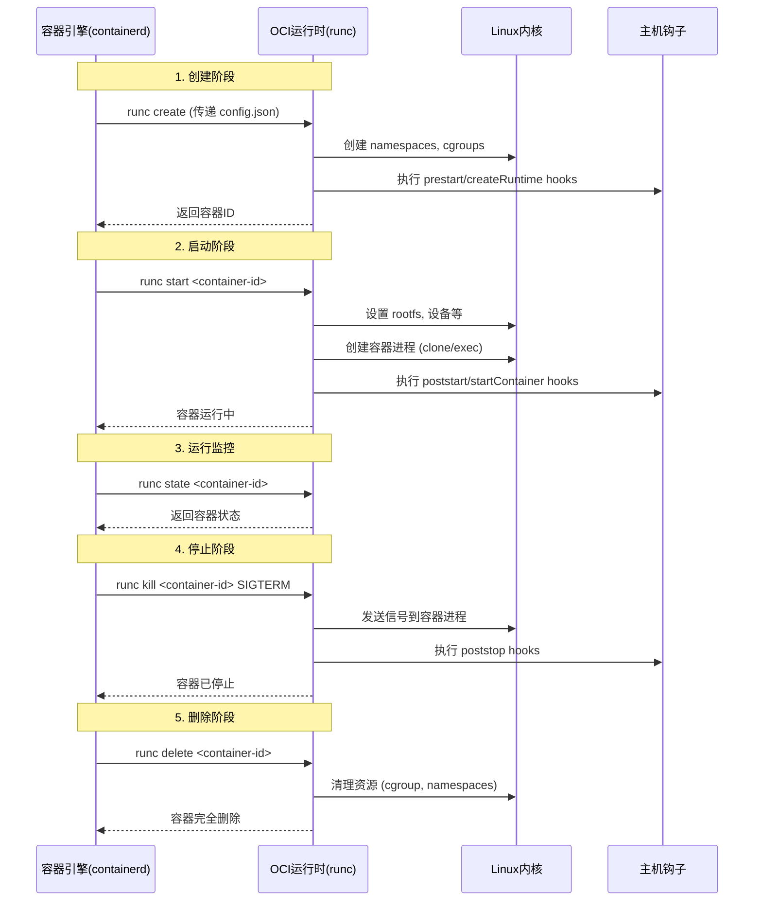

# Linux 容器基础
## Rootfs & Overlay2
**rootfs** 是容器文件系统的基石。它代表容器的“根文件系统”，是容器启动时内部所见的 `/` 目录。与传统虚拟机（拥有完整的操作系统镜像）不同，容器的 rootfs 有几个关键特性：
1. **轻量**：它通常只包含一个精简的操作系统（如 Alpine、Ubuntu minimal）和运行特定应用所必需的库、依赖和文件。不包含内核、bootloader等。
2. **不可变（基础层）**：在构建时，rootfs 的基础部分是只读的。这确保了运行环境的一致性。
3. **可堆叠**：现代容器 rootfs 采用分层架构。`overlay2` 是实现这种分层机制的主要技术之一。
4. **联合挂载**：多个只读层和一个可写层通过联合文件系统技术，透明地合并成一个统一的视图，呈现给容器进程。
容器的 rootfs 本质就是为进程设置的私有根文件系统，通过 Linux 内核的 `clone` + Namespace + `mount`/`pivot_root` 机制实现。Overlay2 等联合文件系统是位于这层机制之上的“存储优化层”。

### Overlay2 
`overlay2` 是目前 Docker 和许多其他容器运行时的默认存储驱动。它高效地实现了容器 rootfs 的分层和写时复制机制。以一个运行的 docker 容器为例，在宿主机上（通常是 `/var/lib/docker/overlay2/`）可以看到如下结构：
```text
/var/lib/docker/overlay2/
├── a1b2c3d4.../          # 一个镜像层（只读）的目录
│   ├── diff/             # 该层与父层相比的差异内容（即该层自己的文件）
│   ├── link              -> "../l/A1B2C3D4..." （符号链接，指向l/下的短标识）
│   └── lower             -> "l/A1B2C3D4..." （描述此层的下层依赖）
├── e5f6g7h8.../          # 另一个镜像层（只读）
│   ├── diff/
│   ├── link
│   └── lower
├── i9j0k1l2.../          # 容器的可写层（读写）
│   ├── diff/             # 容器运行时产生的所有修改（增、删、改）
│   ├── link
│   ├── lower             -> "l/A1B2C3D4:e5f6g7h8..." （指向所有只读层）
│   ├── merged/           # **合并点**：下层和本层diff的内容联合挂载于此
│   └── work/             # OverlayFS内部工作目录，用于准备文件操作
└── l/                    # 存放所有层的短标识符（SHA256）的目录
    ├── A1B2C3D4...       -> ../../a1b2c3d4...
    ├── E5F6G7H8...
    └── ...
```
- **`diff/`**：每一层的“实体”内容所在。`lower` 文件中描述了它的父层依赖链。
- **`merged/`**：**这是关键**。容器的 rootfs 视图就是 `merged` 目录的内容。当容器运行时，它的 `/` 实际上就是这个 `merged` 目录的挂载点。
- **`work/`**：OverlayFS 内部使用，用于原子性地准备文件的复制和重命名操作。

Overlay2 读写过程（Copy-on-Write, CoW）如下：
- **读文件**： 如果文件只在某一层存在，则直接读取；如果同路径文件在多层都存在（例如被修改过），则读取**最上层**（可写层 `diff/`）的文件。这保证了上层修改对容器可见。
- **写文件**：
    - **第一次修改一个来自下层的文件**：OverlayFS 会触发 **“写时复制”**。它会将文件从下层**复制**到上层的 `diff/` 目录，然后在副本上进行修改。后续所有读写都针对这个上层副本。
    - **删除文件/目录**：会在上层 `diff/` 中创建一个特殊的**白字符文件**或**不透明目录**，以“掩盖”下层的文件，使容器内看起来文件被删除了。
    - **创建新文件**：直接在上层 `diff/` 目录创建。

Overlay2 给容器带来的好处：
- **高效的存储**：基础镜像层（如 `ubuntu:latest`）在所有容器间**共享**。启动 100 个基于 Ubuntu 的容器，宿主机上只存一份 `ubuntu:latest` 的只读层数据。
- **快速的容器启动**：无需复制整个 rootfs，只需要创建薄薄的可写层和挂载点即可。因为容器的 Rootfs 就是在一个镜像（即一系列只读层）之上，添加了一个新的可写层，并挂载出 `merged` 视图而创建的。
- **高效的镜像构建**：Dockerfile 的每一行指令（如 `RUN apt-get install`）基本都对应生成一个新的只读层。构建缓存和层复用变得非常高效。

下图展示了容器间共享镜像的原理：


Overylay2 行为与容器操作的关系：
- 停止容器时，可写层（`diff/`）被保留。
- 删除容器时（`docker rm`），这个可写层会被删除，但底层的镜像只读层不受影响。
- 只有通过 `docker commit` 或构建新镜像，才会将容器的可写层**固化**为一个新的只读镜像层。


https://linuxkernel.org.cn/doc/html/latest/filesystems/overlayfs.html
https://www.sobyte.net/post/2021-09/overlay2-on-package-pipline/

### 容器启动过程
下图描述了 Linux 容器的详细创建过程（不包含 Cgroups 的相关过程）：


容器引擎调用 `clone` 时虽然通过指定 `CLONE_NEWNS 参数创建了新的 mount namespace，但是新进程仍然共享着宿主机（父进程）的根文件系统视图。这是因为它刚刚从父进程的 mount namespace “复制”过来，挂载点列表初始是一样的。此时， Overlay2 准备的容器 Rootfs` 还没有排上用场。
紧接着就是执行一系列的 `mount` 操作来挂载 `/proc`、`/sfs`、`dev`等虚拟文件系统，具体的系统调用如下所示：
```c
# 在新的 mount namespace 内操作
mount("proc", "/path/to/merged/proc", "proc", MS_NOSUID|MS_NOEXEC|MS_NODEV, NULL);
mount("sysfs", "/path/to/merged/sys", "sysfs", MS_NOSUID|MS_NOEXEC|MS_NODEV, NULL);
mount("tmpfs", "/path/to/merged/dev", "tmpfs", MS_NOSUID|MS_STRICTATIME, "mode=755");
# ... 挂载 /dev/pts, /dev/shm 等
```
然后就是执行 `pivot_root` 或 `chroot` 来切换进程的 Rootfs，具体的系统调用如下所示：
```c
// 1. 将准备好的 `merged` 目录挂载为一个绑定挂载到自身（使其成为挂载点）
mount("/path/to/merged", "/path/to/merged", NULL, MS_BIND | MS_REC, NULL);

// 2. 创建一个临时目录作为旧根的存放点
mkdir("/path/to/merged/.oldroot", 0755);

// 3. 调用 pivot_root
syscall(SYS_pivot_root, "/path/to/merged", "/path/to/merged/.oldroot");

// 4. 切换工作目录到新根
chdir("/");

// 5. 卸载旧根目录（现在在 /.oldroot）
umount2("/.oldroot", MNT_DETACH);
rmdir("/.oldroot");
```
最后就是通过 `execve` 系统调用执行容器的用户进程。
下面演示手动方式去创建容器环境的过程：
```bash
#!/bin/bash
# 手动创建容器环境演示

# 创建 namespace
unshare --mount --pid --net --uts --ipc --user --fork --mount-proc

# 设置主机名
hostname mycontainer

# 挂载 proc
mount -t proc proc /proc

# 设置网络（简化）
ip link set lo up

# 切换根目录（如果已准备好rootfs）
# pivot_root /newroot /newroot/.oldroot

# 执行容器进程
exec /bin/bash
```
## Namespace - 隔离
Linux 目前支持下面 8 种类型的 Namespace 来为容器提供不同维度的资源隔离：
1. PID Namespace（`CLONE_NEWPID`）：用于隔离进程 ID 空间，容器内进程 PID 从 1 开始。关联文件：`/proc/<pid>/pid_for_children`
2. Network Namespace（`CLONE_NEWNET`）：用于隔离网络设备、IP 地址、端口、路由表、防火墙规则等。关联文件：`/proc/<pid>/ns/net`。
3. Mount Namespace（`CLONE_NEWNS`）：用于隔离文件系统挂载点视图，这是 **rootfs 隔离的基础**。
4. UTS Namespace（`CLONE_NEWUTS`）：用于隔离主机名和域名（NIS 域名）。 
5. IPC Namespace（`CLONE_NEWIPC`）：用于隔离进程间通信资源，包括 System V IPC 对象（消息队列、信号量、共享内存）和POSIX 消息队列。
6. User Namespace（`CLONE_NEWUSER`）：用于隔离用户和组 ID，实现特权分离（root 在容器内≠宿主机 root）。
7. Cgroup Namespace（`CLONE_NEWCGROUP`（Linux 4.6+））：用于隔离控制组视图，容器内部只能看到属于自己的 Cgroup 子树。
8. 5. Time Namespace（ `CLONE_NEWTIME`（Linux 5.6+））：允许容器拥有独立的系统时钟（boottime, monotonic），可用于调整系统时间、时区等。

### PID Namespace

### Network Namespace

常用底层操作：
```bash
# 新建的 network namespace 只有回环接口
ip netns add new_ns
ip netns exec new_ns ip link list
# 1: lo: <LOOPBACK> mtu 65536 qdisc noop state DOWN mode DEFAULT

# 创建 veth pair 连接 namespace
ip link add veth0 type veth peer name veth1
ip link set veth1 netns new_ns

# namespace 内配置网络
ip netns exec new_ns ip addr add 172.17.0.2/16 dev veth1
ip netns exec new_ns ip link set veth1 up
ip netns exec new_ns ip route add default via 172.17.0.1
```

## Cgroups - 资源限制

`Cgroups`（Control Groups）是Linux内核的一个功能， 用于将进程组织成有层次结构的分组（group），而这个分组对于各种系统资源（CPU、Memory...）的使用情况可以被监控和限制。所以，本质上 Cgroups 是一个基于进程组模型来管理系统资源的机制。内核里的 Cgroup s的接口通过一个叫做`cgroupfs`的文件系统来提供。

Cgroups的几个基本概念：

1. `cgroup`：`cgroup`是一个进程的集合，这些进程绑定到一组通过`cgroupfs`定义的限制或参数。
2. `subsystem（子系统）`：子系统是一个内核组件，它可以修改`cgroup`中的进程的行为。不同的子系统实现可以完成比如限制`cgroup`可用的CPU时间和内存数量、统计`cgroup`使用的CPU时间以及冻结和恢复`cgroup`中进程的执行等工作。子系统有时候也称为`resource controller（资源控制器）`或者`cgroup controller`。
3. `hierarchy（层次结构）`：一个子系统或者控制器的所有cgroups按照hierarchy排列，这个层次结构通过创建、删除和重命名`cgroupfs`中的子系统来定义。在层次结构的每一层，都可以定义属性(例如，限制)。cgroup提供的限制、控制和计算通常对cgroup下面的子层次结构的相关属性也有影响。例如，在高级别层次结构上对cgroup的限制不能被低级别的cgroup所超过。

Cgroups 的初始实现版本从 Linux  2.6.24引入。随着时间的发展，越来越多的cgroup控制器被添加进内核用于管理不同类型的资源，但是这些cgroup控制器的开发在很大程度上是不协调的，结果是cgroup控制器之间产生了许多不一致。从Linux 3.10便开始了新工作去解决Cgroup v1的问题，Cgroup v2在Linux 4.5正式发布。

Cgroups v1控制器中存在的`cgroup.sane_behavior`文件是挂载选项的遗物，这个文件总是报告"0"，主要是为了向后兼容而保留。

虽然Cgroups v2是Cgroups v1的替代品，但是旧的系统继续存在（由于兼容性原因不太可能被移除)。目前，Cgroups v2只实现了Cgroups v1中可用控制器的一个子集。Cgroups v1控制器和Cgroups v2控制器可以挂载在同一个系统上。所以，可以在使用Cgroups v2控制器时，同时也使用那些Cgroups v2还没有实现的Cgroups v1控制器，这里唯一的限制是控制器不能同时在Cgroups v1层次结构和Cgroups v2层次结构中使用，即一个cgroup控制器关联的所有cgroup应该是同一个版本。

### Cgroups v1 

在Cgroups v1下，每个控制器都可以挂载到一个单独的cgroup文件系统上，该文件系统为系统上的进程提供了自己的层次结构。也有可能对同一个cgroup文件系统合并挂载（comount）多个(甚至所有)cgroup v1控制器，这意味着合并挂载的控制器管理相同的进程层次组织。

对于每个挂载的层次结构，目录树反映了控制组层次结构。每个cgroup由一个目录表示，其每个child cgroup表示为一个子目录。

####  Cgroups  v1控制器

每个Cgroups v1控制器都由一个内核配置选项管理(如下所列)。此外，cgroups特性的可用性由`CONFIG_CGROUPS`内核配置选项管理。

`/sys/fs/cgroup`下面的这些子目录实际上就是cgroup控制器的用户视图，关于每个cgroup控制器的具体作用参考[Cgroups version 1 controllers](https://www.man7.org/linux/man-pages/man7/cgroups.7.html#DESCRIPTION)。

```bash
$ ls -al /sys/fs/cgroup
total 0
drwxr-xr-x. 14 root root 360 Apr 13 16:15 .
drwxr-xr-x.  8 root root   0 Apr 13 16:15 ..
dr-xr-xr-x.  6 root root   0 Apr 13 16:15 blkio
lrwxrwxrwx.  1 root root  11 Apr 13 16:15 cpu -> cpu,cpuacct
lrwxrwxrwx.  1 root root  11 Apr 13 16:15 cpuacct -> cpu,cpuacct
dr-xr-xr-x.  6 root root   0 Apr 13 16:15 cpu,cpuacct
dr-xr-xr-x.  3 root root   0 Apr 13 16:15 cpuset
dr-xr-xr-x.  6 root root   0 Apr 13 16:15 devices
dr-xr-xr-x.  3 root root   0 Apr 13 16:15 freezer
dr-xr-xr-x.  3 root root   0 Apr 13 16:15 hugetlb
dr-xr-xr-x.  6 root root   0 Apr 13 16:15 memory
lrwxrwxrwx.  1 root root  16 Apr 13 16:15 net_cls -> net_cls,net_prio
dr-xr-xr-x.  3 root root   0 Apr 13 16:15 net_cls,net_prio
lrwxrwxrwx.  1 root root  16 Apr 13 16:15 net_prio -> net_cls,net_prio
dr-xr-xr-x.  3 root root   0 Apr 13 16:15 perf_event
dr-xr-xr-x.  6 root root   0 Apr 13 16:15 pids
dr-xr-xr-x.  2 root root   0 Apr 13 16:15 rdma
dr-xr-xr-x.  6 root root   0 Apr 13 16:15 systemd
```

挂载Cgroups v1控制器：

```bash
# 挂载cpu控制器
$ mount -t cgroup -o cpu none /sys/fs/cgroup/cpu

#合并挂载cpu和cpuacct两个控制器
$ mount -t cgroup -o cpu,cpuacct none /sys/fs/cgroup/cpu,cpuacct

#合并挂载所有的控制器
$ mount -t cgroup -o all cgroup /sys/fs/cgroup
```

一个cgroup文件系统包含单个root cgroup，即层次结构树的根`'/'`，所有的进程都属于这个cgroup。创建新的cgroup的操作就是在cgroup文件系统下创建目录，控制器定义的属性文件也会自动生成。

```bash
# 创建新的cgroup
$ mkdir /sys/fs/cgroup/cpu/cg1
$ ls -al /sys/fs/cgroup/cpu/cg1
total 0
drwxr-xr-x. 2 root root 0 May 30 16:50 .
dr-xr-xr-x. 7 root root 0 Apr 13 16:15 ..
-rw-r--r--. 1 root root 0 May 30 16:50 cgroup.clone_children
-rw-r--r--. 1 root root 0 May 30 16:50 cgroup.procs
-r--r--r--. 1 root root 0 May 30 16:50 cpuacct.stat
-rw-r--r--. 1 root root 0 May 30 16:50 cpuacct.usage
-r--r--r--. 1 root root 0 May 30 16:50 cpuacct.usage_all
-r--r--r--. 1 root root 0 May 30 16:50 cpuacct.usage_percpu
-r--r--r--. 1 root root 0 May 30 16:50 cpuacct.usage_percpu_sys
-r--r--r--. 1 root root 0 May 30 16:50 cpuacct.usage_percpu_user
-r--r--r--. 1 root root 0 May 30 16:50 cpuacct.usage_sys
-r--r--r--. 1 root root 0 May 30 16:50 cpuacct.usage_user
-rw-r--r--. 1 root root 0 May 30 16:50 cpu.cfs_period_us
-rw-r--r--. 1 root root 0 May 30 16:50 cpu.cfs_quota_us
-rw-r--r--. 1 root root 0 May 30 16:50 cpu.rt_period_us
-rw-r--r--. 1 root root 0 May 30 16:50 cpu.rt_runtime_us
-rw-r--r--. 1 root root 0 May 30 16:50 cpu.shares
-r--r--r--. 1 root root 0 May 30 16:50 cpu.stat
-rw-r--r--. 1 root root 0 May 30 16:50 notify_on_release
-rw-r--r--. 1 root root 0 May 30 16:50 tasks

# 移动进程到到新建的cgroup中
# 	1. 一次应该只写入一个进程ID到这个文件里
# 	2. 写入 0 会把执行写入的进程移动到关联的cgroup中
#   3. 当写入进程ID到这个文件的时候，进程的所有线程也会被移动到关联的cgroup中
$ cat /sys/fs/cgroup/cpu/cg1/cgroup.procs
$ echo $$
2569946
$ cat /sys/fs/cgroup/cpu/cgroup.procs |grep 2569946
$ echo $$ > /sys/fs/cgroup/cpu/cgroup.procs  # 先将当前进程ID写入root cgroup
$ cat /sys/fs/cgroup/cpu/cgroup.procs |grep 2569946
2569946
$ echo $$ > /sys/fs/cgroup/cpu/cg1/cgroup.procs   # 将当前进程ID移动到cg1 cgroup
$ cat /sys/fs/cgroup/cpu/cgroup.procs |grep 2569946
$ cat /sys/fs/cgroup/cpu/cg1/cgroup.procs
2569946
2570900
```

用`rmdir`命令删除关联的目录就可以删除cgroup（cgroup目录下那些文件不需要也不能被手动删除），但是有一些约束条件：

1. 该cgroup没有child cgroup。
2. 该cgroup不包含进程。

```bash
$ rmdir /sys/fs/cgroup/cpu/cg1
rmdir: failed to remove '/sys/fs/cgroup/cpu/cg1': Device or resource busy
$ cat /sys/fs/cgroup/cpu/cg1/cgroup.procs
2569946
2573272
$ echo $$ > /sys/fs/cgroup/cpu/cgroup.procs
$ cat /sys/fs/cgroup/cpu/cg1/cgroup.procs
$ rmdir /sys/fs/cgroup/cpu/cg1
$ echo $?
0
```

#### Demo - 限制进程内存使用
Demo环境信息：

```bash
$ cat /etc/redhat-release 
Red Hat Enterprise Linux release 8.6 (Ootpa)
$ uname -r
4.18.0-372.9.1.el8.x86_64
```

在做这个实验之前，先临时禁用内存swap：

```bash
$ cat /proc/swaps
Filename                                Type            Size            Used            Priority
/dev/dm-1                               partition       6205436         220024          -2
$ swapoff -v /dev/dm-1
swapoff /dev/dm-1
$ systemctl daemon-reload

$ cat /proc/swaps
Filename                                Type            Size            Used            Priority
$ free --mega
              total        used        free      shared  buff/cache   available
Mem:          12366        4234        4138         567        3993        7210
Swap:             0           0           0
```

现在通过`systemctl`命令限制hunk用户所占用的内存空间：

```bash
$ id hunk
uid=1000(hunk) gid=1000(hunk) groups=1000(hunk)

# 限制hunk用户使用内存不超过256MB
$ systemctl set-property user-1000.slice MemoryLimit=256M
# 至少需要有一个hunk登录的session，这个目录才会存在
$ cd /sys/fs/cgroup/memory/user.slice/user-1000.slice/
free --mega; egrep "swap|rss" memory.stat; cat memory.usage_in_bytes; cat memory.limit_in_bytes
              total        used        free      shared  buff/cache   available
Mem:          12366        4238        4134         567        3994        7206
Swap:             0           0           0
rss 0
rss_huge 0
swap 0
total_rss 4497408
total_rss_huge 0
total_swap 0
6012928   #在只有一个SSH session的情况下，用户占用不到6MB的内存空间
268435456 #限定的256MB
```

现在用hunk用户执行`stress-ng`命令：

```bash
[hunk] $ stress-ng --vm 2 --vm-bytes 500M
stress-ng: info:  [2888801] defaulting to a 86400 second (1 day, 0.00 secs) run per stressor
stress-ng: info:  [2888801] dispatching hogs: 2 vm, 2 mmap
```

可以动态地观察到hunk用户创建的stress-ng进程最多占用`250MB`的内存空间，当stress-ng想要申请超出的内存空间时就会被OOM-Killer直接干掉，然后stress-ng又会自动启动新的进程开始分配内存：

```bash
$ free --mega; egrep "swap|rss" memory.stat; cat memory.usage_in_bytes; cat memory.limit_in_bytes
              total        used        free      shared  buff/cache   available
Mem:          12366        4476        3881         586        4008        6949
Swap:             0           0           0
rss 0
rss_huge 0
swap 0
total_rss 253706240
total_rss_huge 243269632
total_swap 0
267362304
268435456

$ tail -f /var/log/messages | grep stress
Jun  1 11:47:49 localhost kernel: Memory cgroup out of memory: Killed process 698096 (stress-ng-vm) total-vm:210428kB, anon-rss:131332kB, file-rss:704kB, shmem-rss:20kB, UID:1000 pgtables:372kB oom_score_adj:1000
Jun  1 11:47:49 localhost kernel: oom_reaper: reaped process 698096 (stress-ng-vm), now anon-rss:0kB, file-rss:0kB, shmem-rss:20kB
Jun  1 11:47:49 localhost stress-ng[676994]: memory (MB): total 11793.88, free 3543.79, shared 599.41, buffer 1.04, swap 0.00, free swap 0.00
```

如果开启了内存swap功能，那么stress进程不会直接被干掉，但是占用的物理内存空间仍然不会超出限制。
### Cgroups & systemd

总是基于进程ID去控制资源分配会面临很多问题，比如进程因为异常重启就需要更新`cgroup.procs`文件里的进程ID。在redhat/centos系统中，通过将cgroup层次结构域systemd单元树捆绑，可以把资源管理从进程级别平移到应用程序级别。

默认地，systemd会自动创建`slice`、`scope`和`service`单位的层级，来为cgroup树提供统一层次结构。如下图所示，如果我们将所有系统资源看出一块馅饼，那么每一种资源默认会被划分成3个cgroup：`system`、`user`和`machine`，每个cgroup都是一个slice，每个slice都可以有自己的子slice。


```bash
$ ls -al /sys/fs/cgroup/cpu/ |grep slice
drwxr-xr-x.  6 root root   0 May  4 16:24 machine.slice
drwxr-xr-x. 92 root root   0 May 23 14:25 system.slice
drwxr-xr-x.  2 root root   0 May 23 14:46 user.slice
$ ls -al /sys/fs/cgroup/memory/ |grep slice
drwxr-xr-x.  6 root root   0 May  4 16:24 machine.slice
drwxr-xr-x. 92 root root   0 May 23 14:25 system.slice
drwxr-xr-x.  3 root root   0 May 23 14:46 user.slice
```

以CPU资源为例，系统默认创建了3个顶级slice，每个slice都会获得相同的CPU使用时间（仅在CPU繁忙时生效），这3个顶级slice的含义如下：

1. `system.slice`：所有由systemd管理的系统service的默认cgroup，所有启动的systemd服务都会自动创建关联的child cgroup，比如`/sys/fs/cgroup/memory/system.slice/crond.service`；当这个服务被stop后，这个child cgroup就会被自动删除。
2. `user.slice`：所有用户session的默认cgroup。每个用户session都会在user.slice下面创建一个基于用户ID的子slice，如果同一个用户多次登录系统，它们使用同一个子slice。
3. `machine.slice`：所有虚拟机和Linux容器的默认cgroup。

关于更多细节参考：[Cgroup 如何对 CPU 资源进行控制？](https://icloudnative.io/posts/understanding-cgroups-part-1-basics/)

[第 26 章 使用带有 systemd 的控制组群版本 1](https://access.redhat.com/documentation/zh-cn/red_hat_enterprise_linux/8/html/managing_monitoring_and_updating_the_kernel/using-control-groups-version-1-with-systemd_managing-monitoring-and-updating-the-kernel)

### Cgroup v2
Cgroups v2相比于Cgroups v1有一些新的行为：

1. Cgroups v2提供了一个统一的层次结构，所有的控制器都可以在这个层次结构上挂载。
2. “内部”进程是不允许的。除了`root cgroup`之外，进程可能只驻留在cgroup树的叶节点（即不包含child cgroup的cgroup）中。
3. 激活的cgroup必须通过`cgroup.controllers`和`cgroup.subtree_control`这两个文件指定。详见后面的Cgroups v2子树控制部分。
4. `tasks`文件已经被删除，该文件在Cgroups v1里用于跟踪与由参数设置控制的层次结构相关联的进程，tasks文件包含分配给cgroup的所有进程id (pid)。此外，`cpuset`控制器使用的`cgroup.clone_children`文件已被删除。
5. `cgroup.events`文件提供了一种改进的用于通知空的cgroup的机制。
6. v2层次结构中的每个cgroup可以通过`cgroup.max.depth`文件来限制派生的cgroup树的深度，通过`cgroup.max.descendants`文件来限制派生的cgroup的数量。


> 关于如何从 Cgroup v1切换到Cgroups v2可以参考：[Enable cgroup v2 on RHEL8](https://access.redhat.com/solutions/6898151)
#### Cgroups v2统一层次结构

相比于Cgroups v1里不同的控制器可以挂载在不同的层次结构上，即衍生出多个独立的cgroup树，Cgroups v2只有一颗统一的cgroup树，摒弃了一些应用设计的灵活性（这种灵活性也会带来复杂度），简化了层次结构。

所有可用的Cgroups v2控制器都会自动被挂载，所以在执行挂载操作时不再需要指定控制器，比如：

```bash
$ mount -t cgroup2 none /mnt/cgroup2
```

> 只要一个Cgroups v2控制当前没有挂载到一个Cgroups v1的层次结构上，这个控制器就是可用的。原则上，尽管Cgroups v2向后兼容，但是控制器不能同时挂载在v1的层次结构和v2的层次结构。

`systemd`是Cgroups v1的重度使用者，如果想禁掉一些v1的控制器，可以在内核启动命令行加一个参数`cgroup_no_v1=list`, list是逗号分隔的控制器名字列表。

#### Cgroups v2控制器

关于每个cgroup v2控制器的具体作用参考[Cgroups v2 controllers](https://www.man7.org/linux/man-pages/man7/cgroups.7.html#DESCRIPTION)。

#### Cgroups v2子树控制

v2层次结构下的每个cgroup都包含这`cgroup.controllers`和`cgroup.subtree_control`这两个文件：

1. `cgroup.controllers`：这是一个只读文件，它包含了这个cgroup可用的控制器的列表，文件内容和`parent cgroup`的`cgroup.subtree_control`文件相匹配。

2. `cgroup.subtree_control`：这个文件包含了这个cgroup激活的控制器列表，这个控制器列表是`cgroup.controllers`的子集，可以通过更新这个文件来修改激活的控制器列表。比如：

   ```bash
   # + 代表激活； - 代表禁掉
   $ echo '+pids -memory' > x/y/cgroup.subtree_control
   ```

简单说，就是`cgroup.controllers`文件记录可用的控制器，`cgroup.subtree_control`记录激活的控制器，并且`parent cgroup`激活的控制器列表就是`child chroup`的可用控制器列表。

### Cgroups相关的/proc文件

1. `/proc/cgroups`：描述内核中支持的控制器名字、层次结构ID、cgroup的数量以及控制器是否被激活。

   ```bash
   $ cat /proc/cgroups 
   #subsys_name    hierarchy       num_cgroups     enabled
   cpuset  8       1       1
   cpu     6       171     1
   cpuacct 6       171     1
   blkio   12      1       1
   memory  7       2013    1
   devices 2       168     1
   freezer 11      1       1
   net_cls 4       1       1
   perf_event      3       1       1
   net_prio        4       1       1
   hugetlb 10      1       1
   pids    5       243     1
   rdma    9       1       1
   ```

2. `/proc/[pid]/cgroup`：描述该进程属于的cgroup信息：

   ```bash
   # 行格式： hierarchy-ID:controller-list:cgroup-path
   $ cat /proc/$$/cgroup 
   12:blkio:/
   11:freezer:/
   10:hugetlb:/
   9:rdma:/
   8:cpuset:/
   7:memory:/user.slice/user-888.slice/session-3573.scope
   6:cpu,cpuacct:/user.slice
   5:pids:/user.slice/user-888.slice/session-3573.scope
   4:net_cls,net_prio:/
   3:perf_event:/
   2:devices:/system.slice/sshd.service
   1:name=systemd:/user.slice/user-888.slice/session-3573.scope
   ```

3. `/sys/kernel/cgroup/delegate`：描述可委派的（delegatable）cgroup v2文件。

   ```bash
   $  cat /sys/kernel/cgroup/delegate 
   cgroup.procs
   cgroup.threads
   cgroup.subtree_control
   memory.oom.group
   ```

4. `/sys/kernel/cgroup/features`：描述内核cgroup支持的功能。

   ```bash
   $ cat /sys/kernel/cgroup/features 
   nsdelegate
   memory_localevents
   memory_recursiveprot
   ```


### References

[cgroups(7) — Linux manual page](https://www.man7.org/linux/man-pages/man7/cgroups.7.html#DESCRIPTION)

[Understanding cgroups](https://www.grant.pizza/blog/understanding-cgroups/)

[Controll Groups](https://www.kernel.org/doc/html/latest/admin-guide/cgroup-v1/cgroups.html)

[IOCost: Block IO Control for Containers in Datacenters](https://www.cs.cmu.edu/~dskarlat/publications/iocost_asplos22.pdf) # Linux blkio-cgroup作者的论文

[Chapter 32. Stress testing real-time systems with stress-ng](https://access.redhat.com/documentation/en-us/red_hat_enterprise_linux_for_real_time/8/html/optimizing_rhel_8_for_real_time_for_low_latency_operation/assembly_stress-testing-real-time-systems-with-stress-ng_optimizing-rhel8-for-real-time-for-low-latency-operation#proc_generating-a-virtual-memory-pressure_assembly_stress-testing-real-time-systems-with-stress-ng)


## 参考资料

- [An Updated Performance Comparasion of Virtual Machines and Linux Container](https://domino.research.ibm.com/library/cyberdig.nsf/papers/0929052195DD819C85257D2300681E7B/$File/rc25482.pdf )

# OCI 规约
OCI 规约主要由两部分组成：
1. OCI 镜像格式规约（Image Specification）：定义容器镜像的格式、清单、配置和文件系统布局
2. OCI 运行时规约（Runtime Specification）：定义容器的运行环境、生命周期和执行配置
## 镜像格式规约

参考[Digging into the OCI Image Specification](https://www.buaq.net/go-137096.html)

### Image Index

Image Index （镜像索引）是可选的，它表示一组 Image Manifest （镜像清单）的集合，一般用于将不同CPU架构（amd64/arm64）的相同镜像组织在一起，当我们使用 Image Index 作为容器镜像时，容器引擎可以自动拉起适合主机CPU架构的 Image。在 harbor dashboard上我们可以看到 Image Index 有特殊符号标识。如下就是 Image Index 的数据结构，其中包含了一个 Image Manifest 的数组，每个 Image Manifest 都包含了其digest（和harbor上的manifest digest一致）、CPU架构、os等信息。

```bash
[root@master1 ~]# docker manifest inspect registry.cluster.local:30443/calico/kube-controllers:v3.12.0
{
   "schemaVersion": 2,
   "mediaType": "application/vnd.docker.distribution.manifest.list.v2+json",
   "manifests": [
      {
         "mediaType": "application/vnd.docker.distribution.manifest.v2+json",
         "size": 948,
         "digest": "sha256:edf14a5bcc663d2b0013b1830469626b7aa27206cbc7715ed83c042890ca5837", 
         "platform": {
            "architecture": "amd64",
            "os": "linux"
         }
      },
      {
         "mediaType": "application/vnd.docker.distribution.manifest.v2+json",
         "size": 740,
         "digest": "sha256:6773376b9d5b75b42cb709e5ca440c2736ee544b91f867a92075147da6161e58",
         "platform": {
            "architecture": "arm64",
            "os": "linux"
         }
      }
   ]
}
```

如下，在本地拉取 Image Index ，使用的 digest `sha256:f862b9cabc4` 来自于 harbor ，它是从如上的 Image Index 的内容计算 sha256sum 而来，docker 本地也会保存相同的副本：

```bash
[root@master1 ~]# docker pull registry.cluster.local:30443/calico/kube-controllers:v3.12.0
v3.12.0: Pulling from calico/kube-controllers
Digest: sha256:f862b9cabc4a4047c71ae2d67dabf63cff2548b04c2ae91f12b8009cf481e06a
Status: Image is up to date for registry.cluster.local:30443/calico/kube-controllers:v3.12.0
registry.cluster.local:30443/calico/kube-controllers:v3.12.0

[root@master1 ~]# sha256sum $DOCKER_IMG_ROOT/containerd/daemon/io.containerd.content.v1.content/blobs/sha256/f862b9cabc4a4047c71ae2d67dabf63cff2548b04c2ae91f12b8009cf481e06a
f862b9cabc4a4047c71ae2d67dabf63cff2548b04c2ae91f12b8009cf481e06a  /data/docker_images/containerd/daemon/io.containerd.content.v1.content/blobs/sha256/f862b9cabc4a4047c71ae2d67dabf63cff2548b04c2ae91f12b8009cf481e06a
```

### Image Manifest

Image Manifest （镜像清单）是 OCI 镜像规范的一部分，是一个 JSON 格式的文件，它描述了镜像的元数据，包括镜像的层、配置、平台信息等。Manifest 文件是镜像的核心部分，定义了镜像的层次结构以及如何重建该镜像。每个镜像都有一个对应的 manifest 文件。其数据结构如下：

```bash
[root@master1 ~]# docker manifest inspect registry.cluster.local:30443/calico/kube-controllers:amd64.v3.12.0
{
        "schemaVersion": 2,
        "mediaType": "application/vnd.docker.distribution.manifest.v2+json",
        "config": {
                "mediaType": "application/vnd.docker.container.image.v1+json",
                "size": 3424,
                "digest": "sha256:53aa421faf0acd88f8a4cb113e9db2cc65b2a2954640ed96a56c4b94233674d8"
        },
        "layers": [
                {
                        "mediaType": "application/vnd.docker.image.rootfs.diff.tar.gzip",
                        "size": 4071,
                        "digest": "sha256:df006080e14d69f9f94372ba7be42a0b2c1182a9450a3e59efb6e2fba7dd302f"
                },
                {
                        "mediaType": "application/vnd.docker.image.rootfs.diff.tar.gzip",
                        "size": 21508759,
                        "digest": "sha256:989e37973aa20eeec309cd24f95d86dc459df08460efd5c0437f171761a0e5d0"
                },
                {
                        "mediaType": "application/vnd.docker.image.rootfs.diff.tar.gzip",
                        "size": 1606253,
                        "digest": "sha256:8310b3afd4dc79bb0d2f455a0ebedacbab93be151cec6a9ca37d2999e3f1a05e"
                }
        ]
}
```

其中 config 字段表示了Image Configuration （镜像配置内容，即我们用 `docker image inspect`看到的内容），这个配置描述了基于镜像创建容器时的启动命令、Rootfs的 layer 结构、权限、CPU架构、os等核心信息。 这个内容在docker 本地被保存在如下路径，`config.digest`是配置内容的 sha256sum 值。

```bash
[root@master1 ~]# sha256sum $DOCKER_IMG_ROOT/image/overlay2/imagedb/content/sha256/53aa421faf0acd88f8a4cb113e9db2cc65b2a2954640ed96a56c4b94233674d8
53aa421faf0acd88f8a4cb113e9db2cc65b2a2954640ed96a56c4b94233674d8  /data/docker_images/image/overlay2/imagedb/content/sha256/53aa421faf0acd88f8a4cb113e9db2cc65b2a2954640ed96a56c4b94233674d8
```

## 运行时规约
OCI 运行时规约（Runtime Specification）主要负责定义容器执行的标准化接口，例如如何创建/运行/删除一个容器，关注的是单个容器的生命周期管理，是容器执行的"低级"标准，其核心价值：
- 通过定义 config.json 格式统一了不同容器运行时（runc、crun、railcar）的接口，同一份 config.json 可在不同 OCI 兼容的运行时上运行。
- 支持细粒度的安全控制（capabilities、seccomp、namespace）。
- 通过 hooks 和 annotations 支持扩展功能。
- 支持 Linux、Windows、Solaris 等多平台。
一个完整的 OCI 运行时规约 JSON 文件包含以下主要部分：
```json
{
  "ociVersion": "1.0.2",//指定遵循的 OCI 运行时规约版本。
  "process": {//定义容器内运行的进程属性，这是容器的入口点。
    "terminal": true,//是否分配伪终端
    "user": {"uid": 0, "gid": 0},//容器内进程的 UID/GID
    "args": ["/bin/sh"],//容器启动命令（相当于 Dockerfile 的 CMD）
    "env": ["PATH=/usr/bin", "TERM=xterm"],
    "cwd": "/",
    "capabilities": {
      "bounding": ["CAP_AUDIT_WRITE", "CAP_KILL", "CAP_NET_BIND_SERVICE"],
      "effective": ["CAP_AUDIT_WRITE", "CAP_KILL", "CAP_NET_BIND_SERVICE"],
      "inheritable": ["CAP_AUDIT_WRITE", "CAP_KILL", "CAP_NET_BIND_SERVICE"],
      "permitted": ["CAP_AUDIT_WRITE", "CAP_KILL", "CAP_NET_BIND_SERVICE"],
      "ambient": []
    },
    "rlimits": [
      {"type": "RLIMIT_NOFILE", "hard": 1024, "soft": 1024}
    ],
    "noNewPrivileges": true
  },
  "root": {"path": "rootfs", "readonly": true},//定义容器的 rootfs 路径和挂载选项。
  "hostname": "mycontainer",//设置容器的主机名（UTS namespace）
  "mounts": [//定义容器启动时需要挂载的额外文件系统。
    {"destination": "/proc", "type": "proc", "source": "proc"},
    {"destination": "/dev", "type": "tmpfs", "source": "tmpfs", "options": ["nosuid", "strictatime", "mode=755", "size=65536k"]},
    {"destination": "/dev/shm", "type": "tmpfs", "source": "shm", "options": ["nosuid", "noexec", "nodev", "mode=1777", "size=65536k"]}
  ],
  "hooks": {//定义在容器生命周期特定阶段执行的**钩子程序**。
	"prestart": [],
	"poststart": [],
	"poststop": []
  },
  "linux": {//Linux 平台特有的配置，这是最复杂也是最重要的部分
    "namespaces": [//命名空间配置
      {"type": "pid"}, {"type": "network"}, {"type": "ipc"},
      {"type": "uts"}, {"type": "mount"}, {"type": "user"}
    ],
    "devices": [//设备白名单
      {"type": "c", "path": "/dev/null", "major": 1, "minor": 3, "fileMode": 438, "uid": 0, "gid": 0},
      {"type": "c", "path": "/dev/zero", "major": 1, "minor": 5, "fileMode": 438, "uid": 0, "gid": 0}
    ],
    "cgroupsPath": "/mycontainer",//控制组路径
    "resources": {//资源控制
      "memory": {"limit": 536870912, "swap": 536870912},
      "cpu": {"shares": 512, "quota": 100000, "period": 100000}
    },
    "sysctl": {},
    "seccomp": {},
    "maskedPaths": ["/proc/kcore", "/proc/latency_stats"],//对容器隐藏的文件
    "readonlyPaths": ["/proc/sys"]//对容器只读的文件
  },
  "annotations": {//注解信息，供运行时使用的任意元数据，对 OCI 运行时无意义，但供上层工具使用
    "com.example.author": "Alice",
    "com.example.version": "1.0"
  }
}
```

OCI 运行时生命周期：


## OCI 运行时
目前，OCI 运行时实现主要有： 
- runc：默认，基于 Linux 容器。
- crun：用 C 写的轻量级运行时。
- kata-containers：基于 VM 的安全容器。
- gVisor (runsc)：用户态内核，沙箱容器