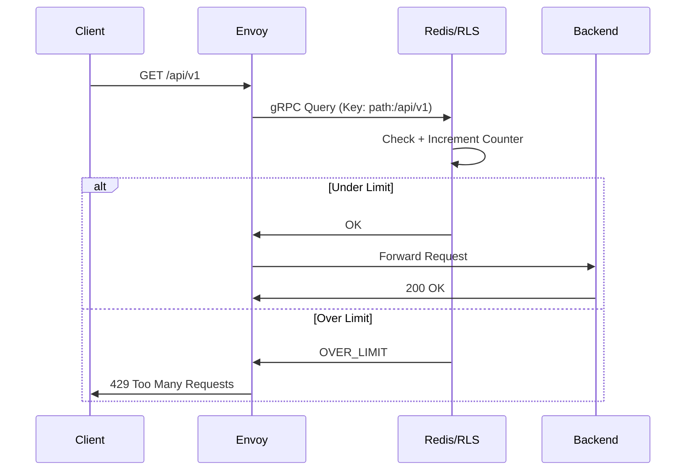
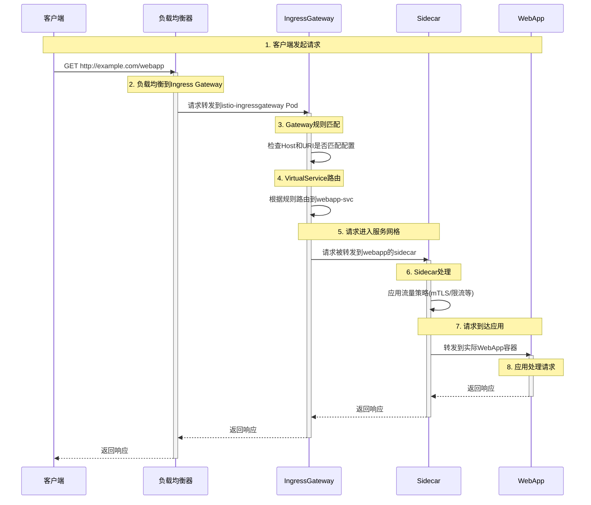
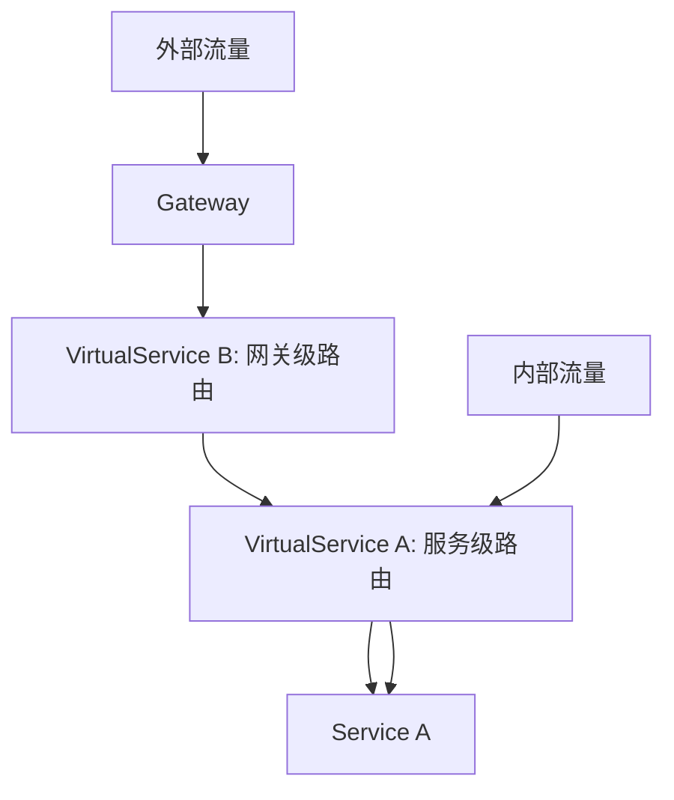
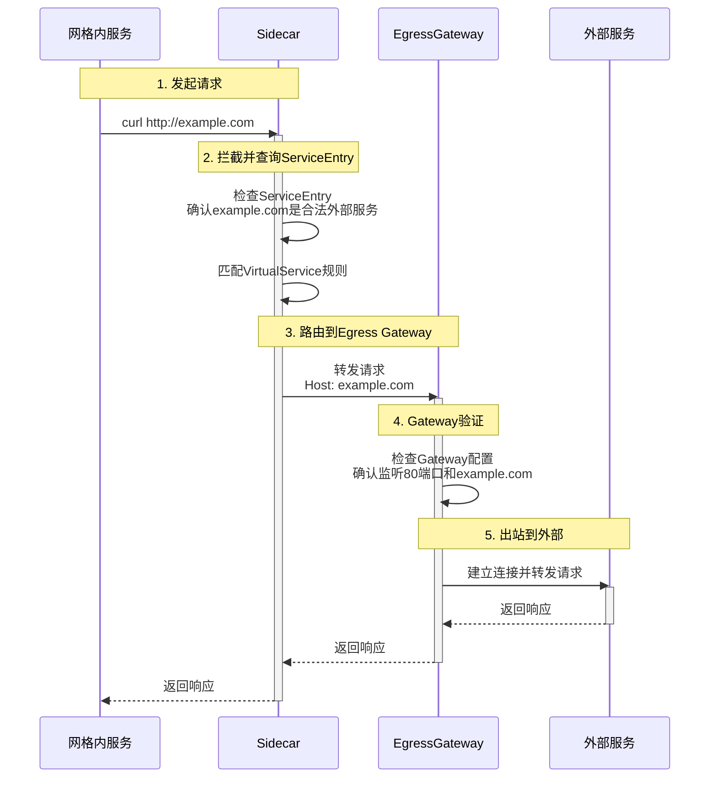
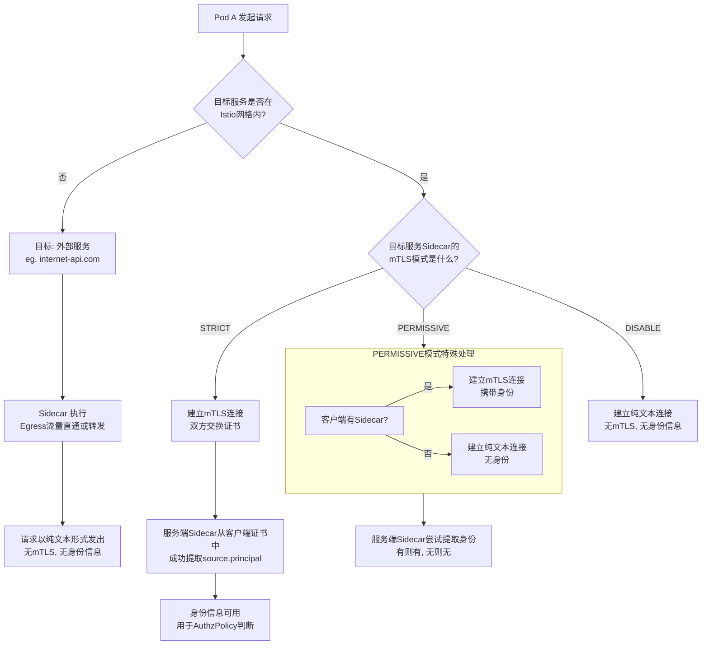

# Istio 及其生态调研

## 服务网格概念

服务网格（Service Mesh） 一词最早由开发 Linkerd 的 Buoyant 公司提出，并于 2016 年 9 月29 日第一次公开使用了这一术语。 Service Mesh 这一概念定义如下：

> 服务网格是一个专门处理服务之间通讯的基础设施层（在 kubernetes 的世界里，这个服务可以狭义的理解成就是 Kubernetes Service）。它的职责是在由云原生应用组成服务的复杂拓扑结构下进行可靠的请求传送。在实践中，它是一组和应用服务部署在一起的轻量级的网络代理，并且对应用服务透明。

服务网格从总体架构上来讲比较简单，不过是一堆紧挨着各项服务的用户代理，外加一组任务管理流程组成。代理在服务网格中被称为数据层或数据平面（data plane），管理流程被称为控制层或控制平面（control plane）。数据层截获不同服务之间的调用并对其进行“处理”；控制层协调代理的行为，并为运维人员提供 API，用来操控和测量整个网络。

关于服务网格概念更深入的理解，参考：

1. https://github.com/servicemesher/istio-handbook/blob/master/concepts/basic.md
2. https://github.com/servicemesher/istio-handbook/blob/master/concepts/microservices-in-post-kubernetes-era.md

## Istio 架构设计


Istio 服务网格在逻辑上分为数据平面和控制平面：

1. 控制平面 - 控制和管理数据平面中的 sidecar 代理，完成配置的分发、服务发现、和授权鉴权等功能。
   1. Pilot 组件的主要功能是将路由规则等配置信息转换为 sidecar 可以识别的信息，并下发给数据平面。可以把它简单的理解为是一个配置分发器（dispatcher），并辅助 sidecar 完成流量控制相关的功能。

   2. Citadel 是 Istio 中专门负责安全的组件，内置有身份和证书管理功能，可以实现较为强大的授权和认证等操作。

   3. Galley 是 Istio 1.1 版本中新增加的组件，其目的是将 Pilot 和底层平台（如 Kubernetes）进行解耦。它分担了原本 Pilot 的一部分功能，主要负责配置的验证、提取和处理等功能。

2. 数据平面 - 一组sidecar代理（Envoy / ztunnel / waypoint），负责调解和控制微服务之间的所有网络通信，以及收集和报告所有网格流量的可观测数据。Istio 的数据平面默认使用 Envoy 作为 sidecar 代理。

### Istiod

Istiod 提供服务发现、配置和证书管理。Istiod 将控制流量行为的高级路由规则转换为 Envoy 特定的配置， 并在运行时将其传播给 Sidecar。它提取了特定平台的服务发现机制， 并将其综合为一种所有符合 [Envoy API](https://www.envoyproxy.io/docs/envoy/latest/api/api) 的 Sidecar 都可以使用的标准格式。

## Sidecar vs Ambient

Istio 支持两种主要的数据平面模式（可以将某些命名空间或工作负载纳入任一模式）：

- **Sidecar 模式**，此模式会为集群中启动的每个 Pod 都部署一个 Envoy 代理， 或者与在虚拟机上运行的服务并行运行一个 Envoy 代理。
  - Sidecar模式的资源开销（CPU和内存）较大，因为网格内服务发送和接收的所有数据平面流量都经由 Envoy 代理，所以每个 pod 的 Sidecar 都需要申请一些固定资源，Sidecar 默认配置：100m cpu + 128Mi 内存。
  - Sidecar 可能对应用程序造成侵入破坏。

- **Ambient 模式**（没有Sidecar的服务网格），此模式在每个节点上开启轻量级的L4代理（ztunnel - 零信任隧道）， 同时支持可选的L7代理（waypoint proxy）。将 L4 和 L7 处理分为两个不同的层也是 Ambient 模式的核心创新。这种分层方法允许我们逐步采用 Istio， 从而实现从无网格到安全覆盖 (L4) 再到可选的完整 L7 处理的平稳过渡 — 根据需要， 按命名空间逐个进行，覆盖整个集群。
  - 轻量级共享 L4 节点代理称为 **[ztunnel](https://istio.io/latest/zh/docs/ambient/overview/#ztunnel)**（零信任隧道）。 ztunnel 是用 Rust 实现的，它消除了在集群中过度配置内存和 CPU 以处理预期负载的需求， 从而大幅降低了运行网格的开销。在某些用例中，节省的成本可能超过 90% 或更多， 同时仍使用具有加密身份的双向TLS、简单的 L4 授权策略和遥测提供零信任安全性。
  - L7 代理称为 **[waypoint](https://istio.io/latest/zh/docs/ambient/overview/#waypoint-proxies)**（ 基于 Envoy）。 waypoint 处理 L7 功能，例如流量路由、丰富的授权策略实施和企业级弹性。 waypoint 在应用程序部署之外运行，可以根据需求独立扩展， 可以是整个命名空间，也可以是命名空间内的多个服务。与 Sidecar 相比， 不需要每个应用程序 Pod 一个 waypoint，并且可以根据其范围有效地扩展 waypoint， 从而在大多数情况下节省大量 CPU 和内存。

Sidecar模式是稳定版且经过广泛的实践和验证，天然支持完整的 Istio 功能集（流量管理、安全、可观测性、可扩展性），而 Ambient 模式需要借助 waypoint 代理才能支持完整的 Isito 功能集；Sidecar模式支持多集群、多网络和虚拟机场景，而Ambient 模式暂不支持这些场景。Sidecar模式相比 Ambient 模式的缺点是资源消耗比较大，平均延迟更高（0.63ms-0.88ms）。
关于Sidecar 和 Ambient两种数据平面模式的详细对比可以参考：

1. https://istio.io/latest/zh/blog/2023/waypoint-proxy-made-simple/
2. [Sidecar 还是 Ambient？](https://istio.io/latest/zh/docs/overview/dataplane-modes/)

## 工作原理

参考资料：

1. https://jimmysong.io/blog/envoy-sidecar-routing-of-istio-service-mesh-deep-dive/
2. https://jimmysong.io/blog/envoy-sidecar-injection-in-istio-service-mesh-deep-dive/

### Sidecar 注入机制

Istio 通过 **自动 sidecar 注入（Automatic Sidecar Injection, ASI）** 或 **手动注入（Manual Injection）** 的方式，将 **Envoy 代理** 作为 Sidecar 容器添加到 Pod 中。具体来说，Istio 使用 **Mutating Admission Webhook** 在 Pod 创建时动态修改其 YAML 以添加 Envoy 容器。

1. 自动注入：启动 Istio 命名空间标签（`kubectl label namespace <your-namespace> istio-injection=enabled`）后，创建 pod 时，由于 `istio-injection=enabled`，API Server 调用 Istio 的 Mutating Webhook 自动进行 Pod 修改。Webhook 会在 `spec.containers` 里 插入一个名为 `istio-proxy` 的 Envoy sidecar 容器，在 `spec.initContainers` 里插入一个 `istio-init` 容器，同时添加 Istio 相关的环境变量和 `volumeMounts`。
2. 手动注入：`istioctl kube-inject -f deployment.yaml | kubectl apply -f -`。适用于 Webhook 未启用的环境（如 CI/CD 流水线）。如果不希望整个命名空间的应用都加入服务网格，毕竟 Sidecar 消耗资源比较大，也可以考虑使用手动注入的方式。也可以用kubectl来给pod模版添加标签来实现：`kubectl patch deployment -n default nginx -p '{"spec":{"template":{"metadata":{"labels":{"sidecar.istio.io/inject":"true"}}}}}'`

如果namespace禁止注入（`kubectl label namespace <your-namespace> istio-injection=disabled`），那么namespace下面的任何pod都不会被注入sidecar，即使单独添加注入标签都不行。

### Sidecar 如何拦截流量？

Istio 在 Pod 级别使用 iptables 规则来强制所有流量经过 Envoy：

1. `istio-init` 初始化容器负责设置 iptables 规则：

   - 将所有出站（egress）流量重定向到 Envoy 15001 端口。

   - 将所有入站（ingress）流量重定向到 Envoy 15006 端口。

   - 规则示例：

     ```bash
     $ iptables -t nat -A PREROUTING -p tcp --dport 80 -j REDIRECT --to-port 15006
     ```

2. Envoy 代理负责：

   - 解析 Istio 配置（如 `VirtualService` 和 `DestinationRule`）。
   - 执行 mTLS 认证、流量控制、负载均衡。
   - 通过 Pilot（istiod）动态获取路由规则。

### Istio 和 kube-proxy的关系

Istio 本身不会替代 Kubernetes Service 机制，仍然需要 `Service` 作为抽象。

默认地，Istio Sidecar 代理（Envoy）会拦截所有网格内部流量，因此 Service-to-Service 之间的流量不会经过 kube-proxy。**`istio-proxy` 代理（Envoy）会从 `istiod` 获取服务的 IP、端口、权重、流量规则，而不依赖 kube-proxy 的 `Endpoints` ，即 Istio 自己负责服务到 endpoint（pod 地址）的解析**。如果服务直接通过 Kubernetes Service (NodePort / LoadBalancer) 暴露，它仍然会依赖 `kube-proxy`， ClusterIP 解析也仍然由 kube-proxy 负责。

所以，kube-proxy 仍然存在于集群中，并继续管理：

1. 未加入 Istio 网格的 Pod 之间的通信。
2. 通过 NodePort、LoadBalancer 的访问流量。
3. 对 Kubernetes API Server (`curl https://kubernetes.default.svc.cluster.local`)的访问。
4. 部分 egress（外部流量）访问。

客户端通过 DNS 名字或 ClusterIP 访问目标服务时，存在以下场景：

|                           **场景**                           |                  **流量路径**                   | 备注                                                         |
| :----------------------------------------------------------: | :---------------------------------------------: | ------------------------------------------------------------ |
|               客户端和服务端均无 Istio Sidecar               |          `Client -> kube-proxy -> Pod`          |                                                              |
|              客户端有 Sidecar，服务端无 Sidecar              |    `Client -> Sidecar -> kube-proxy -> Pod`     | Sidecar 可能修改目标地址                                     |
|              客户端无 Sidecar，服务端有 Sidecar              | `Client -> kube-proxy -> 服务端 Sidecar -> Pod` |                                                              |
|                  客户端和服务端均有 Sidecar                  |  `Client -> Sidecar -> 服务端 Sidecar -> Pod`   | 完全绕过 `kube-proxy`                                        |
| 启用 Istio DNS 代理（通过 `meshConfig.enableAutoDNSSuffix`） |          `Client -> Sidecar -> Pod IP`          | 如果启用了 Istio 的 **DNS 代理**（通过 `meshConfig.enableAutoDNSSuffix`），Sidecar 可能直接返回 Pod IP 而非 `ClusterIP`，从而完全绕过 `kube-proxy`。 |

## 核心CRD 资源 

为了定位到 service registry（服务注册中心）， Istio 会连接到一个服务发现系统。在 Kubernetes 集群中， Istio 会自动检测集群中的服务和 endpoint（pod地址）。使用此服务注册中心，Envoy 代理可以将流量定向到相关服务。大多数基于微服务的应用程序， 每个服务的工作负载都有多个实例来处理流量，称为负载均衡池。

### 虚拟服务（VirtualService）

虚拟服务是 Istio 支持的一种 CRD 资源，用于对传统的服务进行更高级的抽象，通过虚拟主机和丰富的路由规则，它解耦了客户端请求的目标地址与实际响应请求的目标工作负载。使用虚拟服务和路由规则，我们可以为一个或者多个主机名指定流量行为，告诉 Envoy 如何发送虚拟服务的流量到适当的目标。路由目标地址可以是同一服务的不同版本， 也可以是完全不同的服务，这里的服务是多个网络 endpoints，这些 endpoints 由运行在 pod、容器甚至虚拟机内的工作负载提供服务。

>  虚拟服务 = 虚拟主机 + 路由规则。

下面是一个虚拟服务的示例：

```yaml
apiVersion: networking.istio.io/v1
kind: VirtualService
metadata:
  name: reviews
spec:
  hosts:
  # 虚拟的目标地址，可以是 IP 地址、DNS 名称，k8s service短名、FQDN，也可以使用通配符（*）；客户端使用这个主机名访问虚拟机服务；
  # k8s集群内部服务一般就使用service名字；
  # 通过网关对外暴露接口的服务一般会使用一个集群外DNS名字，客户端通过DNS名字或者 curl -HHost:xxx.com http://<ip>/ 访问时，流量就可以被正确路由，参考bookinfo VS
  - reviews
  http: # 包含了一组 HTTPRoute 路由规则
  - match:
    - headers:
        end-user:
          exact: jason
    route:
    - destination:
        host: reviews # 必须指向某个DR资源里的spec.host
        subset: v2
  - route:
    - destination:
        host: reviews
        subset: v3
```

1. 与虚拟服务的 `hosts` 不同，destination 的 host 必须是存在于 Istio 服务注册中心的实际目标地址，否则 Envoy 不知道该将请求发送到哪里。 可以是一个有代理的服务网格，或者是一个通过服务入口（service entry）被添加进来的非网格服务。
2. **路由规则**按从上到下的顺序选择，虚拟服务中定义的第一条规则有最高优先级。本示例中， 不满足第一个路由规则的流量均流向一个默认的目标，该目标在第二条规则中指定。因此， 第二条规则没有 match 条件，直接将流量导向 v3 子集。

如上所示的`http`提供L7的流量路由，虚拟服务还提供了 `tcp` 和 `tls` 来处理 L4 的报文和加密报文（`tls`也处理 https），以及其他的一些路由类型，具体参考：https://istio.io/latest/zh/docs/reference/config/networking/virtual-service。

VirtualService 的核心是路由规则，路由规则本身是可叠加的。如果多个 VirtualService 资源引用相同的 host 时，Istio 会按照特定规则合并和处理这些配置。 

 Istio 的 `VirtualService` 默认行为是：**如果没有匹配的规则，流量会使用默认路由（如果存在）或者直接透传到目标服务**。我们可以显式拒绝不匹配任何规则的流量：

```yaml
apiVersion: networking.istio.io/v1alpha3
kind: VirtualService
metadata:
  name: service-a
spec:
  hosts:
  - "service-a"
  http:
  - match:
    - uri:
        prefix: /api/public
    route:
    - destination:
        host: service-a
  
  # 显式拒绝所有其他流量
  - match:
    - uri:
        prefix: /  # 匹配所有路径
    fault:
      abort:
        percentage:
          value: 100  # 100% 拒绝
        httpStatus: 404  # 返回 404
    # 可选：添加响应头说明
    headers:
      response:
        set:
          x-block-reason: "path-not-allowed"
```

或者使用重定向：

```yaml
http:
- match:
    - uri:
        prefix: /api/public
    route:
    - destination:
        host: service-a
  
  # 重定向到指定页面
  - match:
    - uri:
        prefix: /
    redirect:
      uri: /api/not-found
      authority: error-service.default.svc.cluster.local
```


### 目的规则（DestinationRule）

虚拟服务定义了虚拟主机和路由规则，匹配规则的流量将被转发至目的主机（destination.host），在大多数时候，目的主机可能代表了一组工作负载（pod、vm ...），所以虚拟服务的路由决策并不决定流量会被路由到某个具体的工作负载。目的规则也是 Istio 的另一个重要的CRD 资源，用于配置路由到目的主机的流量应该如何分发，即目标规则将应用于流量的“真实”目标地址，这就涉及到了负载均衡的问题。

默认情况下， Envoy 代理基于**轮询调度（ROUND_ROBIN）**在服务的负载均衡池内分发流量，按顺序将请求发送给池中每个成员， 一旦所有服务实例均接收过一次请求后，就重新回到第一个池成员。Envoy 也支持其它的负载均衡策略，包括最少请求（LEAST_REQUEST，适合请求不均匀的场景）、随机（RANDOM，适合小规模服务）和 PASSTHRROUGH（透传，适合不想用 Istio 控制流量的外部服务），参考：https://www.envoyproxy.io/docs/envoy/latest/intro/arch_overview/upstream/load_balancing/load_balancers。

下面是目的规则的典型示例：

```yaml
apiVersion: networking.istio.io/v1
kind: DestinationRule
metadata:
  name: my-destination-rule
spec:
  host: my-svc # 这个host是注册中心存在的服务，包括k8s service， consul service，service entry
  trafficPolicy:
    loadBalancer:
      simple: RANDOM
  subsets:
  - name: v1
    labels:
      version: v1
  - name: v2
    labels:
      version: v2
    trafficPolicy:
      loadBalancer:
        simple: ROUND_ROBIN
  - name: v3
    labels:
      version: v3
```

1. 每个子集都是基于一个或多个 `labels` 定义的，这些 labels 将会用于匹配拥有相同 labels 的应用（deployment ..）然后组成服务子集（subsets），subset 也常被用于定于不同应用版本。
2. 目标规则对于所有子集都有默认的流量策略 `RANDOM`，也支持为指定子集指定策略覆盖默认流量策略。如上，定义在 `subsets` 上的默认策略，为 `v1` 和 `v3` 子集设置了一个简单的随机负载均衡器。在 `v2` 策略中，轮询负载均衡器被指定在相应的子集字段上。

如果多个 DestinationRule 资源引用相同的 Kubernetes Service 作为 host 时，后创建的配置会覆盖前面创建的配置。

关于 DestinationRule 的更多应用参考：https://istio.io/latest/zh/docs/reference/config/networking/destination-rule/

### 外部服务（Service Entry）

参考 [访问外部服务](https://istio.io/latest/zh/docs/tasks/traffic-management/egress/egress-control/)，IstioOperator 的 `meshConfig.outboundTrafficPolicy.mode`默认值为 `ALLOW_ANY`，所以网格内的服务也可以直接通过DNS名字访问集群外部服务，当我们将这个配置设置为 `REGISTRY_ONLY`后，开启白名单模式，网格内的服务就无法再访问外部服务。Istio 支持添加一个外部服务到 Istio 内部维护的服务注册中心，然后 Envoy 代理可以向添加的服务发送流量， 就好像它是网格内部的服务一样。配置外部服务（Service Entry）允许我们管理运行在网格外的服务的流量，它包括以下几种能力：

- 为外部目标重定向和转发请求，例如来自 Web 端的 API 调用，或者流向遗留老系统的服务。
- 为外部目标定义[重试](https://istio.io/latest/zh/docs/concepts/traffic-management/#retries)、[超时](https://istio.io/latest/zh/docs/concepts/traffic-management/#timeouts)和[故障注入](https://istio.io/latest/zh/docs/concepts/traffic-management/#fault-injection)策略。
- 添加一个运行在虚拟机的服务来[扩展您的网格](https://istio.io/latest/zh/docs/examples/virtual-machines/single-network/#running-services-on-the-added-VM)。

如下的服务入口将 `ext-svc.example.com` 外部依赖项添加到 Istio 的服务注册中心：

```yaml
apiVersion: networking.istio.io/v1
kind: ServiceEntry
metadata:
  name: svc-entry
spec:
  hosts:
  - ext-svc.example.com
  ports:
  - number: 443
    name: https
    protocol: HTTPS
  location: MESH_EXTERNAL
  resolution: DNS
```

> Istio 可能无法解析外部服务的 DNS 名字（在主机上的 /etc/hosst 上配置了也不一定ok），会导致代理报错 no healthy upstream。可以通过 resolution: STATIC 配置静态IP解析。

对于Service Entry 接入的外部服务，我们也可以配置虚拟服务和目的规则（不是必须的），以更细粒度的方式控制到服务入口的流量， 这与网格中的任何其他服务配置流量的方式相同：

```yaml
apiVersion: networking.istio.io/v1
kind: DestinationRule
metadata:
  name: ext-res-dr
spec:
  host: ext-svc.example.com
  trafficPolicy:
    connectionPool:
      tcp:
        connectTimeout: 1s
```

关于服务入口的更多细节参考：https://istio.io/latest/zh/docs/reference/config/networking/service-entry/

Service Entry主要用于直接接入外部的服务，但是并不能接入外部的服务注册中心。Istio 支持多服务注册中心，允许配置 Consul 作为默认服务注册中心，即执行`istioctl install --set meshConfig.defaultConfig.discoveryAddress=consul-server.default.svc:8500`。配置后，Kubernetes 集群中的 Service 仍然被 Istio 发现，Istio还会自动发现 Consul 中注册的服务，并将其加入服务网格，Kubernetes Pod 可以调用 Consul 注册的服务， Consul 注册的 VM 也可以调用 Kubernetes Pod。

> Istio 暂不支持直接接入 Eureka / Zookeeper 作为第三方服务注册中心。

### 边车代理（Sidecar）

默认情况下，Istio Sidecar(Envoy)会监听整个网格中的流量，包括：

1. 代理所有出站和入站流量
2. 监听整个 Istio 服务网格中的所有服务

参考 https://istio.io/latest/zh/blog/2023/waypoint-proxy-made-simple/ ：

> 在现有的 Sidecar 架构中，大多数流量形态（例如[请求路由](https://istio.io/latest/zh/docs/tasks/traffic-management/request-routing/) 或[流量转移](https://istio.io/latest/zh/docs/tasks/traffic-management/traffic-shifting/)或 [故障注入](https://istio.io/latest/zh/docs/tasks/traffic-management/fault-injection/)）策略由源（客户端）代理实现， 而大多数安全策略由目标（服务器）代理实现。每个源 Sidecar 都需要知道关于网格中每个其他目的地的信息。这是一个多项式扩缩问题。 更糟糕的是，如果任何目标配置发生变化，我们需要立即通知所有 Sidecar。

每个 Sidecar 需要保存网格中全量的配置信息，随着网格中工作空间和工作负载的增加，控制面需要向 Sidecar 分发的配置几乎是指数级增长，也会导致 Sidecar 占用的资源快速增长。如果希望限制 Sidecar 的作用范围，就可以使用 Sidecar 资源定义这些行为，例如：

1. 只监听本 Namesapce 内的流量，减少资源消耗
2. 仅允许特定出站流量，增强安全性。
3. 细粒度的控制 Envoy 代理的配置，优化网络流量。
4. 隔离租户流量，在多租户环境中，防止租户之间的流量访问。

## 灰度发布

### 金丝雀发布（Canary Release）

金丝雀发布（Canary Release）是一种渐进式部署方式，发布过程中新版本与旧版本并存，各自处理部分访问流量。例如，允许新版本先在一小部分用户中运行，再逐步推广到全部用户。金丝雀发布的最佳实践：

- 流量分级：
  - **固定用户组**：指定某些测试用户访问新版本（如特定 IP 或地区）。
  - **流量比例**：使用  Istio 逐步增加新版本流量，比如 5% → 20% → 50% → 100%。
- 监控与告警：
  - **关键指标监控**：如 延迟、错误率、CPU、内存、数据库查询性能。
  - **自动回滚**：结合 Prometheus + Alertmanager 或  Kubernetes HPA 实现自动回滚。
- A/B 测试结合：
  - **金丝雀版本**可用于 **A/B 测试**，收集用户反馈并优化新版本。

在 Kubernetes + Istio 的生态中有两种主流的灰度发布工具：Argo Rollouts 和 Flagger。下面是 Argo Rollouts 和 Flagger 两个项目的对比分析：

| 特性        | Argo Rollouts                                                | Flagger                                                      |
| ----------- | ------------------------------------------------------------ | ------------------------------------------------------------ |
| 目标场景    | 提供高级部署策略，包括金丝雀、蓝绿、渐进式发布<br />高度可定制，支持复杂场景，例如多阶段金丝雀+手动验证 | 自动化金丝雀发布、蓝绿部署（需手动扩展）、A/B测试、流量管理<br />开箱即用，适合标准化流程 |
| 集成方式    | 深度集成 Kubernetes API，使用 Rollout CRD 资源（替代原生 Deployment）<br />需要手动定义VirtualService 和 DestinationRule<br /> | Canary 资源（与原生 Deployment 配合）<br />相比于Argo Rollouts，Flagger 自动化程度更高，和 Istio 集成更加紧密，例如自动创建 Deployment、Service、VirtualService 和 DestinationRule<br />基于kubernetes 原生的 工作负载，与已有的监控、可视化系统等兼容性更好。 |
| 自动回滚    | 手动触发或者基于分析结果自动回滚                             | 失败时自动回滚（基于指标阈值）并支持自定义 Webhook 校验      |
| 指标分析    | 依赖外部工具（Prometheus等）                                 | 内置 Prometheus、Webhook、Kubernetes Events                  |
| UI / 可视化 | 配合 Argo CD 提供 Dashboard                                  | 可与 Kiali、Grafana、Meshery集成                             |

> 复杂场景下，可使用 Flagger 自动化金丝雀发布，使用Argo Rollouts 管理蓝绿部署。

Argo Rollouts 通过定义的 Rollout CRD 来代替Kubernetes 原生 Deployment 资源以支持金丝雀发布，并且需要用户自定义 Istio 虚拟机服务和目的规则这些资源，在现有系统进行集成时比较麻烦，比如无法利用 K8s 现有的资源可视化编辑能力，也无法针对用户已经创建的应用直接创建灰度发布任务。

Flagger 通过 Canary CRD 资源引用Kubernetes 原生的 Deployment 等资源来支持金丝雀发布，并且支持自动创建和更新Istio 虚拟机服务和目的规则这些资源，发布失败时自动回滚，还支持自定义 webhook 在金丝雀发布的各个阶段进行负载测试。总之， Flagger 与 Istio 生态和 K8s集群功能兼容性更好一些。

### 蓝绿部署

蓝绿部署（Blue-Green Deployment）是一种零停机的部署方法，它维护两个不同版本的生产环境：

- **蓝（Blue）环境**：当前线上运行的版本
- **绿（Green）环境**：新版本的应用

当新版本准备就绪时：

1. 绿环境部署新版本并完成测试。
2. 通过切换流量（通过 Istio、负载均衡或 DNS 切换）到绿环境。
3. 观察一段时间后，蓝环境可作为回滚选项。

最佳实践：

- **数据库兼容性**：确保新旧版本数据库兼容，使用 版本化数据库迁移（如 Flyway、Liquibase） 进行管理。
- **环境隔离**：蓝绿环境需完全隔离，包括数据库、缓存等，以免影响老版本。
- **流量切换策略**：使用  Istio 进行流量路由控制。
- **回滚机制**：切换回蓝环境时要保证数据一致性，如避免有状态应用的数据丢失。所以，蓝绿部署更适用于无状态应用。
- **自动化**：借助 CI/CD（如 ArgoCD、Flux、Jenkins）实现自动化部署和流量切换。

蓝绿部署 vs 金丝雀发布：

| 特性         | 蓝绿部署                       | 金丝雀发布                             |
| ------------ | ------------------------------ | -------------------------------------- |
| **切换方式** | 一次性全量切换                 | 逐步增加流量                           |
| **回滚方式** | 直接回滚到旧环境               | 停止流量并回滚                         |
| **风险控制** | 需要确保新版本完全无问题       | 可以在小范围测试后放大影响力           |
| **适用场景** | 适用于无状态应用、大型版本更新 | 适用于需要谨慎验证的变更，如金融、SaaS |

如果应用需要 **快速切换且无状态**，蓝绿部署是不错的选择；如果你的应用需要 **逐步放量并监控影响**，金丝雀发布更合适。

基于 Flagger 的蓝绿部署： https://docs.flagger.app/usage/deployment-strategies#blue-green-deployments

### 流量镜像（Traffic Mirroring）

流量镜像是 Istio 提供的一种流量复制功能，可以将实时请求复制到另一个服务（新版本 / 不同的服务），而不影响原始流量的处理，主要应用场景：

1. A/B测试（灰度测试）：让新版本的服务接收真实流量的副本进行测试，而不影响实际用户。
2. 日志分析：通过镜像流量，分析应用在真实负载下的行为。
3. 实时故障排查：复制流量到测试环境，复现生产环境问题。
4. 性能评估：对比不同版本的服务在相同负载下的性能。

流量镜像也是通过虚拟服务里的 `http`路由规则来配置，可以设置流量复制的比例。

注意：流量镜像适合于那些幂等的或者支持被处理两次（primary 和 canary）的请求。如果我们的请求被处理两次会对生产环境数据造成破坏，例如 primary 和 canary 服务后端连接着相同的数据存储，那么写请求被处理两次就可能对数据造成破坏，除非接口本身是幂等的。

## 流量管理

### 超时 & 重试 & 故障注入

超时是 Envoy 代理等待来自给定服务的答复的时间量，以确保服务不会因为等待答复而无限期的挂起， 并在可预测的时间范围内调用成功或失败。HTTP 请求的默认超时时间是 15 秒， 这意味着如果服务在 15 秒内没有响应，调用将失败。为了找到并使用最佳超时设置， Istio 允许使用[虚拟服务](https://istio.io/latest/zh/docs/concepts/traffic-management/#virtual-services)按服务轻松地动态调整超时，而不必修改业务代码。

重试设置指定如果初始调用失败，Envoy 代理尝试连接服务的最大次数。 重试可以通过确保调用不会由于暂时性问题（例如临时过载的服务或网络）而永久失败， 从而提高服务可用性和应用程序性能。重试之间的间隔（25ms+）是可变的，由 Istio 自动确定， 防止被调用的服务被请求淹没。HTTP 请求的默认重试行为是在返回错误之前重试两次。

超时、重试和故障注入都是在虚拟服务中配置，如下：

```yaml
apiVersion: networking.istio.io/v1
kind: VirtualService
metadata:
  name: ratings
spec:
  hosts:
  - ratings
  http:
  - route:
    - destination:
        host: ratings
        subset: v1
    timeout: 10s # 超时配置
    retries:     # 重试配置
      attempts: 3
      perTryTimeout: 2s
```

> 一般地，超时和重试机制都是在应用程序中实现，并通过配置项来控制超时时间和重试次数等细节，并且可以在程序日志中打印超时和重试的细节。 Envoy 代理处理超时和重试的好处是可以更方便的做动态调整，也可以简化应用程序的编码工作。但是，如果 Envoy 和应用程序同时加入了超时和重试处理，则会引入很多奇怪的问题。


在配置了网络，包括故障恢复策略之后，可以使用 Istio 的故障注入机制来为整个应用程序测试故障恢复能力。 故障注入是一种将错误引入系统以确保系统能够承受并从错误条件中恢复的测试方法。 使用故障注入特别有用，能确保故障恢复策略不至于不兼容或者太严格，这会导致关键服务不可用。

> 警告：**目前，故障注入配置不能与同一个虚拟服务上的重试或超时配置相结合。**

Istio 支持注入两种故障，它们都使用[虚拟服务](https://istio.io/latest/zh/docs/concepts/traffic-management/#virtual-services)配置：

- 延迟：延迟是时间故障。它们模拟增加的网络延迟或一个超载的上游服务。
- 终止：终止是崩溃失败。他们模仿上游服务的失败。终止通常以 HTTP 错误码或 TCP 连接失败的形式出现。

例如，下面的虚拟服务为千分之一的访问 `ratings` 服务的请求配置了一个 5 秒的延迟：

```yaml
apiVersion: networking.istio.io/v1
kind: VirtualService
metadata:
  name: ratings
spec:
  hosts:
  - ratings
  http:
  - fault:
      delay:
        percentage:
          value: 0.1
        fixedDelay: 5s
    route:
    - destination:
        host: ratings
        subset: v1
```

### 熔断降级

熔断机制用于设置一个对服务中的单个主机调用的限制，例如并发连接的数量或对该主机调用失败的次数。 一旦限制被触发，熔断器就会“跳闸”并停止连接到该主机。 使用熔断模式可以快速失败而不必让客户端尝试连接到过载或有故障的主机。

和超时 & 重试机制不同，熔断机制主要通过配置目的规则里的`trafficPolicy`来实现，下面的示例将 v1 子集的 `reviews` 服务工作负载的 tcp 并发连接数限制为 100：

```yaml
apiVersion: networking.istio.io/v1
kind: DestinationRule
metadata:
  name: reviews
spec:
  host: reviews
  subsets:
  - name: v1
    labels:
      version: v1
    trafficPolicy:
      connectionPool:
        tcp:
          maxConnections: 100
```

案例参考：https://istio.io/latest/zh/docs/tasks/traffic-management/circuit-breaking/

### 限流

限流可以控制服务的流量压力，避免服务实例因为过大的流量压力被击穿。

| 方案                                                | 适用场景                      | 性能影响       | 复杂度 |
| :-------------------------------------------------- | :---------------------------- | :------------- | :----- |
| 基于`AuthorizationPolicy`的单实例限流               | 简单条件限流（如命名空间/IP） | 低             | 低     |
| 基于`EnvoyFilter` + 外部限流服务（redis）的全局限流 | 全局配额，分布式系统          | 高（网络调用） | 高     |

#### 单实例限流

在 Istio 中，`AuthorizationPolicy` 主要用于**访问控制**（如黑白名单、JWT 验证等），但其内置的 `DENY` 规则和条件匹配能力可以间接实现**简单限流**（如基于请求频率、IP、路径等）。不过，相比专业的限流工具（如 `EnvoyFilter` 或外部限流服务），`AuthorizationPolicy` 的限流功能较为基础，适合轻量级场景。例如：

```yaml
# 限制单个IP的请求频率
apiVersion: security.istio.io/v1beta1
kind: AuthorizationPolicy
metadata:
  name: rate-limit-by-ip
  namespace: foo
spec:
  selector:
    matchLabels:
      app: my-service
  action: DENY  # 拒绝超过阈值的请求
  rules:
  - from:
    - source:
        ipBlocks: ["1.2.3.4"]  # 目标 IP
    when:
    - key: request.count       # 请求计数
      values: ["100"]         # 每分钟超过 100 次则拒绝
      notValues: ["0-99"]     # 允许 0-99 次
      
# 限制 dev 命名空间的请求
apiVersion: security.istio.io/v1beta1
kind: AuthorizationPolicy
metadata:
  name: rate-limit-dev-ns
  namespace: foo
spec:
  selector:
    matchLabels:
      app: my-service
  action: DENY
  rules:
  - from:
    - source:
        namespaces: ["dev"]      # 来源命名空间
    when:
    - key: request.count
      values: ["200"]           # 每分钟最多 200 次
      
# 限制携带特定 Header 的请求频率
apiVersion: security.istio.io/v1beta1
kind: AuthorizationPolicy
metadata:
  name: rate-limit-bots
  namespace: foo
spec:
  selector:
    matchLabels:
      app: my-service
  action: DENY
  rules:
  - when:
    - key: request.headers[user-agent]
      values: ["Bot"]          # 匹配 Header
    - key: request.count
      values: ["20"]           # 每分钟最多 20 次
```

- `AuthorizationPolicy` 的限流是 **统计窗口内的总数控制**（如每分钟 100 次），无法实现**令牌桶**或**漏桶算法**等高级限流。使用 `AuthorizationPolicy` 实现的限流规则是每个 Pod 独立生效的，不会跨 Pod 聚合数据。这是因为`AuthorizationPolicy` 的限流逻辑是基于 Envoy Sidecar 的本地统计，各 Pod 的 Sidecar 之间不会共享请求计数状态。例如：
  - 如果设置 `DENY` 规则限制每分钟 100 次请求，**每个 Pod 都会允许自己接收最多 100 次请求**，而不是所有 Pod 共享 100 次的全局配额。
  - 若有 10 个 Pod，实际总限流阈值是 `100 × 10 = 1000` 次/分钟。
- 不支持**分布式限流**（各 Pod 独立计数，无法全局共享状态）。
- 适合保护单个 Pod 免受过载（如防止单实例被突发流量打垮）。不适合需要精确控制全局请求量的场景（如 API 全局限流）。

#### 全局限流

基于 **EnvoyFilter + Redis** 可以实现分布式全局限流，如下是相关工作原理、Istio-Envoy-Redis 的交互流程：

核心组件：

| 组件                  | 角色                                                         |
| :-------------------- | :----------------------------------------------------------- |
| **Envoy Sidecar**     | 拦截请求，向 Redis 限流服务发起查询，根据响应决定放行或拒绝。 |
| **Redis**             | 存储全局请求计数，实现令牌桶/漏桶算法。                      |
| **RateLimit Service** | 可选组件（如 [Envoy RLS](https://github.com/envoyproxy/ratelimit))，作为中间层处理复杂逻辑。 |

工作流程：

1. **请求匹配**：
   Envoy 根据 `VirtualService` 路由请求，并提取限流 Key（如 `path: /api/v1`）。
2. **gRPC 查询**：
   Envoy 通过 `RateLimit` 过滤器向 Redis/RLS 发送 gRPC 查询（包含 Key 和阈值）。
3. **Redis 处理**：
   - Redis 使用 `INCR` 命令统计计数，通过 `TTL` 实现时间窗口。
   - 若计数超限，返回 `OVER_LIMIT`；否则返回 `OK`。
4. **Envoy 响应**：
   - 若 `OK`：转发请求到后端服务。
   - 若 `OVER_LIMIT`：返回 `429`。



详细配置参考： https://istio.io/latest/docs/tasks/policy-enforcement/rate-limit/

## 网关管理

主要通过 Gateway 资源来管理进入网格和从网格出去的流量，也支持 kubernetes Gateway API。

### 进入网关(Ingress)

默认情况下，集群外部无法直接访问网格服务，需要通过配置进入网关来将网格服务暴露到集群外部。下面是一个配置入口网关的案例：

```yaml
# 1. 先注册一个k8s服务
---
apiVersion: v1
kind: Service
metadata:
  name: nginx
  namespace: default
spec:
  selector:
    app: nginx
  ports:
    - protocol: TCP
      port: 80
      targetPort: 80

# 2. 创建入口网关
# 可以创建多个入口网关（主机不同），然后同一个虚拟服务同时引用这些入口网关
apiVersion: networking.istio.io/v1alpha3
kind: Gateway
metadata:
  name: nginx-gateway
  namespace: default
spec:
  selector:
    istio: ingressgateway # 使用默认的 ingressgateway
  servers:
  - port:
      number: 80 # ingressgateywa pod监听的端口。对于默认的监听端口：https - 8443；http - 80，也可以指定ingressgateywa service 的端口，即80和443；
      name: http # 
      protocol: HTTP # 监听的协议类型（HTTP/HTTPS/GRPC/GRPC-WEB/HTTP2/MONGO/TCP/TLS），这里的协议必须和后端服务的实际协议保持一致。
    hosts:
    - "nginx.servicemesh.com" # 配置监听的域名
    - "*.servicemesh.org" # 支持通配符

# 3.配置虚拟服务，虚拟服务一般先于网关创建，只需要添加 spec.gateways 配置项引用创建好的网关资源即可
# 当我们创建虚拟服务并绑定网关的时候，对应的ingressgateway pod就会监听指定的端口准备处理入口流量，即使真正的后端服务还没有被创建出来。
apiVersion: networking.istio.io/v1alpha3
kind: VirtualService
metadata:
  name: nginx
  namespace: default
spec:
  hosts:
  - "nginx.servicemesh.com" # 匹配Gateway中定义的host
  - "*.servicemesh.org" 
  gateways:
  - "nginx-gateway" # 引用上面定义的Gateway
  http:
  - match:
    - uri:
        prefix: /index.html
    route:
    - destination:
        host: nginx.default.svc.cluster.local # 目标K8s服务
        port:
          number: 80
```

入口网关流量走向图解如下：



图中的负载均衡器不是必须的，也可以直接将 IngressGateway 的Service 通过 NodePort 暴露出来。

`VirtualService.gateways` 字段决定规则作用于哪些网关或网格内部：

- `gateways: ["my-gateway"]`：仅对通过 `my-gateway` 进入服务网格的流量生效，不影响内部流量。对于网关流量，`VirtualService.hosts` 必须与 `Gateway.hosts` 匹配，否则路由无效。
- `gateways: ["mesh"]`：仅对服务间直接访问生效。对于服务间流量，`VirtualService.hosts` 需匹配目标服务的 DNS 名称。
- 不配置 `gateways`：**默认同时作用于网关和网格内部**（需谨慎使用）。

所以，通过合理配置 `hosts` 和 `gateways`，可以精确控制路由规则的生效范围。

### 两级虚拟服务设计

通过两级 `VirtualService` 来实现流量分层管理，既保证了内部流量的灵活性，又增强了外部访问的安全性，如下所示：




VirtualService A负责处理所有到达 Service A 的流量（包括内部和外部）；网关级 VirtualService B 只暴露部分接口到外部，作为入口流量过滤器。具体配置如下：

```yaml
# VirtualService A负责处理所有到达 Service A 的流量（包括内部和外部）
apiVersion: networking.istio.io/v1alpha3
kind: VirtualService
metadata:
  name: service-a  # 建议与服务同名，便于管理
  namespace: default
spec:
  hosts:
  - "service-a.default.svc.cluster.local"  # 服务的 FQDN
  - "service-a"  # 短名称（用于集群内访问）
  # 不指定 gateways，默认同时作用于网格和网关流量
  http:
  - match:
    - uri:
        prefix: /api/v1
    route:
    - destination:
        host: service-a.default.svc.cluster.local
        subset: v1
    timeout: 2s
    retries:
      attempts: 3
      perTryTimeout: 1s
  
  - match:
    - uri:
        prefix: /api/v2
    route:
    - destination:
        host: service-a.default.svc.cluster.local
        subset: v2
  
  - match:
    - uri:
        prefix: /internal/
    route:
    - destination:
        host: service-a.default.svc.cluster.local
    # 内部接口的特定策略
    corsPolicy:
      allowOrigins:
      - exact: "*"
  
  - route:  # 默认路由
    - destination:
        host: service-a.default.svc.cluster.local
        subset: default

# 网关级 VirtualService B 只暴露部分接口到外部，作为入口流量过滤器
# virtualservice-b-gateway.yaml
apiVersion: networking.istio.io/v1alpha3
kind: VirtualService
metadata:
  name: service-a-gateway
  namespace: default
spec:
  hosts:
  - "api.example.com"  # 外部域名
  - "service-a.example.com"  # 专用外部域名
  gateways:
  - "my-gateway"  # 只绑定到网关，不影响内部流量
  http:
  - match:
    - uri:
        prefix: /api/v1/public
    route:
    - destination:
        host: service-a.default.svc.cluster.local  # 最终指向服务A
    # 网关级安全策略
    headers:
      response:
        set:
          Strict-Transport-Security: "max-age=31536000"
  
  - match:
    - uri:
        prefix: /api/v2/approved
    route:
    - destination:
        host: service-a.default.svc.cluster.local
  
  - match:
    - uri:
        prefix: /status
    route:
    - destination:
        host: service-a.default.svc.cluster.local
  
  # 显式拒绝其他所有外部访问
  - match:
    - uri:
        prefix: /
    fault:
      abort:
        percentage:
          value: 100
        httpStatus: 403
    headers:
      response:
        set:
          x-blocked-by: "gateway-policy"

```


### 出口网关(Egress)

参考前面外部服务资源部分的描述，将 IstioOperator 的 `meshConfig.outboundTrafficPolicy.mode`配置为 `REGISTRY_ONLY`后，我们通过创建 ServiceEntry 资源来将外部服务注册到 Istio 注册中心。

网格中的服务访问这些外部服务时，流量直接走客户端  Envoy 代理出去（如下图所示），这会导致外出流量的管理比较麻烦，包括审计、日志等方面。

```txt
┌─────────────┐    ┌───────────┐    ┌──────────────┐
│ 网格内服务   │───>│ Sidecar   │───>│ 外部服务     │
└─────────────┘    └───────────┘    └──────────────┘
       │                  │                  │
       │ 1. curl example.com │ 2. 检查 ServiceEntry │ 3. 直接访问
```

最佳实践是，访问外部服务的流量也通过统一的出口网关（Egress Gateway）出去，流量路径如下图所示：

```tex
┌─────────────┐    ┌───────────┐    ┌──────────────────┐    ┌──────────────┐
│ 网格内服务   │───>│ Sidecar   │───>│ Egress Gateway   │───>│ 外部服务     │
└─────────────┘    └───────────┘    └──────────────────┘    └──────────────┘
       │                  │                    │                     │
       │ 1. 发起请求      │ 2. 检查            │ 3. 验证并           │ 4. 处理
       │ curl example.com │ ServiceEntry       │ 转发请求            │ 请求
       │                  │ 匹配VirtualService │                     │
```

> 使用出口网关需要在 IstioOperator 里配置 `spec.components.egressGateways`，并确保 istio-system 空间下相应的 egressgateway pod正常运行。 

对比分析这两种方式：

| **特性**       | **直接访问（无 Egress Gateway）**                           | **通过 Egress Gateway 访问**                      |
| :------------- | :---------------------------------------------------------- | :------------------------------------------------ |
| **配置复杂度** | ✅ 简单（仅需 `ServiceEntry` + `DestinationRule(optional)`） | ❌ 复杂（需额外配置 `Gateway` + `VirtualService`） |
| **安全性**     | ❌ Sidecar 直接连接外部，无集中管控                          | ✅ 统一出口，可实施全局 TLS/mTLS、访问控制         |
| **监控与日志** | ❌ 分散在各个 Sidecar，难聚合                                | ✅ 集中监控 Egress Gateway 的流量                  |
| **性能影响**   | ✅ 直接连接，延迟更低                                        | ❌ 多一跳（经 Gateway），轻微延迟                  |
| **适用场景**   | - 开发测试环境 - 不敏感的外部调用                           | - 生产环境 - 需要审计/安全管控的外部访问          |
| **协议支持**   | ✅ 支持 HTTP/HTTPS/TCP                                       | ✅ 支持，并可额外做协议转换（如 HTTP → HTTPS）     |
| **DNS 控制**   | ❌ 依赖集群 DNS 解析                                         | ✅ 可在 Gateway 层统一管理 DNS                     |

下面给出一个走出口网关访问外部服务的配置案例：

```yaml
# ServiceEntry - 服务声明
# 作用： 告诉Istio："example.com"是一个允许访问的外部服务，不直接参与流量转发，但没有它，请求会被Sidecar拦截并拒绝
apiVersion: networking.istio.io/v1alpha3
kind: ServiceEntry
metadata:
  name: external-http
spec:
  hosts:
  - example.com       # 外部服务域名
  ports:
  - number: 80        # 服务端口
    name: http
    protocol: HTTP
  resolution: DNS     # 通过DNS解析IP

# Gateway -出口门户
# 作用：在Egress Gateway Pod上打开80端口，只接受Host头为example.com的请求
apiVersion: networking.istio.io/v1alpha3
kind: Gateway
metadata:
  name: istio-egressgateway
spec:
  selector:
    istio: egressgateway  # 绑定到Egress Gateway Pod
  servers:
  - port:
      number: 80
      name: http
      protocol: HTTP
    hosts:
    - example.com         # 允许处理的域名

# VirtualService - 路由导航
apiVersion: networking.istio.io/v1alpha3
kind: VirtualService
metadata:
  name: route-via-egress
spec:
  hosts:
  - example.com
  gateways:
  - mesh               # 匹配网格内发出的请求
  - istio-egressgateway # 匹配Gateway收到的请求
  http:
  - match:
    - gateways:
      - mesh           # 来自网格内部的请求
      port: 80
    route:
    - destination:
        host: istio-egressgateway.istio-system.svc.cluster.local  # 导向Gateway
        port:
          number: 80
  - match:
    - gateways:
      - istio-egressgateway # Gateway收到的请求
      port: 80
    route:
    - destination:
        host: example.com  # 最终目标
        port:
          number: 80
```

详细的流量处理流程图：




## 可观测性

Istio 生成以下类型的遥测数据，以提供对整个服务网格的可观测性：

- [**指标**](https://istio.io/latest/zh/docs/concepts/observability/#metrics)。
- [**分布式追踪**](https://istio.io/latest/zh/docs/concepts/observability/#distributed-traces)。Istio 为每个服务生成分布式追踪 span， 运维人员可以理解网格内服务的依赖和调用流程。
- [**访问日志**](https://istio.io/latest/zh/docs/concepts/observability/#access-logs)。当流量流入网格中的服务时， Istio 可以生成每个请求的完整记录，包括源和目标的元数据。 此信息使运维人员能够将服务行为的审查控制到单个[工作负载实例](https://istio.io/latest/zh/docs/reference/glossary/#workload-instance)的级别。

### 指标

Istio 支持代理级别、服务级别和控制平面级别的监控指标：

- 代理级别指标：Istio 指标收集从 Sidecar 代理（Envoy）开始。Istio 支持在每个工作负载实例上选择生成和收集哪个 Envoy 指标。 默认情况下，Istio 只支持 Envoy 生成的统计数据的一小部分， 以避免依赖过多的后端服务，还可以减少与指标收集相关的 CPU 开销。
- 服务级别指标：涵盖了四个基本的服务监控需求：延迟、流量、错误和饱和情况。Istio 提供了一组默认的基于这些服务指标的 Grafana 网格监控仪表板，参考https://istio.io/latest/zh/docs/tasks/observability/metrics/using-istio-dashboard/。
- 控制平面指标：允许监控 Istio 自己的行为（与网格内的服务指标有所不同）。

### 链路追踪

Istio 支持通过 Envoy 代理进行分布式（链路）追踪，代理自动为其应用程序生成追踪 span， 只需要应用程序转发适当的请求上下文即可。

Istio 提供了 [Telemetry API](https://istio.io/latest/zh/docs/tasks/observability/distributed-tracing/telemetry-api/)， 可用于配置分布式链路追踪，包括选择提供商、 设置[采样率](https://istio.io/latest/zh/docs/tasks/observability/distributed-tracing/sampling/)和修改标头。Istio 支持很多追踪系统，包括 [Jaeger](https://istio.io/latest/zh/docs/tasks/observability/distributed-tracing/jaeger/)、 [Zipkin](https://istio.io/latest/zh/docs/tasks/observability/distributed-tracing/zipkin/)， 以及许多支持 [OpenTelemetry](https://istio.io/latest/zh/docs/tasks/observability/distributed-tracing/opentelemetry/) 的工具和服务。 

1. Zipkin 主要用于 Spring Cloud Sleuth 生态，适合于小规模轻量级部署，不需要复杂的存储方案。

2. Jaeger 兼容 Zipkin 格式的数据，所以可以使用 Zipkin 协议收集和存储追踪数据。相比于 Zipkin，Jaeger 有如下优势：
   1. Jaeger 可以与 Kiali 进行可视化集成。
   2. Jaeger 云原生支持更好，更适合于 Kubernetes 和 Istio 生态，适用于大规模数据存储和查询。


> OpenTelemetry 是一个开源的可观测性框架和工具集，旨在将遥测数据的生成、导出和收集标准化，参考官网：https://opentelemetry.io/docs/what-is-opentelemetry/ 和 https://opentelemetry.opendocs.io/docs/demo/architecture/

下面我们主要考虑基于Envoy、 OpenTelemetry (OTel) 和 Jaeger 的链路追踪方案，涉及数据采集、处理、存储和可视化：

1. Envoy： 负责拦截请求并生成 Trace 数据。在 Istio 的`meshConfig.defaultConfig.tracing`配置采样率和 OTel 地址即可。
   1. Envoy 代理拦截 HTTP/gRPC 请求，创建`Root Span`，其代表整个请求的入口；
   2. Envoy 将 Trace ID 添加到请求头（`x-b3-traceid`、`x-b3-spanid`）。
   3. 下游服务接收请求时，从 HTTP header解析 Trace ID。（可选）如果服务程序集成了 OpenTelemetry SDK，可以创建子 Span 并关联 Trace ID；
   4. 请求继续传递时，Trace 相关请求头附带在请求头中。
   5. Envoy 通过 OTLP（OTel Protocol ）或 Jaeger 格式发送 Span 到 OTel Collector；Span 发送策略支持定期批量发送、超时发送等。
2. OTel Collector 负责收集、处理和发送 Trace 数据到 Jaeger。OTel Collector相关内部组件：
   1. Receiver：接收 Envoy 发送的 Span。
   2. Processor：过滤、转换、批处理 Trace 数据。
   3. Exporter：将数据发送到 Jaeger / Prometheus 等后端。
3. Jaeger 负责存储和可视化链路追踪数据。

追踪数据的流向：Envoy → OTel Collector → Jaeger。其中，OTel Collector 并不是必须的，Envoy 也可以直接将 Trace 数据发送到 Jaeger 后端。但是更推荐配置 OTel Collector 作为中间层，它可以对追踪数据做聚合、过滤或转换（如 Zipkin 格式转 OTLP），并且减轻 Jaeger 的直接负载，支持多后端分发（如同时发送到 Jaeger 和云服务）。

Span 是请求的基本追踪单元，表示单个操作或者调用。一个 Trace 由多个 Span 组成，这些 Span 通过 Trace ID关联起来，形成完整的调用链。Span 关键属性：Trace ID、Span ID、Parent Span ID、Start & End Time（记录操作开始和结束时间）、Attributes（额外的元数据，比如HTTP 方法和状态码）、Events（记录某些关键事件，比如错误和重试）。

> 关于 Span 的更多解释参考：https://opentelemetry.opendocs.io/docs/concepts/signals/traces/

尽管 Envoy 代理能够自动发送 span，但需要一些附加信息才能将这些 span 加到同一个调用链。 所以当代理发送 span 信息的时候，应用程序需要附加适当的 HTTP 请求头信息，这样才能够把多个 span 加到同一个调用链。要做到这一点，每个应用程序必须从每个传入的请求中收集请求头，并将这些请求头转发到传入请求所触发的所有传出请求中。 具体选择转发哪些请求头取决于所配置的链路追踪后端，但是 `x-request-id` 、 `traceparent` 和 `tracestate` 这3个 header是必须要转发的。

> 防止应用误操作丢弃了这些`x-b3-xxx`  Trace header，可使用 EnvoyFilter 强制保留 Trace header。还有某些API Gateway 或者负载均衡器（Nginx、Traefik）可能会丢弃这些 Trace header，可以检查它们的配置来避免。

使用 [OpenTelemetry](https://opentelemetry.io/) 作为链路追踪的标准，并默认会将链路信息上报到可观测模块，如果您希望使用链路追踪功能，需要在应用中引入 OpenTelemetry 的 SDK，并在应用中配置好链路追踪的参数，具体可以参考 [OpenTelemetry 官方文档](https://opentelemetry.io/docs/)。

或者如果想简单使用，可以简单的透传 W3C 标准的 TraceContext，详细可以参考 [W3C TraceContext](https://www.w3.org/TR/trace-context/)。 即：将 request 请求中的 **traceparent** 和 **tracestate** 请求头发送到需要被请求的消息头中即可。

### 网格可视化

Istio 官方社区提供了一个 `Kiali` 插件来实现网格可视化，即使用基于 Web 的图形用户界面来查看网格和 Istio 配置对象的服务图，参考：https://istio.io/latest/zh/docs/tasks/observability/kiali/。

除了 `Kiali`，还有一些服务网格可视化项目可供选择，例如 `Meshery`和`Gloo Mesh`，下面是它们的对比：

| 可视化工具 | Web UI 管理能力（自动化流...）                               | 特色 & 应用场景                                              | 资费                                             | 结论                                       |
| ---------- | ------------------------------------------------------------ | ------------------------------------------------------------ | ------------------------------------------------ | ------------------------------------------ |
| Kiali      | 1. 不支持可视化创建编辑 VirtualService、Destination、Gateway资源；支持在 UI 里 `Istio Config` 修改 YAML<br />2. 支持完整的网络拓扑图和实时流量监控可视化，支持 Istio 规则分析<br />3. 金丝雀发布：可以和 `Flagger`结合来支持自动化金丝雀发布和基于监控指标的自动回滚，但是不支持可视化创建编辑金丝雀发布策略；可以集成 Prometheus 监控金丝雀发布状态<br />4. Kiali 还支持和链路追踪 Jaeger 进行集成。参考 https://kiali.io/docs/features/tracing/<br />5. Kiali 支持多集群管理（单个service mesh），参考 https://kiali.io/docs/features/multi-cluster/ | 1. 网络拓扑图和流量可视化，包括展示金丝雀发布和蓝绿部署过程中的流量切换 | 免费                                             | OK                                         |
| Meshery    | 1. 支持可视化编辑 VirtualService、Destination、Gateway资源<br />2. 只支持基础的网络拓扑（显示 Istio 控制的微服务之间的连接关系），不如 Kiali 详细，也不支持流量实时监控<br />2.金丝雀发布：支持 Web 创建金丝雀发布策略，原生不支持自动回滚，可以和 `Flagger`结合来支持基于监控指标的自动回滚；可以集成 Prometheus 监控金丝雀发布状态<br />3. 支持A/B测试和蓝绿部署<br />4. 兼容 GitOps（ArgoCD、FluxCD） | 1. 可视化编辑<br />2. 支持多种 Service Mesh，包括 Istio、Linkerd 和 Cilium | 免费                                             | 暂不考虑，可借鉴其可视化编辑资源的接口设计 |
| Gloo Mesh  | 1. 比 Kiali 和 Meshery 更强的 Web UI<br />2. 原生支持A/B测试和自动化蓝绿部署；<br />3. 原生支持自动化金丝雀发布及基于指标（Prometheus / Istio Telemetry / 请求错误率）的自动回滚<br />4. 兼容 GitOps（ArgoCD、FluxCD） ，支持 CI/CD<br /> | 1. 企业级、大规模、多集群 Istio 服务网格管理<br />           | 企业版收费；开源版仅提供最基础的服务网格管理能力 | 暂不考虑                                   |

 

### 访问日志

## 安全

> 参考 [Istio 安全概念](https://istio.io/latest/zh/docs/concepts/security/)

Istio 主要通过 `AuthorizationPolicy` 、`PeerAuthentication`和 `RequestAuthentication` 这几个 CRD 资源来管理服务间访问控制、用户身份认证和请求授权。

### 身份认证

Istio 身份模型使用经典的 `Service Identity`（服务身份）来确定一个请求源端的身份。在 Kubernetes 集群中，一般使用 Kubernetes 服务帐户作为服务身份。

Istio 支持的身份认证方式：

1. JWT
2. mTLS（双向 TLS）
3. OAuth2 / OIDC

### 访问控制

Istio 支持的访问控制：

1. 基于角色（RBAC，Role-Based Access Controller）
2. 基于属性（ABAC，Attribute-Based Access Controller）
3. 基于 URI 路径、HTTP 方法、客户端IP地址等细粒度的控制

`AuthorizationPolicy` 资源直接控制服务或者工作负载的访问策略，下面这些原则是非常重要的：

1. 如果没有配置 `AuthorizationPolicy` 资源，默认允许所有访问。

2. **一旦定义了动作为 ALLOW的 `AuthorizationPolicy` 资源，默认拒绝所有未明确允许的访问。任何访问都需要明确允许，即创建相应的动作为 ALLOW 的 `AuthorizationPolicy`。**但是只创建动作为 DENY 的资源，则只有被规则明确匹配的流量会被拒绝，其它流量仍被允许。比如只配置了一个拒绝来自ns1空间的策略，则来自其它空间里的访问流量仍会被允许。

3. 可以组合多个 `AuthorizationPolicy` 资源以实现复杂的访问控制。策略优先级如下所示，简单说就是在上面两条基本原则的前提下，有DENY策略明确拒绝了，那请求也会被直接拒绝，没有拒绝规则再看看有没有配置任何ALLOW策略，没有的话则直接放行，有的话则必须有明确的ALLOW策略允许才放行。

   

网络上有很多文章，以及很多AI给出的方案里，都是上来就先配置一个如下的全局的DENY策略先拒绝所有访问，然后再去基于ServiceAccount 或者 IP 去配置ALLOW规则，结果不管怎么配置ALLOW规则，客户端都收到了 RBAC: access denied。因为即使有另一个 `ALLOW` 策略允许请求，但由于 `DENY` 策略优先于 `ALLOW` 策略，所以将始终拒绝请求。 如果想要临时禁用对工作负载的所有访问，可以使用此策略。这也算是一个初学者容易踩的坑了。

```yaml
apiVersion: security.istio.io/v1
kind: AuthorizationPolicy
metadata:
  name: deny-all
spec:
  action: DENY
  # rules 字段有一个空白规则，策略将始终匹配。
  rules:
  - {}
```

#### principals和namespaces

principals 用于配置基于身份的白名单（最安全，网格内最佳实践）；namespaces 用于配置基于命名空间的白名单。案例如下所示：

```yaml
apiVersion: security.istio.io/v1beta1
kind: AuthorizationPolicy
metadata:
  name: allow-list-by-sa
  namespace: default # 策略生效的命名空间
spec:
  # 策略目标：匹配哪些工作负载
  selector:
    matchLabels:
      app: demo-service
  # 动作：ALLOW（白名单） | DENY（黑名单） | CUSTOM
  action: ALLOW
  # 规则列表
  rules:
  - from:
    - source:
        # 关键：使用服务账户进行白名单控制
        principals: ["cluster.local/ns/default/sa/allowed-sa"]
  - from:
    - source:
        # 关键：使用命名空间进行白名单控制
        namespaces: ["default"]
    # 可以进一步限制to和when，例如只允许访问特定API
    # to:
    # - operation:
    #     methods: ["GET"]
    #     paths: ["/api/v1/health"]
```

#### mTLS与身份

Istio 的身份机制依赖于 **双向 TLS（mTLS）**。服务账户信息（`source.principal`）不是作为一个HTTP头（Header）来传递的，而是作为 **mTLS握手证书的一部分** 进行加密和验证的。

1. **Sidecar代理的职责**：当Pod A（客户端）试图调用Pod B（服务端）时，流量首先被Pod A的Istio Sidecar（Envoy）劫持。
2. **发起mTLS连接**：Pod A的Sidecar会与Pod B的Sidecar建立一个mTLS连接。在这个握手过程中，双方会交换并验证对方的证书。
3. **证书与身份的映射**：Istio自动为每个工作负载颁发证书。这个证书中包含的身份信息格式为：
   `spiffe://<cluster-domain>/ns/<namespace>/sa/<service-account>`
   例如：`spiffe://example.com/ns/default/sa/my-client-sa`
4. **策略执行**：服务端（Pod B）的Sidecar在收到请求时，会从客户端的证书中提取出这个身份信息（`source.principal`），然后用它来比对已配置的 `AuthorizationPolicy` 规则。

身份传递的流程图：




从上图可以看出，要确保服务账户信息被可靠传递，必须满足以下**两个条件**：

1. **目标服务在Istio网格内**：即目标Pod也有Istio Sidecar注入。
2. **目标服务配置了STRICT模式的mTLS**：这是最关键的一点。只有在这种模式下，网格内服务间的通信才**强制**使用mTLS，从而保证身份信息100%被传递和验证。经过实际测试来看，加入服务网格的工作负载也可以不配置STRICT模式的mTLS。

如果目标服务或者客户端不在网格内（例如，访问互联网上的API），那么Sidecar通常不会为其建立mTLS，身份信息也就无从谈起。即使配置了基于服务账号的ALLOW规则也无法访问。

#### ipBlocks和 remoteIpBlocks

和基于服务账号和命名空间的规则不同，基于IP的规则（`ipBlocks`和`remoteIpBlocks`）的判断远早于对mTLS连接的解密和身份提取过程，它只依赖于最基础的网络层信息，因此完全不需要依赖mTLS。

 `ipBlocks` 和 `remoteIpBlocks` 的区别在于**施加策略的代理的视角**不同。

- **`ipBlocks`**：指的是直接连接到当前代理的客户端IP地址。

- **`remoteIpBlocks`**：指的是原始客户端的IP地址，通常出现在X-Forwarded-For等头中，用于经过代理链的情况，所以常用于配置通过Istio网关进入的流量的客户端IP地址。但是，Istio网关服务的类型也会影响到`remoteIpBlocks`规则的有效性：

  - Istio网关使用的 Service 最好是LoadBalancer Service（云厂商首选），因为云厂商提供的 LoadBalancer Service 通常能够配置为**保留客户端IP**（例如，AWS NLB、GCP Load Balancer 都有此功能）。

  - 如果Istio网关使用的 Service 是 NodePort类型，`kube-proxy` 会对数据包进行 SNAT（Source Network Address Translation）：它将数据包的**源IP地址（即客户端的真实IP）** 替换为**该节点本身某个Pod的IP地址**（或者是节点自己的IP，取决于网络插件配置）。然后，这个被修改过的数据包才被转发到运行在Pod中的 Istio Ingress Gateway。从 Istio Ingress Gateway 的视角来看，所有请求都好像来自于集群内部的某个节点或Pod，它根本无法看到原始的客户端IP。所以，设置的 `remoteIpBlocks` 规则就失效了。此时，如果 `remoteIpBlocks`里放开了集群内节点IP地址，就等于放开了所有客户端IP地址。

  - 如果是在自有机房（Bare Metal）部署，没有云负载均衡器，可以考虑让 Ingress Gateway Pod 直接使用宿主机的网络命名空间和端口。这个方案的缺点是网关Pod 需要调度到不同节点以避免端口冲突，需要自己管理负载均衡（如外部DNS轮询）。

    ```yaml
    # Gateway Deployment 配置示例
    spec:
      template:
        spec:
          hostNetwork: true # 使用主机网络
          dnsPolicy: ClusterFirstWithHostNet
          containers:
          - name: istio-proxy
            ports:
            - containerPort: 80
              hostPort: 80 # 直接使用主机端口
              protocol: TCP
            - containerPort: 443
              hostPort: 443
              protocol: TCP
    ```

最好不要去配置基于pod ip地址的规则，没有太大意义，除非是需要放开整个集群的pod IP网段。


## 插件管理


## 接入规范

将云原生服务加入服务网格，需要遵守一定的规范：https://docs.daocloud.io/mspider/intro/app-spec


# 部署实践

## 平台要求

[集群节点上的 Linux 内核模块要求](https://istio.io/latest/zh/docs/ops/deployment/platform-requirements/)

## 安装Istio

### istioctl vs helm

官方社区支持 istioctl 和 helm 两种方式安装 istio 及其插件，这两种安装方式区别如下：

|   **特性**    |                  **Istioctl**                   |              **Helm**              |
| :-----------: | :---------------------------------------------: | :--------------------------------: |
| **设计定位**  |      Istio 官方 CLI 工具，专为 Istio 定制       |     Kubernetes 通用包管理工具      |
| **配置方式**  |       通过 `IstioOperator` CRD 声明式配置       |  通过 Helm Values 文件参数化配置   |
|  **灵活性**   | 支持细粒度组件定制（如 Pilot、Ingress Gateway） |  依赖 Helm Chart 预定义的模板参数  |
| **版本管理**  |        与 Istio 版本严格绑定，更新同步快        | 依赖 Helm Chart 更新，可能存在延迟 |
| **升级/回滚** |          提供 `istioctl upgrade` 命令           |     需依赖 Helm 的版本管理机制     |
| **调试能力**  |       集成验证和诊断命令（如 `analyze`）        |  依赖 Helm 和 Kubernetes 原生工具  |

Istio 官方明确推荐使用 `istioctl`，原因包括：

- **深度集成**：直接操作 `IstioOperator` API，避免 Helm 的模板抽象层。
- **安全性**：自动验证配置合法性（如 `istioctl validate`），减少错误配置风险。
- **可维护性**：提供 `istioctl dump` 和 `istioctl bug-report` 等运维辅助工具。

- **Helm 仍被支持但非首选**，适合特定场景（如与 ArgoCD 等 GitOps 工具集成）。

为了方便，这里仍然使用 helm 离线安装。参考官网https://istio.io/latest/zh/docs/setup/install/helm/安装即可，如果是离线环境可以先将helm charts保存成压缩包：

```bash
$ helm repo add istio https://istio-release.storage.googleapis.com/charts
$ helm repo update
$ helm repo list
NAME    URL
istio   https://istio-release.storage.googleapis.com/charts
$ helm search repo istio
NAME                    CHART VERSION   APP VERSION     DESCRIPTION
istio/istiod            1.24.2          1.24.2          Helm chart for istio control plane
istio/istiod-remote     1.23.4          1.23.4          Helm chart for a remote cluster using an extern...
istio/ambient           1.24.2          1.24.2          Helm umbrella chart for ambient
istio/base              1.24.2          1.24.2          Helm chart for deploying Istio cluster resource...
istio/cni               1.24.2          1.24.2          Helm chart for istio-cni components
istio/gateway           1.24.2          1.24.2          Helm chart for deploying Istio gateways
istio/ztunnel           1.24.2          1.24.2          Helm chart for istio ztunnel components
$ helm pull istio/base --version 1.24.2
$ helm pull istio/istiod --version 1.24.2
$ helm pull istio/gateway --version 1.24.2
$  ls
base-1.24.2.tgz  gateway-1.24.2.tgz  istiod-1.24.2.tgz  pilot_1.24.2.tar  proxyv2_1.24.2.tar  ztunnel-1.24.2.tgz
```

### 安装istio-base & istiod

helm离线安装（安装失败可以执行`helm uninstall`后重新执行`helm install`）：

```bash
# （必选）安装istio-base
$ helm install istio-base base-1.24.2.tgz -n istio-system --set defaultRevision=default --create-namespace

# （必选）安装istiod，需要提前准备好镜像：docker.io/istio/pilot:1.24.2
$ helm install istiod istiod-1.24.2.tgz -n istio-system --wait --debug
helm status istio-ingress -n istio-ingress | grep STATUS
STATUS: deployed
$ helm ls -n istio-system
NAME            NAMESPACE       REVISION        UPDATED                              STATUS          CHART           APP VERSION
istio-base      istio-system    1               2025-02-07 07:12:38.836039502 +0000 UTC deployed        base-1.24.2     1.24.2   
istiod          istio-system    1               2025-02-08 03:38:15.674650595 +0000 UTC deployed        istiod-1.24.2   1.24.2

```

### 安装istio-ingress（可选）

```bash
# （可选）安装istio-ingress的，需要提前准备好镜像：docker.io/istio/proxyv2:1.24.2
$ helm install istio-ingress gateway-1.24.2.tgz -n istio-ingress --create-namespace --wait --debug

# 在新窗口将istio-ingress deploy的容器imagePullPolicy改成IfNotPresent
$ kubectl edit deploy -n istio-ingress istio-ingress

# 如果Kubernetes集群没有配置LoadBalancer类型的Service支持（默认不支持）
# 还需要把istio-ingress svc的类型改成NodePort或者ExternalIP，否则上面的install会一直卡住
# 调试信息显示错误：Service does not have load balancer ingress IP address
$ kubectl patch svc istio-ingress -n istio-ingress -p '{"spec":{"type":"NodePort"}}'
service/istio-ingress patched

$ kubectl get svc -A| grep istio
istio-ingress   istio-ingress                          NodePort    10.233.37.203   <none>        15021:32495/TCP,80:31702/TCP,443:31795/TCP   6d17h
istio-system    istiod                                 ClusterIP   10.233.41.102   <none>        15010/TCP,15012/TCP,443/TCP,15014/TCP        6d17h

# 检查istio-ingress的状态为deployed
$ helm ls -n istio-ingress
NAME            NAMESPACE       REVISION        UPDATED                                 STATUS          CHART           APP VERSION
istio-ingress   istio-ingress   1               2025-02-08 05:34:35.600491712 +0000 UTC deployed        gateway-1.24.2  1.24.2
```

现在，`http://<host ip>:31702`就是集群中Istio服务网格的入口地址，任何进入该端口的流量多会被`kube-proxy`路由到 `istio-ingress`空间里的`istio-ingress` pod来进行处理：

```bash
$ kubectl get endpoints -n istio-ingress
NAME            ENDPOINTS                                                AGE
istio-ingress   10.233.97.144:15021,10.233.97.144:80,10.233.97.144:443   30d

$ kubectl get pod -n istio-ingress -o wide | grep ingress
istio-ingress-89d7cc74c-c769c   1/1     Running   1 (23h ago)   30d   10.233.97.144   master   <none>           <none>
```
### 安装Gateway API CRD（可选）

Istio 支持 Kubernetes [Gateway API](https://istio.io/latest/zh/blog/2024/gateway-mesh-ga/)， 并计划将其作为未来流量管理的默认 API。

```bash
$ kubectl apply -f https://github.com/kubernetes-sigs/gateway-api/releases/download/v1.2.0/experimental-install.yaml
```

## 部署Bookinfo示例程序

参考：https://istio.io/latest/zh/docs/examples/bookinfo/

Bookinfo 应用可细分为四个独立的微服务：

- `productpage`：这个微服务会调用 `details` 和 `reviews` 两个微服务，用来填充页面内容。
- `details`：这个微服务中包含了书籍的信息。
- `reviews`：这个微服务中包含了书籍相关的评论。它还会调用 `ratings` 微服务。
- `ratings`：这个微服务中包含了由书籍评论组成的评级信息。

`reviews` 微服务有 3 个版本：

- v1 版本不会调用 `ratings` 服务。
- v2 版本会调用 `ratings` 服务，并使用 1 到 5 个黑色星形图标来显示评分信息。
- v3 版本会调用 `ratings` 服务，并使用 1 到 5 个红色星形图标来显示评分信息。

```bash
# 需要先准备好镜像：docker.io/istio/examples-bookinfo-productpage-v1:1.20.2,docker.io/istio/examples-bookinfo-details-v1:1.20.2,docker.io/istio/examples-bookinfo-ratings-v1:1.20.2,docker.io/istio/examples-bookinfo-reviews-v1:1.20.2,docker.io/istio/examples-bookinfo-reviews-v2:1.20.2,docker.io/istio/examples-bookinfo-reviews-v3:1.20.2
$ kubectl apply -f https://raw.githubusercontent.com/istio/istio/release-1.24/samples/bookinfo/platform/kube/bookinfo.yaml

# 给default名字空间打上如下标签后，default名字空间的所有pod在启动时都会自动被注入istio-proxy sidecar，相应的deployment并不会被注入
$ kubectl label namespace default istio-injection=enabled

# 启动了3个不同版本的reviews服务
$ kubectl get pod | egrep "details|ratings|reviews"
details-v1-649d7678b5-lld8p                   2/2     Running   0              69m
ratings-v1-794db9df8f-phxnh                   2/2     Running   0              69m
reviews-v1-7f9f5df695-9vplr                   2/2     Running   0              69m
reviews-v2-65c9797659-rx5bx                   2/2     Running   0              69m
reviews-v3-84b8cc6647-cdgjx                   2/2     Running   0              69m

# 在pod内用curl命令访问api
$ kubectl exec "$(kubectl get pod -l app=ratings -o jsonpath='{.items[0].metadata.name}')" -c ratings -- curl -sS productpage:9080/productpage | grep -o "<title>.*</title>"
<title>Simple Bookstore App</title>
```

### 配置Bookinfo Gateway

为了集群外部可以访问bookinfo应用，还需要配置如下的 Bookinfo Gateway，要指定路由并让 Gateway 按预期工作，必须把 Gateway 绑定到 VirtualService上：

```bash
# 注意： 
# 	1. 使用helm部署的Isito Gateway，需要将bookinfo-gateway.yaml里Gateway的selector改成：istio=ingress
#   2. bookinfo-gateway.yaml里Gateway的http端口需要改成80，因为istio-ingress service的路由端口只有80，没有8080
$ kubectl apply -f https://raw.githubusercontent.com/istio/istio/release-1.24/samples/bookinfo/networking/bookinfo-gateway.yaml
$ cat bookinfo-gateway.yaml
apiVersion: networking.istio.io/v1
kind: Gateway
metadata:
  name: bookinfo-gateway
spec:
  # The selector matches the ingress gateway pod labels.
  # If you installed Istio using Helm following the standard documentation, this would be "istio=ingress"
  selector:
    istio: ingress # use istio default controller
  servers:
  - port:
      number: 80
      name: http
      protocol: HTTP
    hosts:
    - "*"
---
apiVersion: networking.istio.io/v1
kind: VirtualService
metadata:
  name: bookinfo
spec:
  hosts:
  - "*"
  gateways:
  - bookinfo-gateway
  http:
  - match:
    - uri:
        exact: /productpage
    - uri:
        prefix: /static
    - uri:
        exact: /login
    - uri:
        exact: /logout
    - uri:
        prefix: /api/v1/products
    route:
    - destination:
        host: productpage
        port:
          number: 9080

root@master:~/hebo/istio# kubectl get service productpage -o yaml
apiVersion: v1
kind: Service
metadata:
  labels:
    app: productpage
    service: productpage
  name: productpage
  namespace: default
  resourceVersion: "13243420"
  uid: 5d21ecc3-b5c4-4276-93f9-f07c24363d65
spec:
  clusterIP: 10.233.21.143
  clusterIPs:
  - 10.233.21.143
  internalTrafficPolicy: Cluster
  ipFamilies:
  - IPv4
  ipFamilyPolicy: SingleStack
  ports:
  - name: http
    port: 9080
    protocol: TCP
    targetPort: 9080
  selector:
    app: productpage
  sessionAffinity: None
  type: ClusterIP
status:
  loadBalancer: {}
```

注意，K8s Gateway API和Istio Gateway API在命名上有冲突，如果已经部署了K8s Gateway API，查询 Istio Gateway 的时候需要加上API group：

```bash
$ kubectl api-resources | grep gateways
gateways                             gtw                        gateway.networking.k8s.io/v1        true         Gateway
gateways                             gw                         networking.istio.io/v1              true         Gateway
$ kubectl get gateways.v1.networking.istio.io
NAME               AGE
bookinfo-gateway   17m

$ export INGRESS_NAME=istio-ingress
$ export INGRESS_NS=istio-ingress
$ kubectl get svc "$INGRESS_NAME" -n "$INGRESS_NS"
NAME            TYPE       CLUSTER-IP     EXTERNAL-IP   PORT(S)                                      AGE
istio-ingress   NodePort   10.233.15.50   <none>        15021:31699/TCP,80:31702/TCP,443:31556/TCP   127m

$ export INGRESS_HOST=$(kubectl get po -l istio=ingress -n "${INGRESS_NS}" -o jsonpath='{.items[0].status.hostIP}')
$ export INGRESS_PORT=$(kubectl -n "${INGRESS_NS}" get service "${INGRESS_NAME}" -o jsonpath='{.spec.ports[?(@.name=="http2")].nodePort}')
$ export SECURE_INGRESS_PORT=$(kubectl -n "${INGRESS_NS}" get service "${INGRESS_NAME}" -o jsonpath='{.spec.ports[?(@.name=="https")].nodePort}')
$ export TCP_INGRESS_PORT=$(kubectl -n "${INGRESS_NS}" get service "${INGRESS_NAME}" -o jsonpath='{.spec.ports[?(@.name=="tcp")].nodePort}')
$ export GATEWAY_URL=$INGRESS_HOST:$INGRESS_PORT
$ echo $GATEWAY_URL
192.168.9.20:31702

$ curl -s "http://${GATEWAY_URL}/productpage" | grep -o "<title>.*</title>"
<title>Simple Bookstore App</title>
```

现在也可以在浏览器访问`http://192.168.9.20:31702/productpage`。 如果刷新几次应用的页面，就会看到 `productpage` 页面会以轮询的方式展示不同版本的 `reviews` 服务 （红色星形、黑色星形或者没有星形）。`reviews` 服务出现这种情况是因为我们还没有使用 Istio 来控制版本的路由。

> 所有集群外部访问`http://192.168.100.1:31551/productpage`的流量先进入 istio-ingress pod，然后 istio-ingress pod 根据 Gateway 和 VirtualService 将指定的 uri 路径的流量路由到 productpage 服务的 9080端口。因为我们还没有配置任何 Bookinfo 服务内部的 VirtualService 和 DestinationRule，所以进入  productpage 服务 9080 端口的流量仍然由 kube-proxy 配置的 iptables或者ipvs 规则来转发给 productpage-v1 这个pod，至于 productpage-v1 访问 reviews 服务时流量会被路由到哪个版本的 pod 里，就取决于 kube-proxy 支持的路由策略了。从结果来看，流量是被随机路由到了3个不同版本的 reviews  pod 里了。

### 定义应用版本（subset）

```bash
$ kubectl apply -f https://raw.githubusercontent.com/istio/istio/release-1.24/samples/bookinfo/networking/destination-rule-all.yaml
```

为了将细粒度的控制请求路由，我们可以对后端服务的应用进行版本划分，即通过`DestinationRule`资源定义`subsets`。如下所示，每个subset实际上是通过label selector将不同版本的应用进行分组，这意味着相应的应用deployment需要打上匹配的标签。有了应用分组后，Istio 就可以根据`VirtualService`  配置的路由规则将流量路由到不同版本的应用里，从而实现服务新版本的灰度发布和金丝雀发布。

```yaml
---
apiVersion: networking.istio.io/v1
kind: DestinationRule
metadata:
  name: reviews
spec:
  host: reviews
  subsets:
  - name: v1
    labels:
      version: v1
  - name: v2
    labels:
      version: v2
  - name: v3
    labels:
      version: v3
```

## 流量管理

在前面Bookinfo实例程序的基础上配置`VirtualService`和`DestinationRule`来更细粒度的控制内部访问流量。

### 配置请求路由

参考https://istio.io/latest/zh/docs/tasks/traffic-management/request-routing/

例如，下面这个配置规则可以实现将所有reviews请求都路由到v1版本pod：

```bash
$ kubectl apply -f https://raw.githubusercontent.com/istio/istio/release-1.24/samples/bookinfo/networking/virtual-service-all-v1.yaml
$ cat virtual-service-all-v1.yaml
apiVersion: networking.istio.io/v1
kind: VirtualService
metadata:
  name: productpage
spec:
  hosts:
  - productpage
  http:
  - route:
    - destination:
        host: productpage
        subset: v1
---
apiVersion: networking.istio.io/v1
kind: VirtualService
metadata:
  name: reviews
spec:
  hosts:
  - reviews
  http:
  - route:
    - destination:
        host: reviews
        subset: v1
---
apiVersion: networking.istio.io/v1
kind: VirtualService
metadata:
  name: ratings
spec:
  hosts:
  - ratings
  http:
  - route:
    - destination:
        host: ratings
        subset: v1
---
apiVersion: networking.istio.io/v1
kind: VirtualService
metadata:
  name: details
spec:
  hosts:
  - details
  http:
  - route:
    - destination:
        host: details
        subset: v1
---
```

### 基于请求header的路由

下面这个 VirtualService 的规则可以实现将jason用户发起的reviews请求都路由到v2版本pod，即基于用户身份的路由：

```bash
$ kubectl apply -f  https://raw.githubusercontent.com/istio/istio/release-1.24/samples/bookinfo/networking/virtual-service-reviews-test-v2.yaml
$ cat virtual-service-reviews-test-v2.yaml
apiVersion: networking.istio.io/v1
kind: VirtualService
metadata:
  name: reviews
spec:
  hosts:
    - reviews
  http:
  - match:
    - headers:
        end-user:
          exact: jason
    route:
    - destination:
        host: reviews
        subset: v2
  - route:
    - destination:
        host: reviews
        subset: v1
```

### 基于权重的路由

也可以通过在`VirtualService`里配置路由权重来决定将不同比例的请求路由到不同版本的服务pod里，通过调整`VirtualService`也可以实现服务版本的平滑升级，即逐步调整新老版本的请求路由权重，确认稳定后将所有请求路由到新版本。更多细节参考：https://istio.io/latest/zh/docs/tasks/traffic-management/traffic-shifting/。

使用Istio基于权重或者基于用户身份的路由，结合Kubernetes的弹性伸缩HPA能力，就可以实现金丝雀发布。比如开始90%的流量路由到老版本服务，设置HPA就可以根据负载情况启动更多的老版本应用副本，当只有10%的流量被路由到老版本服务就自动缩减副本，参考：https://istio.io/latest/zh/blog/2017/0.1-canary/。

## 灰度发布

## 可观测性

###  生成 bookinfo 访问流量

在实践可观测性特性时，我们主要还是基于之前的 Bookinfo 服务。为了更好的观测数据，可以实现一个测试脚本周期性地去访问 `http://192.168.9.20:31702/productpage`。

```bash
#!/bin/bash

# 目标URL
URL="http://192.168.9.20:31702/productpage"

# 静默模式访问，丢弃响应内容
while true; do
  curl -s "$URL" > /dev/null  # -s 静默模式，> /dev/null 丢弃输出
  sleep 0.01                  # 支持小数秒的sleep实现（推荐Linux系统）
  # 如果系统不支持小数秒，可改用：usleep 10000  # 微秒单位（需安装GNU coreutils）
done
```

如果集群拥有 DNS 名字，可以参考 https://istio.io/latest/zh/docs/tasks/observability/gateways/#configuring-remote-access 通过 Istio 网关和虚拟服务来配置域名方式访问各个遥测插件服务，包括 grafana、kiali 等。为了方便，这里都直接采用了 NodePort 来直接暴露相关的服务，但不推荐在生产环境使用此方法。

### 部署 Prometheus Addon

Prometheus 插件是预先配置抓取 Istio 端点收集指标的 Prometheus 服务器。

> 参考： https://istio.io/latest/zh/docs/tasks/observability/metrics/querying-metrics/

```bash
$ docker load -i prometheus_v2.54.1.tar
Loaded image: prom/prometheus:v2.54.1
$ docker load -i prometheus-config-reloader_v0.76.0.tar
Loaded image: ghcr.io/prometheus-operator/prometheus-config-reloader:v0.76.0
$ kubectl apply -f prometheus.yaml # 可将service临时改成NodePort方便访问Prometheus dashboard
serviceaccount/prometheus created
configmap/prometheus created
clusterrole.rbac.authorization.k8s.io/prometheus created
clusterrolebinding.rbac.authorization.k8s.io/prometheus created
service/prometheus created
deployment.apps/prometheus created
$ kubectl -n istio-system get svc prometheus
NAME         TYPE       CLUSTER-IP     EXTERNAL-IP   PORT(S)          AGE
prometheus   NodePort   10.233.19.88   <none>        9090:31705/TCP   14m
```

现在可通过`http://192.168.9.20:31705/` 访问 Prometheus dashboard，输入 `istio_requests_total` 后执行即可看到相应的监控指标，也可以参考上面的链接查询指标统计数据。 

### 部署 Grafana Addon

> 参考：https://istio.io/latest/zh/docs/tasks/observability/metrics/using-istio-dashboard/

Istio 提供了一组预定义的 Grafana 仪表盘，安装 Grafana Addon 可以开箱即用。也可以手动将这些仪表盘导入到已经部署好的 Granafa 实例。

```bash
# 镜像依赖： docker.io/grafana/grafana:11.2.2-security-01
$  kubectl apply -f grafana.yaml
serviceaccount/grafana created
configmap/grafana created
service/grafana created
deployment.apps/grafana created
configmap/istio-grafana-dashboards created
configmap/istio-services-grafana-dashboards created

$ kubectl get svc -n istio-system grafana
NAME      TYPE       CLUSTER-IP     EXTERNAL-IP   PORT(S)          AGE
grafana   NodePort   10.233.28.21   <none>        3000:31706/TCP   15m
```

现在可通过 `http://192.168.9.20:31706/` 访问 Grafana dashboard，Home -> Dashboard > Istio 下面有 Istio 预定义的各种仪表盘。

### 部署 Jaeger Addon

> 参考： https://istio.io/latest/zh/docs/tasks/observability/distributed-tracing/jaeger/
>
> 暂时没有部署 OTel Collector 作为 tracing 数据的中间层，后期需要再部署，参考：https://istio.io/latest/zh/docs/tasks/observability/distributed-tracing/opentelemetry/

配置 Jaeger 之前，需要先在 Istio 里开启并配置链路追踪，包括两个部分：

1. 配置 meshConfig 开启链路追踪。
2. 创建 Telemetry 资源。

#### 开启 Istio 链路追踪

如果是 helm 安装的 Istio，可通过修改 istio 这个configmap添加如下配置：

```bash
$ kubectl get configmap istio -n istio-system -o jsonpath='{.data.mesh}'
defaultConfig:
  tracing: {}
enableTracing: true
extensionProviders:
- name: jaeger
  opentelemetry:
    port: 4317
    service: jaeger-collector.istio-system.svc.cluster.local
```

如果是通过 `istioctl` 工具安装的 istio，可以通过创建 IstioOperator 资源来开启tracing：

```bash
$ cat <<EOF > ./tracing.yaml
apiVersion: install.istio.io/v1alpha1
kind: IstioOperator
spec:
  meshConfig:
    enableTracing: true
    defaultConfig:
      tracing: {} # 禁用旧版 MeshConfig 链路追踪选项
    extensionProviders:
    - name: jaeger
      opentelemetry:
        port: 4317
        service: jaeger-collector.istio-system.svc.cluster.local
EOF
istioctl install -f ./tracing.yaml --skip-confirmation

```

#### 创建 Telemetry 资源

```bash
$ kubectl apply -f - <<EOF
apiVersion: telemetry.istio.io/v1
kind: Telemetry
metadata:
  name: mesh-default
  namespace: istio-system
spec:
  tracing:
  - providers:
    - name: jaeger
EOF
```

#### 部署 Jaeger 并访问 UI

参考 https://istio.io/latest/zh/docs/ops/integrations/jaeger/#installation 部署 Istio 提供的 Jaeger Addon，因为使用的是一个all-in-one的镜像，可以直接通过 NodePort 端口暴露 tracing 服务用于访问 Jaeger UI：

```bash
$ kubectl get svc -n istio-system tracing
NAME      TYPE       CLUSTER-IP     EXTERNAL-IP   PORT(S)                        AGE
tracing   NodePort   10.233.18.20   <none>        80:31707/TCP,16685:31320/TCP   179m
```

> TODO: Jaeger 默认使用的是内存存储，在生产环境最好配置持久化存储，支持 es 等，更详细的部署参考：https://www.jaegertracing.io/docs/1.67/operator/

### 部署 Kiali

> 部署 Kiali 参考：https://kiali.io/docs/installation/installation-guide/install-with-helm/，官方推荐通过 helm-operator chart 而不是 helm-server chart 去安装，以获取完整的功能集。
>
> Kiali 与 Jaeger 的集成： https://kiali.io/docs/configuration/p8s-jaeger-grafana/tracing/jaeger/
>
> 部署 Kiali 之前需要在节点上安装 socat 工具，否则其无法访问Istio 控制面（ istio-system 空间里的 istiod pod），Kiali UI上会有告警。
>
> Kiali CR 的参考文档：https://kiali.io/docs/configuration/kialis.kiali.io/

helm 离线安装 kiali-operator：

```bash
# 外网机
$ helm repo ls
NAME    URL
kiali   https://kiali.org/helm-charts
$ helm search repo kiali
NAME                    CHART VERSION   APP VERSION     DESCRIPTION
kiali/kiali-operator    2.7.1           v2.7.1          Kiali is an open source project for service mes...
kiali/kiali-server      2.7.1           v2.7.1          Kiali is an open source project for service mes...
$ helm pull kiali/kiali-operator --version 2.7.1

# 内网机
# 安装前先准备好镜像： quay.io/kiali/kiali-operator:v2.7.1 和  quay.io/kiali/kiali:v2.7.1
$ helm install \
    --set cr.create=true \
    --set cr.namespace=istio-system \
    --set cr.spec.auth.strategy="anonymous" \
    --namespace kiali-operator \
    --create-namespace \
    kiali-operator \
    kiali-operator-2.7.1.tgz \
    --debug
 
# 可能需要把 kiali-operator deployemnt 里的镜像拉取策略改成 IfNotPresent
$ helm ls -n kiali-operator
NAME            NAMESPACE       REVISION        UPDATED                                 STATUS          CHART                   APP VERSION
kiali-operator  kiali-operator  1               2025-03-25 12:34:28.17890834 +0000 UTC  deployed        kiali-operator-2.7.1    v2.7.1

$ kubectl get po -A| grep kiali
istio-system     kiali-57954fb69b-zt2sk                           1/1     Running   0              16m
kiali-operator   kiali-operator-756b48544d-8hhj6                  1/1     Running   0              34m
```

默认地，Kiali-operator 不会自动创建服务，需要创建如下 Kiali CR 资源来创建服务并指定 Prometheus 数据源（因为 Prometheus 等插件都是部署在 istio-system 这个空间里的，所以下面的 url 都是使用的服务短名，如果跨空间部署需要修改一下）：

```yaml
---
apiVersion: kiali.io/v1alpha1
kind: Kiali
metadata:
  name: kiali
  namespace: istio-system  # 与 Istio 控制平面同命名空间
spec:
  auth:
    strategy: "anonymous"  # 或 "openid"、"ldap" 等
  deployment:
    accessible_namespaces:
    - "**"  # 允许监控所有命名空间
    service_type: "NodePort"  # 可选 NodePort/LoadBalancer
    ingress_enabled: true     # 如需外部访问，需启用并配置 Ingress
  external_services:
    prometheus:
      url: "http://prometheus:9090"  # Prometheus 地址
    grafana:
      url: "http://grafana:3000"         # Grafana 地址（可选）
    tracing:
      enabled: true
      internal_url: http://tracing:16685/jaeger  # 用于从jaeger获取trace数据
      use_grpc: true
      external_url: http://192.168.7.20:31707/jaeger # 用于在 kiali 页面上跳转到 jaeger UI
```

现在可以通过 http://192.168.9.20:31657 访问 Kiali dashboard。

> TODO: 测试发现 Kiali 跳转 Jaeger UI 的访问有些问题，后面再处理。

```bash
$ kubectl get svc -n istio-system | grep kiali
kiali        NodePort    10.233.43.30    <none>        20001:31657/TCP,9090:31324/TCP          88s
```

也可参考  https://kiali.io/docs/installation/installation-guide/accessing-kiali 通过配置 k8s ingress 或者 istio gateway 暴露其访问端口。因为前面配置 Bookinfo gateway 时使用过 Istio gateway，下面也以此为例：

```bash
# https://istio.io/latest/docs/tasks/observability/gateways/#option-2-insecure-access-http
$ export INGRESS_HOST=$(kubectl get po -l istio=ingress -n "${INGRESS_NS}" -o jsonpath='{.items[0].status.hostIP}')
$ export INGRESS_DOMAIN=${INGRESS_HOST}.nip.io  # 没有domain，使用nip.io 自动解析ip
$ echo $INGRESS_DOMAIN
192.168.9.20.nip.io
$ cat <<EOF | kubectl apply -f -
apiVersion: networking.istio.io/v1
kind: Gateway
metadata:
  name: kiali-gateway
  namespace: istio-system
spec:
  selector:
    istio: ingress
  servers:
  - port:
      number: 80
      name: http-kiali
      protocol: HTTP
    hosts:
    - "kiali.${INGRESS_DOMAIN}"
---
apiVersion: networking.istio.io/v1
kind: VirtualService
metadata:
  name: kiali-vs
  namespace: istio-system
spec:
  hosts:
  - "kiali.${INGRESS_DOMAIN}"
  gateways:
  - kiali-gateway
  http:
  - route:
    - destination:
        host: kiali
        port:
          number: 20001
---
apiVersion: networking.istio.io/v1
kind: DestinationRule
metadata:
  name: kiali
  namespace: istio-system
spec:
  host: kiali
  trafficPolicy:
    tls:
      mode: DISABLE
---
EOF
```

TODO： 后面再配置这种方式

# 运维

## 常用分析工具

```bash
$ istioctl analyze
$ istioctl proxy-status

$ kubectl exec -it <pod-name> -c istio-proxy -- curl -X POST "localhost:15000/logging?upstream=debug"
$ kubectl logs <pod> -c istio-proxy

$ kubectl exec -it <pod-name> -c istio-proxy -- curl localhost:15000/stats | grep example.com
```
## 典型问题
[常见流量管理问题](https://istio.io/latest/zh/docs/ops/common-problems/network-issues/#virtual-service-with-fault-injection-and-retrytimeout-policies-not-working-as-expected)
