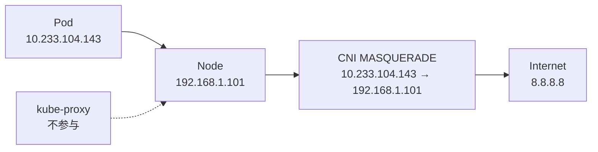
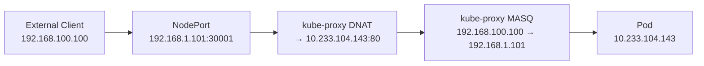

# Kubernetes基础

## Kubernetes架构

Kubernetes核心组件介绍：

1. 控制平面组件（Control Plane Components）：控制平面组件会为集群做出全局决策，比如资源的调度。控制平面组件可以在集群中的任何节点上运行。 然而，为了简单起见，设置脚本通常会在同一个计算机上启动所有控制平面组件， 并且不会在此计算机上运行用户容器。
   1. kube-api-server：负责提供API服务。API 服务器是 Kubernetes 控制平面的前端。
   
      k8s中的所有组件都会和`kube-apiserver` 进行连接，组件与组件之间一般不进行独立的连接，都依赖于`kube-apiserver` 进行消息的传递。
   
      `kube-apiserver` 设计上考虑了水平扩缩，也就是说，它可通过部署多个实例来进行扩缩，你可以运行 `kube-apiserver` 的多个实例，并在这些实例之间平衡流量。
   
   2. etcd：基于raft共识协议实现的一致且高可用的键值存储，用作 Kubernetes 所有集群数据的后台数据库，主要由kube-api-server进行读写。
   
   3. kube-scheduler：负责监视新创建的、未指定运行[节点（node）](https://kubernetes.io/zh-cn/docs/concepts/architecture/nodes/)的 [Pods](https://kubernetes.io/zh-cn/docs/concepts/workloads/pods/)， 并选择节点来让 Pod 在上面运行，即实现集群的调度能力。调度决策考虑的因素包括单个 Pod 及 Pods 集合的资源需求、软硬件及策略约束、 亲和性及反亲和性规范、数据位置、工作负载间的干扰及最后时限。
   
   4. kube-controller-manager：负责运行控制器进程。从逻辑上讲， 每个控制器都是一个单独的进程， 但是为了降低复杂性，它们都被编译到同一个可执行文件，并在同一个进程中运行。后面再介绍kubernetes的控制器和控制器模式。Kubernetes支持的部分控制器类型：
      1. 节点控制器（Node Controller）：负责在节点出现故障时进行通知和响应。
      2. 任务控制器（Job Controller）：监测代表一次性任务的 Job 对象，然后创建 Pod 来运行这些任务直至完成。
      3. 端点分片控制器（EndpointSlice controller）：填充端点分片（EndpointSlice）对象（以提供 Service 和 Pod 之间的链接）。
      4. 服务账号控制器（ServiceAccount controller）：为新的命名空间创建默认的服务账号（ServiceAccount）。
   
2. Node组件：
   1. kubelet：`kubelet` 会在集群中每个[节点（node）](https://kubernetes.io/zh-cn/docs/concepts/architecture/nodes/)上运行。 它保证[容器（containers）](https://kubernetes.io/zh-cn/docs/concepts/containers/)都运行在 [Pod](https://kubernetes.io/zh-cn/docs/concepts/workloads/pods/) 中。[kubelet](https://kubernetes.io/docs/reference/command-line-tools-reference/kubelet/) 接收一组通过各类机制提供给它的 PodSpec，确保这些 PodSpec 中描述的容器处于运行状态且健康。 kubelet 不会管理不是由 Kubernetes 创建的容器。kubelet的主要职责：
      1. 负责通过 CRI（Container Runtime Interface，参见[CRI: the Container Runtime Interface](https://github.com/kubernetes/community/blob/master/contributors/devel/sig-node/container-runtime-interface.md)） 和容器运行时打交道。具体的容器运行时，比如 Docker 项目，则一般通过 OCI 这个容器运行时规范同底层的 Linux 操作系统进行交互，即：把 CRI 请求翻译成对 Linux 操作系统的调用（操作 Linux Namespace 和 Cgroups 等）。因为 CRI  隔离了容器运行时的实现，不管是 Docker Enginee 还是containerd，只要能运行标准的容器镜像，kubelet 的操作方式都是一样的。
      2. kubelet 还通过 gRPC 协议同一个叫作 Device Plugin 的插件进行交互。这个插件，是 Kubernetes 项目用来管理 GPU 等宿主机物理设备的主要组件，也是基于 Kubernetes 项目进行机器学习训练、高性能作业支持等工作必须关注的功能。
      3. kubelet 的另一个重要功能，则是调用网络插件和存储插件为容器配置网络和持久化存储。这两个插件与 kubelet 进行交互的接口，分别是 CNI（Container Networking Interface）和 CSI（Container Storage Interface）。
   2. kube-proxy：[kube-proxy](https://kubernetes.io/zh-cn/docs/reference/command-line-tools-reference/kube-proxy/) 是集群中每个[节点（node）](https://kubernetes.io/zh-cn/docs/concepts/architecture/nodes/)上所运行的网络代理， 实现 Kubernetes [服务（Service）](https://kubernetes.io/zh-cn/docs/concepts/services-networking/service/) 概念的一部分。kube-proxy 维护节点上的一些网络规则， 这些网络规则会允许从集群内部或外部的网络会话与 Pod 进行网络通信。
   3. 容器运行时（container runtime）：这个基础组件使 Kubernetes 能够有效运行容器。 它负责管理 Kubernetes 环境中容器的执行和生命周期。Kubernetes 支持许多容器运行环境，例如 [containerd](https://containerd.io/docs/)、 [CRI-O](https://cri-o.io/#what-is-cri-o) 以及 [Kubernetes CRI (容器运行环境接口)](https://github.com/kubernetes/community/blob/master/contributors/devel/sig-node/container-runtime-interface.md) 的其他任何实现。

Kubernetes 项目要着重解决的问题，则来自于 Borg 的研究人员在论文中提到的一个非常重要的观点：运行在大规模集群中的各种任务之间，实际上存在着各种各样的关系。这些关系的处理，才是作业编排和管理系统最困难的地方。这种任务与任务之间的关系，在我们平常的各种技术场景中随处可见。比如，一个 Web 应用与数据库之间的访问关系，一个负载均衡器和它的后端服务之间的代理关系，一个门户应用与授权组件之间的调用关系。

Kubernetes 项目最主要的设计思想是，从更宏观的角度，以统一的方式来定义任务之间的各种关系，并且为将来支持更多种类的关系留有余地。

实际上，过去很多的集群管理项目（比如 Yarn、Mesos，以及 Swarm）所擅长的，都是把一个容器，按照某种规则，放置在某个最佳节点上运行起来。这种功能，我们称为“调度”。而 Kubernetes 项目所擅长的，是按照用户的意愿和整个系统的规则，完全自动化地处理好容器之间的各种关系。这种功能，就是我们经常听到的一个概念：编排。

### Kubernetes对象资源全景图

1. Pod：Pod 是可以在 Kubernetes 中创建和管理的、最小的可部署的计算单元。它本质上是一组关联的容器，这些容器是相对紧密的耦合在一起的，并且共享存储、网络、以及怎样运行这些容器的声明。Pod 天生地为其成员容器提供了两种共享资源：[网络](https://kubernetes.io/zh/docs/concepts/workloads/pods/#pod-networking)和 [存储](https://kubernetes.io/zh/docs/concepts/workloads/pods/#pod-storage)，即network namespace和data volume。

2. Deployment：有了 Pod 之后，我们希望能一次启动多个应用的副本（replicas），这样就需要 Deployment 这个 Pod 的多实例管理器，Deployment主要用于无状态应用。

3. Service：有了一组相同的 Pod 后，我们又需要通过一个固定的 IP 地址和端口以负载均衡的方式访问它，于是就有了 Service。Service 服务的主要作用，就是作为 Pod 的代理入口（Portal），从而代替 Pod 对外暴露一个固定的网络地址（Service 服务声明的 IP 地址等信息是“终生不变”的）。这样不同 Pod 之间就有了稳定的访问方式，比如 web 服务Pod 通过 Service 来访问数据库 Pod，就可以很大程度上屏蔽数据库Pod内部的一些临时状态带来的影响 。

4. Secret：如果现在两个不同 Pod 之间不仅有“访问关系”，还要求在发起时加上授权信息。最典型的例子就是 Web 应用对数据库访问时需要 Credential（数据库的用户名和密码）信息。针对这种场景，Kubernetes 项目提供了一种叫作 Secret 的对象，它其实是一个保存在 Etcd 里的键值对数据。这样，你把 Credential 信息以 Secret 的方式存在 Etcd 里，Kubernetes 就会在你指定的 Pod（比如，Web 应用的 Pod）启动时，自动把 Secret 里的数据以 Volume 的方式挂载到容器里。这样，这个 Web 应用就可以访问数据库了。

5. Job：用来描述一次性运行的 Pod（比如，大数据任务）。
6. DaemonSet：用来描述每个宿主机上必须且只能运行一个副本的守护进程服务。
7. CronJob：则用于描述定时任务等等。

> 从微服务架构来讲，多个独立功能内聚的服务带来了整体的灵活性，但是同时也带来了部署运维的复杂度提升，这时Docker配合Devops带来了不少的便利(轻量、隔离、一致性、CI、CD等)解决了不少问题，再配合compose，看起来一切都很美了，为什么还需要K8s？可以试着这样理解么？把微服务理解为人，那么服务治理其实就是人之间的沟通而已，人太多了就需要生存空间和沟通方式的优化，这就需要集群和编排了。Docker Compose，swarm，可以解决少数人之间的关系，比如把手机号给你，你就可以方便的找到我，但是如果手机号变更的时候就会麻烦，人多了也会麻烦。而k8s是站在上帝视角俯视芸芸众生后的高度抽象，他看到了大概有哪些类人(组织）以及不同组织有什么样的特点（Job、CornJob、Autoscaler、StatefulSet、DaemonSet...），不同组织之间交流可能需要什么（ConfigMap,Secret...）,这样比价紧密的人们在相同pod中，通过Service-不会变更的手机号，来和不同的组织进行沟通，Deployment、RC则可以帮组人们快速构建组织。Dokcer 后出的swarm mode，有类似的视角抽象（比如Service），不过相对来说并不完善。 - Jeff.W

### Kubernetes声明式API

基于Pod，Kubernetes定义了一组对象用于描述各种类型的应用实例。那么，如何使用Kubernetes来“编排”应用程序呢？在 Kubernetes 项目中所推崇的使用方法是：

1. 首先，通过一个“编排对象”，比如 Pod、Job、CronJob 等，来描述你试图管理的应用；
2. 然后，再为它定义一些“服务对象”，比如 Service、Secret、Horizontal Pod Autoscaler（自动水平扩展器）等。这些对象，会负责具体的平台级功能。

这种使用方法，就是所谓的“声明式 API”。这种 API 对应的“编排对象”和“服务对象”，都是 Kubernetes 项目中的 API 对象（API Object）。这是 Kubernetes 最核心的设计理念。

K8s的API Object通常包含下面几个部分：

1. apiVersion
2. kind
3. metadata - 元数据
4. spec - 描述期望的状态
5. status - 描述观测到的状态

### 控制器和控制器模式

K8s控制面组件kube-controller-manager就是一系列控制器的集合，源码目录`kubernetes/pkg/controller`下面的每一个控制器，都以独有的方式负责某种编排功能。

实际上，这些控制器之所以被统一放在 pkg/controller 目录下，就是因为它们都遵循 Kubernetes 项目中的一个通用编排模式，即：控制循环（control loop）。比如，现在有一种待编排的对象 X，它有一个对应的控制器。那么，我就可以用一段 Go 语言风格的伪代码来描述这个**控制循环**：

```go
for {
  实际状态 := 获取集群中对象 X 的实际状态（Actual State）
  期望状态 := 获取集群中对象 X 的期望状态（Desired State）
  if 实际状态 == 期望状态{
    什么都不做
  } else {
    执行编排动作，将实际状态调整为期望状态
  }
}
```

**在具体实现中，实际状态往往来自于 Kubernetes 集群本身**。比如，kubelet 通过心跳汇报的容器状态和节点状态，或者监控系统中保存的应用监控数据，或者控制器主动收集的它自己感兴趣的信息，这些都是常见的实际状态的来源。**而期望状态，一般来自于用户提交的 YAML 文件**。

比如，Deployment 对象中 Replicas 字段的值就是期望状态。Deployment 控制器从 Etcd 中获取到所有携带了“app: nginx”标签的 Pod，然后统计它们的数量，这就是实际状态；Deployment 控制器将两个状态做比较，然后根据比较结果，确定是创建 Pod，还是删除已有的 Pod。这个操作，通常被叫作调谐（Reconcile）。这个调谐的过程，则被称作“Reconcile Loop”（调谐循环）或者“Sync Loop”（同步循环）。调谐的最终结果，往往都是对被控制对象的某种写操作。比如，增加 Pod，删除已有的 Pod，或者更新 Pod 的某个字段。**这也是 Kubernetes 项目“面向 API 对象编程”的一个直观体现。**

Deployment 控制器对象本身，负责定义被管理对象的期望状态。比如，Deployment 里的 replicas=2 这个字段。被控制对象的定义，则来自于一个“模板”。比如，Deployment 里的 template 字段。像 Deployment 定义的 template 字段，在 Kubernetes 项目中有一个专有的名字，叫作 PodTemplate（Pod 模板）。类似 Deployment 这样的一个控制器，实际上都是由上半部分的控制器定义（包括期望状态），加上下半部分的被控制对象的模板组成的。


## 工作负载

工作负载是在 Kubernetes 上运行的应用程序。取决于应用程序的复杂度，我们可以将其运行在一个或者多个Pod中。在 Kubernetes 中，Pod 代表的是集群上处于运行状态的一组 [容器](https://kubernetes.io/zh/docs/concepts/overview/what-is-kubernetes/#why-containers)。Kubernetes确保确保合适类型的、处于运行状态的 Pod 个数是正确的，与你所指定的状态相一致。

Kubernetes 提供若干种内置的工作负载资源：

- [Deployment](https://kubernetes.io/zh/docs/concepts/workloads/controllers/deployment/) 和 [ReplicaSet](https://kubernetes.io/zh/docs/concepts/workloads/controllers/replicaset/) （替换原来的资源 [ReplicationController](https://kubernetes.io/zh/docs/reference/glossary/?all=true#term-replication-controller)）。 `Deployment` 很适合用来管理你的集群上的无状态应用，`Deployment` 中的所有 `Pod` 都是相互等价的，并且在需要的时候被换掉。
- [StatefulSet](https://kubernetes.io/zh/docs/concepts/workloads/controllers/statefulset/) 让你能够运行一个或者多个以某种方式跟踪应用状态的 Pods。 例如，如果你的负载会将数据作持久存储，你可以运行一个 `StatefulSet`，将每个 `Pod` 与某个 [`PersistentVolume`](https://kubernetes.io/zh/docs/concepts/storage/persistent-volumes/) 对应起来。你在 `StatefulSet` 中各个 `Pod` 内运行的代码可以将数据复制到同一 `StatefulSet` 中的其它 `Pod` 中以提高整体的服务可靠性。

- [DaemonSet](https://kubernetes.io/zh/docs/concepts/workloads/controllers/daemonset/) 定义提供节点本地支撑设施的 `Pods`。这些 Pods 可能对于你的集群的运维是 非常重要的，例如作为网络链接的辅助工具或者作为网络 [插件](https://kubernetes.io/zh/docs/concepts/cluster-administration/addons/) 的一部分等等。每次你向集群中添加一个新节点时，如果该节点与某 `DaemonSet` 的规约匹配，则控制面会为该 `DaemonSet` 调度一个 `Pod` 到该新节点上运行。
- [Job](https://kubernetes.io/zh/docs/concepts/workloads/controllers/job/) 和 [CronJob](https://kubernetes.io/zh/docs/concepts/workloads/controllers/cron-jobs/)。 定义一些一直运行到结束并停止的任务。`Job` 用来表达的是一次性的任务，而 `CronJob`会根据其时间规划反复运行。

### 理解Pod对象

通常我们不需要直接创建 Pod，甚至单实例 Pod。 而是使用诸如 [Deployment](https://kubernetes.io/zh/docs/concepts/workloads/controllers/deployment/) 或 [Job](https://kubernetes.io/zh/docs/concepts/workloads/controllers/job/) 这类工作负载资源 来创建 Pod。如果 Pod 需要跟踪状态， 可以考虑 [StatefulSet](https://kubernetes.io/zh/docs/concepts/workloads/controllers/statefulset/) 资源。

工作负载资源的控制器能够处理Pod副本的管理、上线，并在 Pod 失效时提供自愈能力。 例如，如果一个节点失败，控制器注意到该节点上的 Pod 已经停止工作， 就可以创建替换性的 Pod。调度器会将替身 Pod 调度到一个健康的节点执行。

下面是一些可以管理一个或者多个 Pod 的工作负载资源：

- [Deployment](https://kubernetes.io/zh/docs/concepts/workloads/controllers/deployment/)
- [StatefulSet](https://kubernetes.io/zh/docs/concepts/workloads/controllers/statefulset/)
- [DaemonSet](https://kubernetes.io/zh/docs/concepts/workloads/controllers/daemonset/)

#### Why Pod？

**关联容器的成组调度问题**

对于Linux容器而言：Namespace实现了容器资源的隔离；Cgroups实现了对容器资源的限制；联合文件系统实现了容器的rootfs。本质上，容器还是Linux系统中被隔离了的进程。

受限于容器的“单进程模型”，应用的多个模块进程必须被放到不同的容器里，而这些模块进程之间往往又需要通过local或者Unix域Socket进行通信，因此这些容器又必须同时运行在同一个宿主机上。

> 容器的“单进程模型”，并不是指容器里只能运行一个进程，而是指容器里没有类似于init或者systemd这样的设计，因此容器没有管理多个进程的能力。因为容器里的PID=1的进程就是应用本身，其它的进程都是这个PID=1的进程的子进程，而我们的应用程序并不具备管理进程的能力，当容器里的子进程异常退出时，应用程序任何知道？又如何处理垃圾收集工作？

Kubernetes就是容器世界里的分布式操作系统，当有多个宿主机时，如何调度这些“成组”的容器就成了问题。

假设一个应用场景：集群有2个节点，node-1 上有 3 GB 可用内存，node-2 有 2.5 GB 可用内存。我们的应用包含了3个容器：main、A、B，A和B依赖于同一个机器上的main容器，每个容器设置的内存配额都是1GB。

下面先来看看已有的方案是如何调度这些容器的。

Docker Swarm项目有一个容器亲密性的设计：给关联的容器A和B设置亲密性标签（比如：affinity=main），表示容器A和B必须和main容器运行在同一个机器上。当我们顺序创建这些容器时，它们就会进入Swarm的待调度队列。main容器和容器A先后出队并被调度到了node-2上，此使node-2上的内存只有0.5GB了，但是，当容器B出队开始被调度时，Swarm就不知道如何处理了：node-2上的可用资源并不满足B的配额要求，可是根据亲密性设置，B又必须运行在node-2上。

这就是一个典型的成组调度（gang scheduling）没有被妥善处理的例子。

Mesos 中就有一个资源囤积（resource hoarding）的机制，会在所有设置了 Affinity 约束的任务都达到时，才开始对它们统一进行调度。而在 Google Omega 论文中，则提出了使用乐观调度处理冲突的方法，即：先不管这些冲突，而是通过精心设计的回滚机制在出现了冲突之后解决问题。可是这些方法都谈不上完美。资源囤积带来了不可避免的调度效率损失和死锁的可能性；而乐观调度的复杂程度，则不是常规技术团队所能驾驭的。

Kubernetes对于上述容器成组调度的问题给出的方案正是Pod：**Pod 是 Kubernetes 里的原子调度单位。这就意味着，Kubernetes 项目的调度器，是统一按照 Pod 而非容器的资源需求进行计算的。**

对于上面假设的应用场景：main容器和容器A和B会被组成一个Pod，Kubenetes项目在调度时，自然会去选择可用内存等于3GB的node-1节点进行绑定，而不会考虑node-2。

Pod里的这些关联容器的典型特征包括但不限于：互相之间会发生直接的文件交换、使用 localhost 或者 Socket 文件进行本地通信、会发生非常频繁的远程调用、需要共享某些 Linux Namespace（比如，一个容器要加入另一个容器的 Network Namespace）等等。

#### Pod实现原理

首先，Pod只是Kubernetes里的一个逻辑概念。即：Kubernetes真正处理的是，还是宿主机操作系统上Linux容器的Namespace和Cgroups，而并不是一个所谓的Pod的边界或者隔离环境。

Pod本质上是一组共享了某些资源的容器。具体的说：Pod里的所有容器，共享的是同一个Network Namespace，并且可以声明共享同一个Volume。这些需求似乎用`docker run --net --volumes-from`这样的命令也能实现，比如：

```bash
$ docker run --net=B --volumes-from=B --name=A image-A
```

但是，基于这种实现，A和B这两个容器就成了拓扑关系而不是对等关系了，因为B容器必须先于A容器启动。

所以，在Kubernetes项目里，Pod的实现需要使用一个中间容器，这个容器叫做Infra容器，它的名字和Pod里的其它容器差不多，基本格式就是**k8s_POD_\<Pod name\>**。在创建Pod的时候，Infra容器永远都是第一个被创建的容器，而其它用户容器，则通过Join Network Namespace的方式，与Infra容器关联在一起。
如上图，这个Pod里包含了容器A和B，以及Infra容器。在 Kubernetes 项目里，Infra 容器一定要占用极少的资源，所以它使用的是一个非常特殊的镜像，叫作：k8s.gcr.io/pause。这个镜像是一个用汇编语言编写的、永远处于“暂停”状态的容器，解压后的大小也只有 100~200 KB 左右。

每个 Pod 都在每个地址族中获得一个唯一的 IP 地址，也就是这个Pod的Network Namespace对应的IP地址。其它的所有网络资源，都是一个Pod一份，并且被该Pod中的所有容器共享。对于Pod里的容器A和容器B来说：

1. 共享网络名字空间，包括 IP 地址和网络端口。 *Pod 内* 的容器可以使用 `localhost` 互相通信。 当 Pod 中的容器与 *Pod 之外* 的实体通信时，它们必须协调如何使用共享的网络资源 （例如端口）。
2. 可以通过如 SystemV 信号量或 POSIX 共享内存这类标准的进程间通信方式互相通信。 
3. 它们看到的网络设备和Infra容器看到的完全一样；Pod 中的容器所看到的系统主机名与为 Pod 配置的 `name` 属性值相同。
4. Pod的生命周期只跟Infra容器一致，而与容器A和B无关。

Pod 扮演的是传统部署环境里“虚拟机”的角色。这样的设计，是为了使用户从传统环境（虚拟机环境）向 Kubernetes（容器环境）的迁移，更加平滑。

>  **凡是调度、网络、存储，以及安全相关的属性，基本上是 Pod 级别的。**这些属性的共同特征是，它们描述的是“机器”这个整体，而不是里面运行的“程序”。比如，配置这个“机器”的网卡（即：Pod 的网络定义），配置这个“机器”的磁盘（即：Pod 的存储定义），配置这个“机器”的防火墙（即：Pod 的安全定义）。更不用说，这台“机器”运行在哪个服务器之上（即：Pod 的调度）。

> **凡是跟容器的 Linux Namespace 相关的属性，也一定是 Pod 级别的**。这个原因也很容易理解：Pod 的设计，就是要让它里面的容器尽可能多地共享 Linux Namespace，仅保留必要的隔离和限制能力。这样，Pod 模拟出的效果，就跟虚拟机里程序间的关系非常类似了。

#### sidecar设计模式和initContainer

考虑一种应用场景：我们在Tomcat容器里运行WAR包里的应用程序，WAR包里的应用程序经常在更新，而Tomcat本身是比较稳定的。先看看，在Docker的世界里，该如何处理这种关系呢？

1. 直接将Tomcat容器和WAR包放在同一个镜像里，那么更新WAR包或者升级Tomcat环境的时候，就要重新制作发布新的镜像，非常麻烦。
2. 永远只发布一个Tomcat容器，为这个容器的webapps目录声明一个hostPath类型的Volume，从而把宿主机上的WAR包挂载进容器运行起来。这需要解决一个难题：如何维护每台宿主机上的这个存放WAR包的目录，这就不得不引入复杂的分布式存储系统了。在实际生产环境中，我们的很多容器都是有状态的，因此配置分布式存储系统是很常见的。但是，在储存用户数据的存储系统上发布软件包的做法并不可取。

基于Pod，我们可以把Tomcat容器和WAR包分别做成镜像，然后放到同一个Pod里，并通过Volume来共享WAR包。yaml配置如下：

```yaml
apiVersion: v1
kind: Pod
metadata:
  name: javaweb-2
spec:
  initContainers:
  - image: geektime/sample:v2
    name: war
    command: ["cp", "/sample.war", "/app"]
    volumeMounts:
    - mountPath: /app
      name: app-volume
  containers:
  - image: geektime/tomcat:7.0
    name: tomcat
    command: ["sh","-c","/root/apache-tomcat-7.0.42-v2/bin/start.sh"]
    volumeMounts:
    - mountPath: /root/apache-tomcat-7.0.42-v2/webapps
      name: app-volume
    ports:
    - containerPort: 8080
      hostPort: 8001 
  volumes:
  - name: app-volume
    emptyDir: {}
```

WAR包是一个**initContainer**类型的容器。在Pod中，可以定义多个Init Container，所有Init Container容器会按顺序逐一启动，而直到它们都启动并且退出了，spec.containers里的容器才会启动。这就保证了，Tomcat容器启动时，webapps目录下的WAR总是已经ready。

#### Pod模板

工作负载的控制器会使用负载对象中的 `PodTemplate` 来生成实际的 Pod。 `PodTemplate` 是你用来运行应用时指定的负载资源的目标状态的一部分，即`spec.template`部分。比如，下面是一个描述一个Job的yaml，其中的 `template` 指示启动一个容器。

```yaml
apiVersion: batch/v1
kind: Job
metadata:
  name: hello
spec:
  template:
    # 这里是 Pod 模版
    spec:
      containers:
      - name: hello
        image: busybox
        command: ['sh', '-c', 'echo "Hello, Kubernetes!" && sleep 3600']
      restartPolicy: OnFailure
    # 以上为 Pod 模版
```

修改工作负载资源的 Pod 模版或者切换到新的 Pod 模版都不会对已经存在的 Pod 起作用。 Pod 不会直接收到模版的更新。相反， 新的 Pod 会被创建出来，与更改后的 Pod 模版匹配。

关于Pod模板里`spec`支持的参数可以查看k8s源码里的`kubernetes/vendor/k8s.io/api/core/v1/types.go`的定义和注解：

```json
type Pod struct
type PodSpec struct
```

#### 静态Pod

静态 Pod（Static Pod） 直接由特定节点上的 `kubelet` 守护进程管理， 不需要[API 服务器](https://kubernetes.io/zh/docs/reference/command-line-tools-reference/kube-apiserver/)看到它们。 尽管大多数 Pod 都是通过控制面（例如，[Deployment](https://kubernetes.io/zh/docs/concepts/workloads/controllers/deployment/)） 来管理的，对于静态 Pod 而言，`kubelet` 直接监控每个 Pod，并在其失效时重启之。

控制面的组件kube-apiserver、kube-controller-manager、kube-scheduler和etcd，都会被kubelet使用静态 Pod 的方式部署起来。

#### Pod生命周期

Pod 遵循一个预定义的生命周期，起始于 `Pending` [阶段](https://kubernetes.io/zh/docs/concepts/workloads/pods/pod-lifecycle/#pod-phase)，如果至少 其中有一个主要容器正常启动，则进入 `Running`，之后取决于 Pod 中是否有容器以 失败状态结束而进入 `Succeeded` 或者 `Failed` 阶段。

Pod 在其生命周期中只会被[调度](https://kubernetes.io/zh/docs/concepts/scheduling-eviction/)一次。 一旦 Pod 被调度（分派）到某个节点，Pod 会一直在该节点运行，直到 Pod 停止或者 被[终止](https://kubernetes.io/zh/docs/concepts/workloads/pods/pod-lifecycle/#pod-termination)。在 Pod 运行期间，`kubelet` 能够重启容器以处理一些失效场景。 在 Pod 内部，Kubernetes 跟踪不同容器的[状态](https://kubernetes.io/zh/docs/concepts/workloads/pods/pod-lifecycle/#container-states) 并确定使 Pod 重新变得健康所需要采取的动作。

Pod 自身不具有自愈能力。如果一个[节点](https://kubernetes.io/zh/docs/concepts/architecture/nodes/)死掉了，调度到该节点 的 Pod 也被计划在给定超时期限结束后[删除](https://kubernetes.io/zh/docs/concepts/workloads/pods/pod-lifecycle/#pod-garbage-collection)。

任何给定的 Pod （由 UID 定义）从不会被“重新调度（rescheduled）”到不同的节点； 相反，这一 Pod 可以被一个新的、几乎完全相同的 Pod 替换掉。 如果需要，新 Pod 的名字可以不变，但是其 UID 会不同。

更多细节，参见[Pod 的生命周期](https://kubernetes.io/zh/docs/concepts/workloads/pods/pod-lifecycle/)。

**Pod的阶段 - Status**

Pod 的 `status` 字段是一个 [PodStatus](https://kubernetes.io/docs/reference/generated/kubernetes-api/v1.22/#podstatus-v1-core) 对象，其中包含一个 `phase` 字段。Pod 的阶段（Phase）是 Pod 在其生命周期中所处位置的简单宏观概述。下面是 `phase` 可能的值：

1. `Pending`（悬决）：Pod 的 YAML 文件已经提交给了 Kubernetes，API 对象已经被创建并保存在 Etcd 当中。但有一个或者多个容器尚未创建亦未运行。此阶段包括等待 Pod 被调度的时间和通过网络下载镜像的时间。
2. `Running`（运行中）：Pod 已经调度到了某个节点，Pod 中所有的容器都已被创建。至少有一个容器仍在运行，或者正处于启动或重启状态。
3. `Succeeded`（成功）：Pod 中的所有容器都已成功终止，并且不会再重启。这种情况在运行一次性任务时最为常见。
4. `Failed`（失败）：Pod 中的所有容器都已终止，并且至少有一个容器是因为失败终止。也就是说，容器以非 0 状态退出或者被系统终止。
5. `Unknown`（未知）：因为某些原因无法取得 Pod 的状态。意味着 Pod 的状态不能持续地被 kubelet 汇报给 kube-apiserver，这很有可能是主从节点（Master 和 Kubelet）间的通信出现了问题。

一旦[调度器](https://kubernetes.io/docs/reference/generated/kube-scheduler/)将 Pod 分派给某个节点，`kubelet` 就通过 [容器运行时](https://kubernetes.io/zh/docs/setup/production-environment/container-runtimes) 开始为 Pod 创建容器。 容器的状态有三种：`Waiting`（等待）、`Running`（运行中）和 `Terminated`（已终止）。

Pod 对象的 Status 字段，还可以再细分出一组 Conditions。这些细分状态的值包括：PodScheduled、Ready、Initialized，以及 Unschedulable。它们主要用于描述造成当前 Status 的具体原因是什么。比如，Pod 当前的 Status 是 Pending，对应的 Condition 是 Unschedulable，这就意味着它的调度出现了问题。

**Pod终止流程**

使用`kubectl delete`手动删除Pod时的流程如下（该 Pod 的体面终止限期是默认值（30 秒））：

1. API 服务器中的 Pod 对象被更新（状态为Terminating），记录涵盖体面终止限期在内 Pod 的最终死期，超出所计算时间点则认为 Pod 已死（dead）。
2. 在 Pod 运行所在的节点上：`kubelet` 一旦看到 Pod 被标记为Terminating（已经设置了体面终止限期），`kubelet` 即开始本地的 Pod 关闭过程。
   1. 如果 Pod 中的容器之一定义了 `preStop` [回调](https://kubernetes.io/zh/docs/concepts/containers/container-lifecycle-hooks)， `kubelet` 开始在容器内运行该回调逻辑。如果超出体面终止限期时，`preStop` 回调逻辑 仍在运行，`kubelet` 会请求给予该 Pod 的宽限期一次性增加 2 秒钟。如果 `preStop` 回调所需要的时间长于默认的体面终止限期，你必须修改`terminationGracePeriodSeconds` 属性值来使其正常工作。
   2. `kubelet` 接下来触发容器运行时发送 TERM 信号给每个容器中的进程 1。Pod 中的容器会在不同时刻收到 TERM 信号，接收顺序也是不确定的。 如果关闭的顺序很重要，可以考虑使用 `preStop` 回调逻辑来协调。
3. 同时，`kubelet` 启动体面关闭逻辑，控制面会将 Pod 从对应的端点列表（以及端点切片列表， 如果启用了的话）中移除，过滤条件是 Pod 被对应的 [服务](https://kubernetes.io/zh/docs/concepts/services-networking/service/)以某 [选择算符](https://kubernetes.io/zh/docs/concepts/overview/working-with-objects/labels/)选定。 [ReplicaSets](https://kubernetes.io/zh/docs/concepts/workloads/controllers/replicaset/)和其他工作负载资源 不再将关闭进程中的 Pod 视为合法的、能够提供服务的副本。关闭动作很慢的 Pod 也无法继续处理请求数据，因为负载均衡器（例如服务代理）已经在终止宽限期开始的时候 将其从端点列表中移除。
4. 超出终止宽限期限时，`kubelet` 会触发强制关闭过程。容器运行时会向 Pod 中所有容器内 仍在运行的进程发送 `SIGKILL` 信号。 `kubelet` 也会清理隐藏的 `pause` 容器，如果容器运行时使用了这种容器的话。
5. `kubelet` 触发强制从 API 服务器上删除 Pod 对象的逻辑，并将体面终止限期设置为 0 （这意味着马上删除）。
6. API 服务器删除 Pod 的 API 对象，从任何客户端都无法再看到该对象。

如果，某个Worker节点上的kubelet服务停止，节点状态变成NotReady时，某个Deployment一共包含4个Pod副本，其中有两个运行在该Worker节点。那么Kubernetes会终止失效节点上的两个Pod，并重新调度一个Worker节点启动两个新的Pod，从而保证Pod的副本数量始终是4个。对于失效节点上的Pod，会一直处于Terminating状态，当失效节点恢复正常后，这些Pod会被立即彻底删除。

**强制终止Pod**

默认情况下，所有的删除操作都会附有 30 秒钟的宽限期限。 `kubectl delete` 命令支持 `--grace-period=<seconds>` 选项，允许你重载默认值， 设定自己希望的期限值。将宽限期限强制设置为 `0` 意味着立即从 API 服务器删除 Pod，同时额外设置 `--force` 参数才能发起强制删除请求。

```bash
$ kubectl delete pod <pod name> --grace-period=0 --force
```

执行强制删除操作时，API 服务器不再等待来自 `kubelet` 的、关于 Pod 已经在原来运行的节点上终止执行的确认消息。 API 服务器直接删除 Pod 对象，这样新的与之同名的 Pod 即可以被创建。 在节点侧，被设置为立即终止的 Pod 仍然会在被强行杀死之前获得一点点的宽限时间。

> 对于某些工作负载及其 Pod 而言，尤其是有状态的工作负载，强制删除很可能会带来某种破坏。

#### 容器探针和Pod恢复机制

在 Kubernetes 中，我们可以为 Pod 里的容器定义一个健康检查“探针”（Probe）。这样，kubelet 就会根据这个 Probe 的返回值决定这个容器的状态，而不是直接以容器进行是否运行（来自 Docker 返回的信息）作为依据。这种机制，是生产环境中保证应用健康存活的重要手段。

Probe是由 [kubelet](https://kubernetes.io/zh/docs/reference/command-line-tools-reference/kubelet/) 对容器执行的定期诊断。 要执行诊断，kubelet 调用由容器实现的 [Handler](https://kubernetes.io/docs/reference/generated/kubernetes-api/v1.22/#handler-v1-core) （处理程序）。有三种类型的处理程序：

- [ExecAction](https://kubernetes.io/docs/reference/generated/kubernetes-api/v1.22/#execaction-v1-core)： 在容器内执行指定命令。如果命令退出时返回码为 0 则认为诊断成功。
- [TCPSocketAction](https://kubernetes.io/docs/reference/generated/kubernetes-api/v1.22/#tcpsocketaction-v1-core)： 对容器的 IP 地址上的指定端口执行 TCP 检查。如果端口打开，则诊断被认为是成功的。
- [HTTPGetAction](https://kubernetes.io/docs/reference/generated/kubernetes-api/v1.22/#httpgetaction-v1-core)： 对容器的 IP 地址上指定端口和路径执行 HTTP Get 请求。如果响应的状态码大于等于 200 且小于 400，则诊断被认为是成功的。

针对运行中的容器，`kubelet` 可以选择是否执行以下三种探针，以及如何针对探测结果作出反应：

- `livenessProbe`：存活态探针，指示容器是否正在运行。如果存活态探测失败，则 kubelet 会杀死容器， 并且容器将根据其[重启策略](https://kubernetes.io/zh/docs/concepts/workloads/pods/pod-lifecycle/#restart-policy)决定未来。如果容器不提供存活探针， 则默认状态为 `Success`。如果容器中的进程能够在遇到问题或不健康的情况下自行崩溃，则不一定需要存活态探针; `kubelet` 将根据 Pod 的`restartPolicy` 自动执行修复操作。
- `readinessProbe`：就绪态探针，指示容器是否准备好为请求提供服务。如果就绪态探测失败， 接入层（端点控制器）将从与 Pod 匹配的所有服务的端点列表中删除该 Pod 的 IP 地址，即流量将不再分发到这个Pod，知道Pod重新进入就绪态。 初始延迟之前的就绪态的状态值默认为 `Failure`。 如果容器不提供就绪态探针，则默认状态为 `Success`。如果要仅在探测成功时才开始向 Pod 发送请求流量，请指定就绪态探针。如果你的应用程序对后端服务有严格的依赖性，你可以同时实现存活态和就绪态探针。**readinessProbe 检查结果的成功与否，决定的这个 Pod 是不是能被通过 Service 的方式访问到，而并不影响 Pod 的生命周期**。
- `startupProbe`: 启动探针，指示容器中的应用是否已经启动。如果提供了启动探针，则所有其他探针都会被 禁用，直到此探针成功为止。如果启动探测失败，`kubelet` 将杀死容器，而容器依其 [重启策略](https://kubernetes.io/zh/docs/concepts/workloads/pods/pod-lifecycle/#restart-policy)进行重启。 如果容器没有提供启动探测，则默认状态为 `Success`。如果你的容器需要在启动期间加载大型数据、配置文件或执行迁移，即容器启动需要较长时间，你可以使用 [启动探针](https://kubernetes.io/zh/docs/concepts/workloads/pods/pod-lifecycle/#when-should-you-use-a-startup-probe)。你不再需要配置一个较长的存活态探测时间间隔，只需要设置另一个独立的配置选定， 对启动期间的容器执行探测，从而允许使用远远超出存活态时间间隔所允许的时长。

每次探测都将获得以下三种结果之一：

- `Success`（成功）：容器通过了诊断。
- `Failure`（失败）：容器未通过诊断。readinessProbe - 接入层（Service）将没有通过诊断的Pod进行摘除；liveness - 根据配置的策略重新拉起或者删除Pod。
- `Unknown`（未知）：诊断失败，因此不会采取任何行动。

看下来自官网的liveness demo，先部署下面这个Pod：

```yaml
hunk@master1:~/workspace/demo$ cat test-liveness-exec.yaml 
apiVersion: v1
kind: Pod
metadata:
  labels:
    test: liveness
  name: test-liveness-exec
spec:
  containers:
  - name: liveness
    image: docker.io/busybox:1.31.1
    args:
    - /bin/sh
    - -c
    - touch /tmp/healthy; sleep 30; rm -rf /tmp/healthy; sleep 600
    livenessProbe:
      exec:
        command:
        - cat
        - /tmp/healthy
      initialDelaySeconds: 5
      periodSeconds: 5
hunk@master1:~/workspace/demo$ kubectl create -f test-liveness-exec.yaml
```

```bash
hunk@master1:~/workspace/demo$ kubectl get pods |grep live
test-liveness-exec                  1/1     Running   4          6m51s
```

过一会儿，我们会看到Pod虽然仍然是Running状态，但是已经被多次重启，`kubectl describe`命令里没有产生相关的Events，只是Last State部分指出容器上次是因为137这个Error。Kubernetes 中并没有 Docker 的 Stop 语义。所以虽然是 Restart（重启），但实际却是重新创建了容器。

```bash
hunk@master1:~/workspace/demo$ kubectl describe pod test-liveness-exec
...
Containers:
  liveness:
    State:          Running
      Started:      Sat, 25 May 2024 06:04:44 +0000
    Last State:     Terminated
      Reason:       Error
      Exit Code:    137
      Started:      Sat, 25 May 2024 06:03:29 +0000
      Finished:     Sat, 25 May 2024 06:04:43 +0000
    Ready:          True
    Restart Count:  4
Events:
  Type     Reason     Age                    From               Message
  ----     ------     ----                   ----               -------
  Normal   Scheduled  <unknown>              default-scheduler  Successfully assigned default/test-liveness-exec to node2
...
  Normal   Pulled     6m8s                   kubelet, node2     Successfully pulled image "docker.io/busybox:1.31.1"
  Normal   Created    6m8s                   kubelet, node2     Created container liveness
  Normal   Pulling    2m25s (x4 over 6m8s)   kubelet, node2     Pulling image "docker.io/busybox:1.31.1"
```

这个功能就是 Kubernetes 里的**Pod 恢复机制**，也叫 restartPolicy。它是 Pod 的 Spec 部分的一个标准字段（pod.spec.restartPolicy），默认值是 Always，即：任何时候这个容器发生了异常，它一定会被重新创建。

Pod 的恢复过程，永远都是发生在当前节点上，而不会跑到别的节点上去。事实上，一旦一个 Pod 与一个节点（Node）绑定，除非这个绑定发生了变化（pod.spec.node 字段被修改），否则它永远都不会离开这个节点。这也就意味着，如果这个宿主机宕机了，这个 Pod 也不会主动迁移到其他节点上去。

如果想让 Pod 出现在其他的可用节点上，就必须使用 Deployment 这样的“控制器”来管理 Pod，哪怕只需要一个 Pod 副本，这也是一个单 Pod 的 Deployment 与一个 Pod 最主要的区别。

我们还可以通过设置 restartPolicy，改变 Pod 的恢复策略。除了 默认的Always，它还有 OnFailure 和 Never 两种情况：

- Always：在任何情况下，只要容器不在运行状态，就自动重启容器；
- OnFailure: 只在容器 异常时才自动重启容器；
- Never: 从来不重启容器。

在实际使用时，我们需要根据应用运行的特性，合理设置这三种恢复策略。

> 1. **只要 Pod 的 restartPolicy 指定的策略允许重启异常的容器（比如：Always），那么这个 Pod 就会保持 Running 状态，并进行容器重启**。否则，Pod 就会进入 Failed 状态 。
>
> 2. **对于包含多个容器的 Pod，只有它里面所有的容器都进入异常状态后，Pod 才会进入 Failed 状态**。在此之前，Pod 都是 Running 状态。此时，Pod 的 READY 字段会显示正常容器的个数。
>
> 3. 所以，假如一个 Pod 里只有一个容器，然后这个容器异常退出了。那么，只有当 restartPolicy=Never 时，这个 Pod 才会进入 Failed 状态。而其他情况下，由于 Kubernetes 都可以重启这个容器，所以 Pod 的状态保持 Running 不变。
>
>    而如果这个 Pod 有多个容器，仅有一个容器异常退出，它就始终保持 Running 状态，哪怕即使 restartPolicy=Never。只有当所有容器也异常退出之后，这个 Pod 才会进入 Failed 状态。

除了在容器中执行命令外，livenessProbe 也可以定义为发起 HTTP 或者 TCP 请求的方式，定义格式如下：

```yaml
...
livenessProbe:
     httpGet:
       path: /healthz
       port: 8080
       httpHeaders:
       - name: X-Custom-Header
         value: Awesome
       initialDelaySeconds: 3
       periodSeconds: 3
```

```yaml
    ...
    livenessProbe:
      tcpSocket:
        port: 8080
      initialDelaySeconds: 15
      periodSeconds: 20
```

所以，应用 Pod 其实可以暴露一个健康检查 URL（比如 /healthz），或者直接让健康检查去检测应用的监听端口。这两种配置方法，在 Web 服务类的应用中非常常用。

#### Init容器

Init 容器是一种特殊容器，在 [Pod](https://kubernetes.io/docs/concepts/workloads/pods/pod-overview/) 内的应用容器启动之前运行。Init 容器可以包括一些应用镜像中不存在的实用工具和安装脚本。

如果为一个 Pod 指定了多个 Init 容器，这些容器会按顺序逐个运行。 每个 Init 容器必须运行成功，下一个才能够运行。当所有的 Init 容器运行完成时， Kubernetes 才会为 Pod 初始化应用容器并像平常一样运行。

如果 Pod 的 Init 容器失败，kubelet 会不断地重启该 Init 容器直到该容器成功为止。 然而，如果 Pod 对应的 `restartPolicy` 值为 "Never"，并且 Pod 的 Init 容器失败， 则 Kubernetes 会将整个 Pod 状态设置为失败。

如果 Pod [重启](https://kubernetes.io/zh/docs/concepts/workloads/pods/init-containers/#pod-restart-reasons)，所有 Init 容器必须重新执行。对 Init 容器规约的修改仅限于容器的 `image` 字段。 更改 Init 容器的 `image` 字段，等同于重启该 Pod。

因为 Init 容器可能会被重启、重试或者重新执行，所以 Init 容器的代码应该是幂等的。 特别地，基于 `emptyDirs`写文件的代码，应该对输出文件可能已经存在做好准备。

在查看Pod状态的时候，以 `Init:` 开头的 Pod 状态汇总了 Init 容器执行的状态：

| `Init:N/M`                     | Pod 包含 `M` 个 Init 容器，其中 `N` 个已经运行完成。 |
| ------------------------------ | ---------------------------------------------------- |
| `Init:Error`                   | Init 容器已执行失败。                                |
| `Init:CrashLoopBackOff`        | Init 容器执行总是失败。                              |
| `Pending`                      | Pod 还没有开始执行 Init 容器。                       |
| `PodInitializing` or `Running` | Pod 已经完成执行 Init 容器。                         |

#### Pod拓扑分布约束

可以使用 *拓扑分布约束（Topology Spread Constraints）* 来控制 [Pods](https://kubernetes.io/docs/concepts/workloads/pods/pod-overview/) 在集群内故障域 之间的分布，例如区域（Region）、可用区（Zone）、节点和其他用户自定义拓扑域。 这样做有助于实现高可用并提升资源利用率。

更多细节参见[Pod 拓扑分布约束](https://kubernetes.io/zh/docs/concepts/workloads/pods/pod-topology-spread-constraints/)。

#### PodPreset对象

需求场景：Pod本身比较复杂，我们希望开发人员只需要提交一个基本的、非常简单的 Pod YAML，Kubernetes 就可以自动给对应的 Pod 对象加上其他必要的信息，比如 labels，annotations，volumes 等，而这些信息，可以是运维人员事先定义好的。这个叫作 PodPreset（Pod 预设置）的功能 已经出现在了 v1.11 版本的 Kubernetes 中。

例如，开发人员编写的pod.yaml只关注应用本身的必要信息：

```yaml
# pod.yaml
apiVersion: v1
kind: Pod
metadata:
  name: website
  labels:
    app: website
    role: frontend
spec:
  containers:
    - name: website
      image: nginx
      ports:
        - containerPort: 80
```

运维人员编写的preset.yaml用于定义PodPreset对象。在这个 PodPreset 的定义中， selector字段意味着后面这些追加的定义，只会作用于 selector 所定义的、带有“role: frontend”标签的 Pod 对象，这就可以防止“误伤”。

```yaml
# preset.yaml
apiVersion: settings.k8s.io/v1alpha1
kind: PodPreset
metadata:
  name: allow-database
spec:
  selector:
    matchLabels:
      role: frontend
  env:
    - name: DB_PORT
      value: "6379"
  volumeMounts:
    - mountPath: /cache
      name: cache-volume
  volumes:
    - name: cache-volume
      emptyDir: {}
```

```bash
$ kubectl create -f preset.yaml
$ kubectl create -f pod.yaml
$ kubectl get pod website -o yaml
apiVersion: v1
kind: Pod
metadata:
  name: website
  labels:
    app: website
    role: frontend
  annotations:
    podpreset.admission.kubernetes.io/podpreset-allow-database: "resource version"
spec:
  containers:
    - name: website
      image: nginx
      volumeMounts:
        - mountPath: /cache
          name: cache-volume
      ports:
        - containerPort: 80
      env:
        - name: DB_PORT
          value: "6379"
  volumes:
    - name: cache-volume
      emptyDir: {}
```

**PodPreset 里定义的内容，只会在 Pod API 对象被创建之前追加在这个对象本身上，而不会影响任何 Pod 的控制器的定义。**比如，我们现在提交的是一个 nginx-deployment，那么这个 Deployment 对象本身是永远不会被 PodPreset 改变的，被修改的只是这个 Deployment 创建出来的所有 Pod。

如果你定义了同时作用于一个 Pod 对象的多个 PodPreset，Kubernetes 项目会帮你合并（Merge）这两个 PodPreset 要做的修改。而如果它们要做的修改有冲突的话，这些冲突字段就不会被修改。

#### Pod服务质量（QoS）配置

### Deployment 和 ReplicaSet

Deployment和ReplciaSet主要用于描述无状态应用。

下面是部署ReplicaSet的YAML，可以看出，**一个 ReplicaSet 对象，其实就是由副本数目的定义和一个 Pod 模板组成的**，它的定义其实是 Deployment 的一个子集。

```yaml
apiVersion: apps/v1
kind: ReplicaSet
metadata:
  name: nginx-set
  labels:
    app: nginx
spec:
  replicas: 3
  selector:
    matchLabels:
      app: nginx
  template:
    metadata:
      labels:
        app: nginx
    spec:
      containers:
      - name: nginx
        image: nginx:1.7.9
```

下面是部署拥有3副本Pod的Deployment的YAML，和上面的ReplicaSet非常类似。一个定义了 replicas=3 的 Deployment，与它的 ReplicaSet，以及 Pod 的关系，实际上是一种“层层控制”的关系：

1. ReplicaSet 负责通过“控制器模式”，保证系统中 Pod 的个数永远等于指定的个数（比如，3 个）。这也正是 Deployment 只允许容器的 restartPolicy=Always 的主要原因：只有在容器能保证自己始终是 Running 状态的前提下，ReplicaSet 调整 Pod 的个数才有意义。
2. 在此基础上，Deployment 同样通过“控制器模式”，来操作 ReplicaSet 的个数和属性，进而实现“水平扩展 / 收缩”和“滚动更新”这两个编排动作。

```yaml
apiVersion: apps/v1
kind: Deployment
metadata:
  name: nginx-deployment
  labels:
    app: nginx
spec:
  replicas: 3
  selector:
    matchLabels:
      app: nginx
  template:
    metadata:
      labels:
        app: nginx
    spec:
      containers:
      - name: nginx
        image: nginx:1.7.9
        ports:
        - containerPort: 80
```

Deployment 实际上是一个**两层控制器**，Deployment 控制器实际操纵的，正是ReplicaSet 对象，而不是 Pod 对象。首先，它通过 **ReplicaSet 的个数** 来描述应用的版本；然后，它再通过**ReplicaSet 的属性**（比如 replicas 的值），来保证 Pod 的副本数量。 

Deployment 管理多版本的方式，是针对每个版本的`spec.template`创建一个ReplicaSet，由ReplicaSet维护一定数量的Pod副本，而Deployment只关心不同版本的ReplicaSet要指定多少数量的Pod。当我们修改Deployment的`spec.template`时，比如修改了image版本，Deployment控制器就会创建新的ReplicaSet。

> Deployment 不足以覆盖所有的应用编排问题，根本原因在于 Deployment 对应用做了一个简单化假设：一个应用的所有 Pod，是完全一样的。所以，它们互相之间没有顺序，也无所谓运行在哪台宿主机上。

### StatefulSet

实例之间有不对等关系，以及实例对外部数据有依赖关系的应用，就被称为“有状态应用”（Stateful Application）。得益于“控制器模式”的设计思想，Kubernetes 项目很早就在 Deployment 的基础上，扩展出了对“有状态应用”的初步支持。这个编排功能，就是：StatefulSet。StatefulSet 将应用状态抽象为两种情况：

1. 拓扑状态：应用的多个实例之间不是完全对等的关系。这些应用实例，必须按照某些顺序启动，比如应用的主节点 A 要先于从节点 B 启动。而如果你把 A 和 B 两个 Pod 删除掉，它们再次被创建出来时也必须严格按照这个顺序才行。并且，**新创建出来的 Pod，必须和原来 Pod 的网络标识一样**，这样原先的访问者才能使用同样的方法，访问到这个新 Pod。
2. 存储状态：应用的多个实例分别绑定了不同的存储数据。对于这些应用实例来说，Pod A 第一次读取到的数据，和隔了十分钟之后再次读取到的数据，应该是同一份，哪怕在此期间 Pod A 被重新创建过。

**StatefulSet 的核心功能，就是通过某种方式记录这些状态，然后在 Pod 被重新创建时，能够为新 Pod 恢复这些状态。**

#### Headless Service


### Job和CronJob

Job是管理任务的控制器，支持控制任务的并行度/串行度、总的执行次数、重试策略等。

CronJob是管理定时或者周期性任务的控制器。

### DaemonSet

DaemonSet是守护进程的控制器，它能做的事情：

1. 保证集群内每一个（或一些）节点都运行一组相同的Pod。
2. 跟踪集群节点状态，保证新加入的节点自动创建对应的Pod。
3. 跟踪集群节点状态，保证移除的节点删除对应的Pod。
4. 跟踪Pod状态，保证每个节点Pod处于运行状态。

应用场景：

1. 集群存储进程：glusterd、ceph。
2. 日志收集进程：fluentd、logstash。
3. 需要在每个节点运行的监控收集器。

DaemonSet更新策略：

1. RollingUpdate（默认）：当DaemonSet模板更新后，老的Pod会被先删除，然后再去创建新的Pod，可以配合健康检查做滚动更新。
3. OnDelete：当DaemonSet模板更新后，只有手动的删除某一个对应的Pod，此节点Pod才会被更新。

## 服务注册和发现

### 服务 - Service

Kubernetes 服务用于提供访问一个或者多个Pod实例的稳定访问地址，支持多种访问方式实现：

1. ClusterIP
2. Headless
3. NodePort
4. LoadBalanceer

#### ClusterIP 服务

如下创建的 ClusterIP类型的 Service，其ClusterIP 是`10.233.50.133`，这个 IP 在创建 Service 时由 `kube-apiserver` 内部的`service-ip-allocator`组件负责分配，也支持手动指定。

```yaml
root@master1:~# kubectl get svc servicetest -o yaml
apiVersion: v1
kind: Service
metadata:
  creationTimestamp: "2025-09-17T02:02:39Z"
  name: servicetest
  namespace: default
  resourceVersion: "16001995"
  uid: f7ddffbc-5965-4646-a43a-6f71ed3c9039
spec:
  clusterIP: 10.233.50.133
  clusterIPs:
  - 10.233.50.133
  internalTrafficPolicy: Cluster
  ipFamilies:
  - IPv4
  ipFamilyPolicy: SingleStack
  ports:
  - name: tcp-80-0
    port: 80
    protocol: TCP
    targetPort: 80
  selector:
    app: servicetest
    version: v1
  sessionAffinity: None
  type: ClusterIP
status:
  loadBalancer: {}
```

```bash
root@master1:~# kubectl get po -owide | grep servicetest
servicetest-6c8f74466b-9bw79                  1/1     Running   0          87s   10.233.104.157   master1   <none>           <none>
servicetest-6c8f74466b-g6bgk                  1/1     Running   0          88s   10.233.104.135   master1   <none>           <none>
servicetest-6c8f74466b-vth65                  1/1     Running   0          89s   10.233.104.186   master1   <none>           <none>
# kubectl get endpoints servicetest -o yaml 可以看到endpoints还包含了pod名称、节点等信息
root@master1:~# kubectl get endpoints servicetest
NAME          ENDPOINTS                                                           AGE
servicetest   10.233.104.135:80,10.233.104.157:80,10.233.104.186:80 + 3 more...   6d9h
root@master1:~# kubectl get endpointslice | grep servicetest
servicetest-gnvdb               IPv4          80,80         10.233.104.186,10.233.104.135,10.233.104.157   6d9h
```

#### iptables 数据链路

当我们在集群内客户端pod访问服务名称时，集群内部的 `coredns` 总会解析出服务的ClusterIP地址。然后访问 ClusterIP 时，再由 kube-proxy 创建的 ipvs 规则或者 iptables 规则经过负载均衡后转发给具体某个pod ip。

```bash
root@debugtool-6f79c5655f-z78z5:/# nslookup servicetest.default
Server:         10.233.0.2
Address:        10.233.0.2#53

Name:   servicetest.default.svc.cluster.local
Address: 10.233.50.133
```

以 `kube-proxy` 的 iptables 工作模式为例，相关的 iptables 规则（`iptables-save`）主要分布在 `nat`表中，包含3条关键链：`OUTPUT`（本地进程发出的请求），`PREROUTING`（来自外部的请求）、`KUBE-SERVICES`（自定义链，是所有服务的入口点）。

现在通过 iptables 命令逐条看服务相关的各条链，首先通过服务 ClusterIP 在 `KUBE-SERVICES` 链中找出 `KUBE-SVC-`开头的负载均衡链（针对服务的每个端口都会身生成一条 负载均衡链）：

```bash
# -v 参数查看计数器（pkts bytes），在分析问题时比较有用
#  下面的规则表示发往 10.233.50.133 80端口的TCP流量会被转发到 KUBE-SVC-HLV76WL77ILUV6OS 链
root@master1:~# iptables -t nat -L KUBE-SERVICES -n --line-numbers -v | grep 10.233.50.133
num   pkts bytes target     prot opt in     out     source               destination
26      29  1740 KUBE-SVC-HLV76WL77ILUV6OS  tcp  --  *      *       0.0.0.0/0            10.233.50.133        /* default/servicetest:http cluster IP */ tcp dpt:80
```

如下查看 `KUBE-SVC-HLV76WL77ILUV6OS` 这条负载均衡链的规则，这条链上的流量会被负载均衡后转发到几条 `KUBE-SEP-` 开头的端点链上，这里使用了 `statistic` 模块进行随机负载均衡，每条端点链分配了一定的概率：

```bash
# 第一条规则：如果源地址不是 Pod 网段（!10.233.64.0/18）的流量访问这个 service ip，就需要跳转到 KUBE-MARK-MASQ 链打上MASQ标记
root@master1:~# iptables -t nat -L KUBE-SVC-HLV76WL77ILUV6OS -n --line-numbers -v
Chain KUBE-SVC-HLV76WL77ILUV6OS (2 references)
num   pkts bytes target     prot opt in     out     source               destination         
1        0     0 KUBE-MARK-MASQ  tcp  --  *      *      !10.233.64.0/18       10.233.50.133        /* default/servicetest:http cluster IP */ tcp dpt:80
2        5   300 KUBE-SEP-DNFVG3ZOFGOWETAP  all  --  *      *       0.0.0.0/0            0.0.0.0/0            /* default/servicetest:http -> 10.233.104.135:80 */ statistic mode random probability 0.33333333349
3       12   720 KUBE-SEP-SRC6RBATNKD7KJ4K  all  --  *      *       0.0.0.0/0            0.0.0.0/0            /* default/servicetest:http -> 10.233.104.157:80 */ statistic mode random probability 0.50000000000
4       12   720 KUBE-SEP-L4VGX2TQTKBGPIUM  all  --  *      *       0.0.0.0/0            0.0.0.0/0            /* default/servicetest:http -> 10.233.104.186:80 */
```

如下查看其中一条端点链，其规则是将数据包 DNAT 到 Pod IP（10.233.104.135:80）

```bash
root@master1:~# iptables -t nat -L KUBE-SEP-DNFVG3ZOFGOWETAP -n --line-numbers -v
Chain KUBE-SEP-DNFVG3ZOFGOWETAP (1 references)
num   pkts bytes target     prot opt in     out     source               destination         
1        0     0 KUBE-MARK-MASQ  all  --  *      *       10.233.104.135       0.0.0.0/0            /* default/servicetest:http */
2        5   300 DNAT       tcp  --  *      *       0.0.0.0/0            0.0.0.0/0            /* default/servicetest:http */ tcp to:10.233.104.135:80
```

Linux 内核`Netfilter` 框架默认只提供了`PREROUTING`、`INPUT`、`OUTPUT`、`FORWARD`和 `POSTROUTING`这几条链，默认的5条链是数据包的必经之路，无法被删除。`kube-proxy` 为每个服务和断点创建的自定义链本身不是 `Netfilter` 钩子点，数据包不会自动经过，必须通过一条位于默认链中的规则跳转到自定义链，所以`kube-proxy` 还在`PREROUTING`、`OUTPUT`和`POSTROUTING` 链上添加规则用于从默认链将数据包转入服务自定义链，这些自定义链和规则都放在`nat`表中：

```bash
# iptables -t nat -L -n --line-numbers
Chain PREROUTING (policy ACCEPT)
num  target     prot opt source               destination
1    cali-PREROUTING  all  --  0.0.0.0/0            0.0.0.0/0            /* cali:6gwbT8clXdHdC1b1 */
2    KUBE-SERVICES  all  --  0.0.0.0/0            0.0.0.0/0            /* kubernetes service portals */

Chain OUTPUT (policy ACCEPT)
num  target     prot opt source               destination
1    cali-OUTPUT  all  --  0.0.0.0/0            0.0.0.0/0            /* cali:tVnHkvAo15HuiPy0 */
2    KUBE-SERVICES  all  --  0.0.0.0/0            0.0.0.0/0            /* kubernetes service portals */

Chain POSTROUTING (policy ACCEPT)
num  target     prot opt source               destination
1    cali-POSTROUTING  all  --  0.0.0.0/0            0.0.0.0/0            /* cali:O3lYWMrLQYEMJtB5 */
2    KUBE-POSTROUTING  all  --  0.0.0.0/0            0.0.0.0/0            /* kubernetes postrouting rules */
```

另外，`kube-proxy` 还在 `nat` 表中创建了 `KUBE-MARK-MASQ` 和`KUBE-POSTROUTING` 两条自定义链，这两条链是 `kube-proxy` iptables 模式中实现 `SNAT（源地址转换）`的关键组件，它们协同工作以确保响应包能正确返回给客户端。

```bash
# KUBE-MARK-MASQ 链的主要目的是给需要做SNAT的数据包打上一个特殊的标记；它本身并不执行SNAT，而是为后续 KUBE-POSTROUTING 链做准备
# `MARK or 0x4000`：给数据包设置一个标记值0x4000，这个标记只在当前数据包处理过程中有效，不会在网络中传输
# 前面 KUBE-SVC-HLV76WL77ILUV6OS 中第一条规则就是把非集群内部访问流量应用 KUBE-MARK-MASQ 链里的规则
root@master1:~# iptables -t nat -L KUBE-MARK-MASQ -n --line-numbers
Chain KUBE-MARK-MASQ (182 references)
num  target     prot opt source               destination         
1    MARK       all  --  0.0.0.0/0            0.0.0.0/0            MARK or 0x4000

# KUBE-POSTROUTING 链执行实际的 SNAT 操作，它在 POSTROUTING 阶段检查数据包，如果数据包有 0x4000 标记，就执行 MASQUERADE （动态源地址转换）
# MASQUERADE：执行动态SNAT，将源IP替换为出口网卡的IP，所以集群外部通过服务NodePort端口访问pod时，在pod内网卡eth0捕获到的数据包的源地址都是主机IP地址
# random-fully： 完全随机端口选择，避免端口预测攻击
root@master1:~# iptables -t nat -L KUBE-POSTROUTING -n --line-numbers
Chain KUBE-POSTROUTING (1 references)
num  target     prot opt source               destination         
1    RETURN     all  --  0.0.0.0/0            0.0.0.0/0            mark match ! 0x4000/0x4000 # 如果数据包没有标记则返回，本链不做任何处理
2    MARK       all  --  0.0.0.0/0            0.0.0.0/0            MARK xor 0x4000 # 清除 SNAT 标记
3    MASQUERADE  all  --  0.0.0.0/0            0.0.0.0/0            /* kubernetes service traffic requiring SNAT */ random-fully
```

在 k8s 集群中，以下的通信路径需要执行 SNAT，而 Pod 之间的通信不需要执行 SNAT：

1. Pod 访问外部网路，主要由 CNI 负责 Pod 出站 SNAT；
2. NodePort/LoadBalancer  Service 的流量（来自集群外部的访问），kube-proxy 负责执行 SNAT；

| 场景                          | 请求包路径            | 响应包路径      | 需要 SNAT？ | 原因                                                         |
| ----------------------------- | --------------------- | --------------- | ----------- | ------------------------------------------------------------ |
| Pod -> 外部网络               | Pod -> 外部网络       | 外部网络 -> Pod | 是          | 外部网络不知道如何路由到 Pod IP，必须将源 IP 转换为节点 IP，响应包才能正确返回。 |
| Pod A -> Service -> Pod B     | Pod A -> DNAT-> Pod B | Pod B -> Pod A  | 否          | 响应包在 Pod 网络内直接返回，路径对称                        |
| 外部客户端 -> NodePort -> Pod | 客户端 -> DNAT -> Pod | Pod B -> 客户端 | 是          | Pod 不知道如何直接路由到外部客户端，需要节点做中间人         |

> 注意：服务 ClusterIP 只是一个“诱饵”，它本身也是一个完全虚拟的 IP 地址。对于 Pod 之间通信，一旦数据包被 DNAT 到真实的 Pod IP，后续的通信就变成了标准的 Pod-to-Pod 通信，完全在 CNI 管理的 Pod 网络内进行，完全绕过了服务的 ClusterIP 和 `kube-proxy`。但是响应包从目标 Pod 内网卡出来后，还需要依赖于 conntrack 表里的 NAT 记录，响应包达到网络栈时，conntrack 会识别[10.233.104.143:80 -> 10.233.104.160:55242]这个连接，然后查找 conntrack 表，找到相应的原始请求执行反向 DNAT：响应包的源地址被修改成10.233.50.133:80，所以源 Pod 内收到的响应包的源地址仍然是 ClusterIP。
>
> ```bash
> # 源 Pod IP： 10.233.104.160；ClusterIP：10.233.50.133； 目标Pod IP：10.233.104.143
> # 原始方向：10.233.104.160:55242 -> 10.233.50.133:80
> # 回复方向：10.233.104.143:80 -> 10.233.104.160:55242
> root@master1:~# conntrack -L | grep 10.233.104.160
> tcp      6 115 TIME_WAIT src=10.233.104.160 dst=10.233.50.133 sport=55242 dport=80 src=10.233.104.143 dst=10.233.104.160 sport=80 dport=55242 [ASSURED] mark=0 use=1
> ```

在如下的通信路径里，如果外部访问不做 SNAT，客户端期待从节点 IP 收到回复数据包，但是实际从 10.233.104.143 收到，安全策略可能阻止来自 10.233.104.143 的响应，TCP 序列号等状态信息也不匹配。

```txt
请求：客户端 192.168.100.100 -> NodePort -> Pod 10.233.104.143
响应：Pod 10.233.104.143 -> 客户端 192.168.100.100
```

下面再来看一下kube-proxy 与 CNI 在 SNAT 上的分工，为了更清晰地理解，让我们看一个对比：

**场景 1：Pod 访问外部网络（CNI 负责 SNAT）**



数据包变化：

1. 请求: [10.233.104.143 → 8.8.8.8] → **SNAT** → [192.168.1.101 → 8.8.8.8]

2. 响应: [8.8.8.8 → 192.168.1.101] → **反向 DNAT** → [8.8.8.8 → 10.233.104.143]

**场景 2：外部通过 NodePort 访问 Pod（kube-proxy 负责 SNAT）**



数据包变化：

1. 请求: [192.168.100.100 → 192.168.1.101:30001] → **DNAT** → [192.168.100.100 → 10.233.104.143:80] → **SNAT** → [192.168.1.101 → 10.233.104.143:80]

2. 响应: [10.233.104.143:80 → 192.168.1.101] → **反向** → [192.168.1.101 → 192.168.100.100]

#### kubernetes 服务

default 命名空间下的 `kubernetes` 服务由集群自动创建，集群内部署的服务如果需要访问 kubernetes apiserver，一般就是通过这个服务进行访问。相关服务和endpoints 如下所示，我们可以通过 `https://10.233.0.1:443`这个地址访问，请求包被转发给`192.168.9.20:6443`（集群是二进制部署，主机上的6443端口是 kubernetes apiserver 监听端口）。

```bash
root@master1:~# kubectl get svc | grep kubernetes 
kubernetes                ClusterIP   10.233.0.1      <none>        443/TCP                                     59d
root@master1:~# kubectl get endpoints kubernetes  | grep kubernetes
kubernetes   192.168.9.20:6443   59d
```

相关的 iptables 规则如下所示（都在 nat 表）：

```bash
root@master1:~# iptables-save |egrep "KUBE-SVC-NPX46M4PTMTKRN6Y|KUBE-SEP-2ZFRFLKACYFQK3YQ|10.233.0.1"
:KUBE-SEP-2ZFRFLKACYFQK3YQ - [0:0]
:KUBE-SVC-NPX46M4PTMTKRN6Y - [0:0]
-A KUBE-SEP-2ZFRFLKACYFQK3YQ -s 192.168.9.20/32 -m comment --comment "default/kubernetes:https" -j KUBE-MARK-MASQ
-A KUBE-SEP-2ZFRFLKACYFQK3YQ -p tcp -m comment --comment "default/kubernetes:https" -m tcp -j DNAT --to-destination 192.168.9.20:6443
-A KUBE-SERVICES -d 10.233.0.1/32 -p tcp -m comment --comment "default/kubernetes:https cluster IP" -m tcp --dport 443 -j KUBE-SVC-NPX46M4PTMTKRN6Y
-A KUBE-SVC-NPX46M4PTMTKRN6Y ! -s 10.233.64.0/18 -d 10.233.0.1/32 -p tcp -m comment --comment "default/kubernetes:https cluster IP" -m tcp --dport 443 -j KUBE-MARK-MASQ
-A KUBE-SVC-NPX46M4PTMTKRN6Y -m comment --comment "default/kubernetes:https -> 192.168.9.20:6443" -j KUBE-SEP-2ZFRFLKACYFQK3YQ
```

我们可以用如下的方式来查看 nat 表中服务和 endpoint 相关的两条链的数据统计。正常地，我们用 `curl -k https://10.233.0.1:443`每访问一次，这两条链里的 pkts 计数就会加1。当集群中 ClusterIP 访问不通的时候，并且 pod 地址访问和 endpoint 都正常的时候，可以通过这种方式来排查。

```bash
root@master1:~# iptables -t nat -L KUBE-SVC-NPX46M4PTMTKRN6Y -n -v
Chain KUBE-SVC-NPX46M4PTMTKRN6Y (1 references)
 pkts bytes target     prot opt in     out     source               destination         
 1173 70380 KUBE-MARK-MASQ  tcp  --  *      *      !10.233.64.0/18       10.233.0.1           /* default/kubernetes:https cluster IP */ tcp dpt:443
 420K   25M KUBE-SEP-2ZFRFLKACYFQK3YQ  all  --  *      *       0.0.0.0/0            0.0.0.0/0            /* default/kubernetes:https -> 192.168.9.20:6443 */

root@master1:~# iptables -t nat -L KUBE-SEP-2ZFRFLKACYFQK3YQ -n -v
Chain KUBE-SEP-2ZFRFLKACYFQK3YQ (1 references)
 pkts bytes target     prot opt in     out     source               destination         
 1173 70380 KUBE-MARK-MASQ  all  --  *      *       192.168.9.20         0.0.0.0/0            /* default/kubernetes:https */
 420K   25M DNAT       tcp  --  *      *       0.0.0.0/0            0.0.0.0/0            /* default/kubernetes:https */ tcp to:192.168.9.20:6443
```

如果这两条链的 pkts 都是0，大概率是路由出现问题了，因为服务 ClusterIP 都是虚拟IP地址，一般和主机IP不在一个网段，所以需要依靠默认路由进行转发，或者手动添加针对 ClusterIP 网段的路由规则。默认路由缺失，会导致 ClusterIP 地址无法访问，上面的链里的数据统计也为0。

```bash
root@master1:~# ip r |grep default
default via 192.168.0.1 dev ens160 proto static
```


#### NodePort 服务

对于 NodePort 类型的服务，kube-apiserver 的服务接口在创建或者更新服务时，如果用户没有手动指定主机端口，会自动为其分配唯一的主机端口（默认端口范围为：30000 - 32767，可以通过启动参数调整），主机端口是服务独占的。

kube-proxy 会为服务的主机端口在 nat 表创建如下的规则，其实也就是加一条`KUBE-EXT-`链和`KUBE-NODEPORTS`链下的一条规则将数据包转发到服务的负载均衡链即可：

```bash
Chain KUBE-EXT-HLV76WL77ILUV6OS (1 references)
num  target     prot opt source               destination
1    KUBE-MARK-MASQ  all  --  0.0.0.0/0            0.0.0.0/0            /* masquerade traffic for default/servicetest:http external destinations */
2    KUBE-SVC-HLV76WL77ILUV6OS  all  --  0.0.0.0/0            0.0.0.0/0

Chain KUBE-NODEPORTS (1 references)
num  target     prot opt source               destination
6    KUBE-EXT-HLV76WL77ILUV6OS  tcp  --  0.0.0.0/0            0.0.0.0/0            /* default/servicetest:http */ tcp dpt:30340

Chain KUBE-POSTROUTING (1 references)
num  target     prot opt source               destination
1    RETURN     all  --  0.0.0.0/0            0.0.0.0/0            mark match ! 0x4000/0x4000
2    MARK       all  --  0.0.0.0/0            0.0.0.0/0            MARK xor 0x4000
3    MASQUERADE  all  --  0.0.0.0/0            0.0.0.0/0            /* kubernetes service traffic requiring SNAT */ random-fully
```

#### TRACE 链路跟踪

在调试服务 ClusterIP 或者 Pod IP 访问出现问题的时候，如果通过检查端点和nat表中的链都无法确定问题，可以尝试内核的 TRACE 功能，它可以像调试器一样显示数据包匹配规则的每一步。

> TRACE 目标规则可以用于任何表（nat、filter、mangle、raw）中的任何链。但是，raw 表是最高效且最推荐的位置，原因：
>
> 1. 连接跟踪（`conntrack`）的影响：iptables的表有固定的处理顺序：raw -> mangle -> nat -> filter。raw 表是第一个处理的，raw 表里的 TRACE 可以让数据包立即被跟踪，并且可以看到它在后续所有表中的完整路径。如果在 nat 或者 filter 表中添加 TRACE，数据包可能在此之前被 conntrack 处理或丢掉了。
> 2. raw 表专门用于配置数据包是否被连接跟踪（NOTRACK），对性能影响较小。 

如下插入 iptables 规则启用 TRACE 功能：

```bash
# 还是以前面的 servicetest 服务的IP地址为例
# 也可以将规则插入到指定位置：iptables -t raw -I PREROUTING 1 -d 10.233.50.133 -p tcp --dport 80 -j TRACE
root@master1:~# iptables -t raw -A PREROUTING -d 10.233.50.133 -p tcp --dport 80 -j TRACE
root@master1:~# iptables -t raw -A OUTPUT -d 10.233.50.133 -p tcp --dport 80 -j TRACE
root@master1:~# iptables -t raw -L OUTPUT --line-numbers
Chain OUTPUT (policy ACCEPT)
num  target     prot opt source               destination         
1    cali-OUTPUT  all  --  anywhere             anywhere             /* cali:tVnHkvAo15HuiPy0 */
2    TRACE      tcp  --  anywhere             10.233.50.133        tcp dpt:http
root@master1:~# iptables -t raw -L PREROUTING --line-numbers
Chain PREROUTING (policy ACCEPT)
num  target     prot opt source               destination         
1    cali-PREROUTING  all  --  anywhere             anywhere             /* cali:6gwbT8clXdHdC1b1 */
2    TRACE      tcp  --  anywhere             10.233.50.133        tcp dpt:http
```

在另一个pod中通过服务名称访问这个服务，在内核日志中可以看到数据包的详细转发链路：`nat:KUBE-SERVICES -> nat:KUBE-SVC-HLV76WL77ILUV6OS -> nat:KUBE-SEP-SRC6RBATNKD7KJ4K -> nat:KUBE-POSTROUTING`（实际上经过`PREROUTING`和`POSTROUTING`两条链上的数据包更多），其中包含命中链上的第几条规则、源设备、源IP地址、目标IP地址等详细的报文信息。

```bash
# 也可以用 tail -f kern.log 或者 tail -f /var/log/messages
# 如果去掉下面的 KUBE- 过滤，就可以看到数据包在 netfilter 框架各个表和链中的完整路径
root@master1:/var/log# journalctl -fk | awk -F 'TRACE: ' '{print $2}' | awk -F 'TOS' '{print $1}' | grep KUBE-
nat:KUBE-SERVICES:rule:30 IN=cali05d90c59e6b OUT=  SRC=10.233.104.146 DST=10.233.50.133 LEN=60 
nat:KUBE-SVC-HLV76WL77ILUV6OS:rule:2 IN=cali05d90c59e6b OUT=  SRC=10.233.104.146 DST=10.233.50.133 LEN=60 
nat:KUBE-SEP-DNFVG3ZOFGOWETAP:rule:2 IN=cali05d90c59e6b OUT=  SRC=10.233.104.146 DST=10.233.50.133 LEN=60 
nat:KUBE-POSTROUTING:rule:1 IN= OUT=cali5865d585184 SRC=10.233.104.146 DST=10.233.104.135 LEN=60 
```

**注意**：调试完成后，记得删除 TRACE 规则，否则可能导致内核日志被打爆：

```bash
root@master1:~# iptables -t raw -D PREROUTING 2
root@master1:~# iptables -t raw -D OUTPUT 2
```

### 服务注册 - Endpoints

在 Kubernetes 集群中，“服务注册”即将工作负载 pod 的地址信息记录到“服务”这个抽象层中，这个过程是自动完成的，无需人工干预。Endpoints 控制器负责持续监听Pod 和 Service 资源。
### 服务发现 - CoreDNS

CoreDNS 支持以下几种DNS记录类型：
1. A记录：`<svc>.<namesapce>.svc.cluster.lcoal -> clusterip` 。客户端访问时本质上还是通过 clusterip 来访问，所以由 kube-proxy 处理负载均衡。
2. SRV记录（也叫 "Headless Service-like"查询）：SRV 记录是一种用来查询指定服务的主机名和端口的DNS记录，通常用于服务发现协议（如gRPC）。客户端使用 `<svc>.<namesapce>.svc.cluster.lcoal`。客户端得到的是所有后端 pod 的地址和端口列表。
3. 就绪态感知的 pod DNS记录。

#### SRV 记录

SRV 记录的格式：`<priority> <weight> <port> <target>`，其中：
1. priority 表示优先级，kubernetes 中通常都为10；
2. weight 表示权重值，用于负载均衡，
