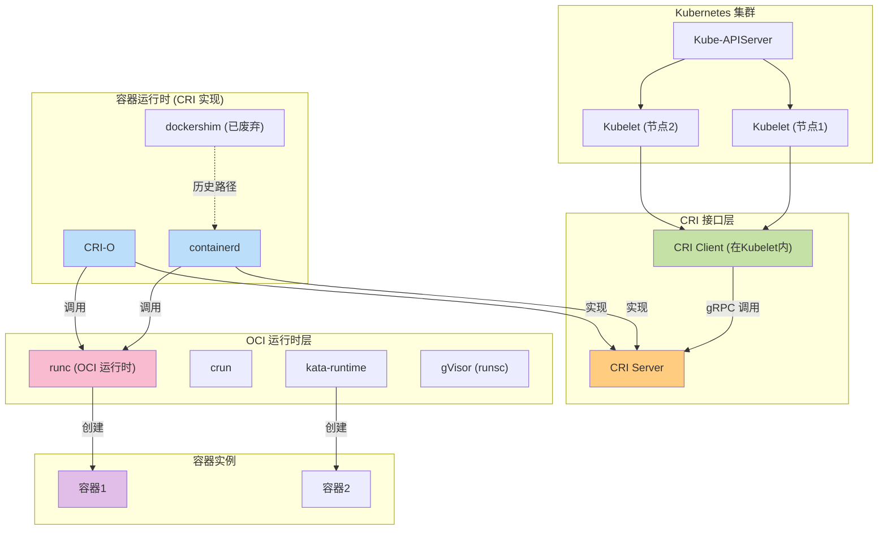
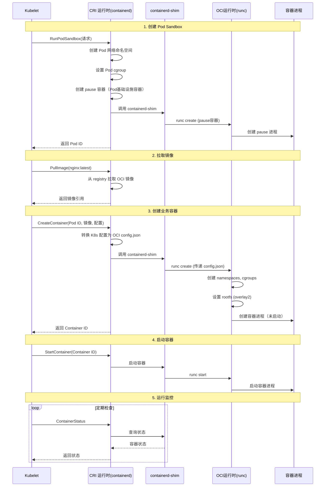
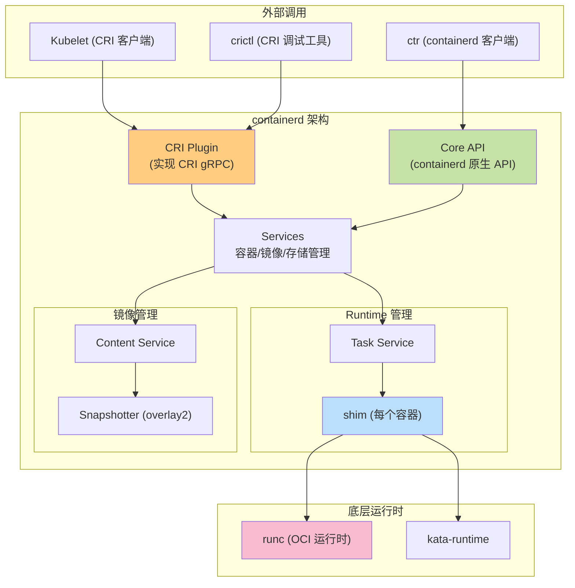

[kubernetes/k8s CRI分析-容器运行时接口分析](https://www.cnblogs.com/lianngkyle/p/15086099.html) - 这篇博客对 CRI 的分析很全面
# CRI 和 OCI 
OCI 运行时关注的是单个容器的生命周期管理的标准化操作，核心定义是一个 config.json 文件。CRI 是 Kubernetes 与容器运行时的标准化接口，是 Kubernetes 与运行时之间的"高级"API，这些 API 定义的是非常明确的 gRPC 接口。关键是，CRI 涵盖的不仅是容器的生命周期的管理，还有对 pod 的支持和管理。
CRI 和 OCI 运行时的总体关系图如下所示：

即，kubelet 创建容器调用的是 containerd 这些容器运行时实现的 gRPC CRI 接口，容器运行时再调用底层的 runc 这些 OCI 运行时的接口。
### CRI 和 OCI 的协作流程
下图展示了 kubelet 创建并管理 pod 和容器的流程：


在这个流程里，CRI 运行时很重要的一个工作就是将 K8s PodSpec（重点是其中包含的 ContainerSpec） 转换成 OCI config.json。
# CRI 接口层
CRI 通过 **Protocol Buffers** 定义了两个主要服务：RuntimeService 和 ImageService。详细的 CRI 接口定义参考：https://github.com/kubernetes/cri-api/。
## RuntimeService（运行时服务）
CRI RuntimeService 核心接口定义如下所示：
```protobuf
service RuntimeService {
  // Pod 生命周期管理接口
  // RunPodSandbox - 创建 pod 的基础设施，kubelet 需要创建新pod时调用，工作流程：
  // 1. 创建 pod 沙箱环境：创建网络ns（不是host网络）并调用 CNI （calico、flannel）配置网络；设置 pod cgroup
  // 2. 创建 pod 沙箱容器：创建 pause 容器；应用安全策略（seccomp、AppArmor、selinux）
  rpc RunPodSandbox(RunPodSandboxRequest) returns (RunPodSandboxResponse) {}
  // StopPodSandbox  - 停止 pod，例如pod被删除、节点需要排空、pod生命周期结束，工作流程：
  // 1. 获取 pod 内所有容器，对每个容器执行优雅停止，即向 Pod 内所有容器发送停止信号（默认 SIGTERM），然后等待优雅终止（grace period），如果超时则发送 SIGKILL
  // 2. 如果配置了网络卸载，调用 CNI 清理 pod 网络
  // 3. 最后清理 pod 状态，将pod状态更新为 Stoppped。
  rpc StopPodSandbox(StopPodSandboxRequest) returns (StopPodSandboxResponse) {}
  // RemovePodSandbox - 删除 Pod 沙箱，在 pod 完全停止后调用它清理资源，工作流程：
  // 1. 删除 Pod 沙箱容器（pause 容器；
  // 2. 清理网络命名空间；
  // 3. 删除 Pod cgroup
  // 4. 清理日志目录，释放所有相关资源
  rpc RemovePodSandbox(RemovePodSandboxRequest) returns (RemovePodSandboxResponse) {}
  
  // 容器生命周期管理接口
  // CreateContainer - 在 Pod Sandbox 创建后，为 Pod 创建业务容器；K8s Container Spec → OCI config.json
  rpc CreateContainer(CreateContainerRequest) returns (CreateContainerResponse) {}
  rpc StartContainer(StartContainerRequest) returns (StartContainerResponse) {}
  rpc StopContainer(StopContainerRequest) returns (StopContainerResponse) {}
  rpc RemoveContainer(RemoveContainerRequest) returns (RemoveContainerResponse) {}
  
  // 状态查询
  rpc ListContainers(ListContainersRequest) returns (ListContainersResponse) {}
  rpc ContainerStatus(ContainerStatusRequest) returns (ContainerStatusResponse) {}
  
  // 执行命令
  rpc Exec(ExecRequest) returns (ExecResponse) {}
  rpc Attach(AttachRequest) returns (AttachResponse) {}
}
```

## ImageService（镜像服务）
CRI ImageService 核心接口定义如下所示：
```protobuf
service ImageService {
  rpc ListImages(ListImagesRequest) returns (ListImagesResponse) {}
  rpc ImageStatus(ImageStatusRequest) returns (ImageStatusResponse) {}
  rpc PullImage(PullImageRequest) returns (PullImageResponse) {}
  rpc RemoveImage(RemoveImageRequest) returns (RemoveImageResponse) {}
  rpc ImageFsInfo(ImageFsInfoRequest) returns (ImageFsInfoResponse) {}
}
```

# CRI 运行时实现
CRI 运行时一般也叫做容器运行时或者容器引擎，主流实现包括：containerd, CRI-O, Docker (通过 dockershim/cri-docker)。在 k8s 开源生态中，随着 kubelete 中内置 dockershim 的移除，containerd 已经成为事实上的标准。
## containerd
